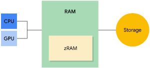
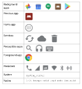

## 概览

Android 运行时 ( **ART** ) 和 **Dalvik 虚拟机** 使用 **分页** 和 **内存映射** 来管理内存。这意味着应用修改的任何内存，无论修改的方式是分配新对象还是轻触内存映射的页面，都会一直驻留在 RAM 中，并且无法换出。 **要从应用中释放内存，只能释放应用保留的对象引用，使内存可供垃圾回收器回收。** 这种情况有 **一个例外** ：对于任何未经修改的内存映射文件（如代码），如果系统想要在其他位置使用其内存，可将其从 RAM 中换出。

### 特征

Ref: <https://blog.csdn.net/greedylin/article/details/103711555>   
Android的内存大，但是管理不太好   
基本单位: Page

  1. 默认4K一个page（与linux相同），但并不意味是4K对齐的

  2. 回收和分配以page为单位

  3. 分为用户态和内核态，常见的一个问题是，用户态中的一个指针越界到内核态，该程序就会挂掉

### LMK

内存管理工具-low memory killer（AKA lmk）   
一些现象都和它有关，例如闪退 服务消失 手机重启等   
当内存不足时，killer会从下往上杀应用，当杀到前台（Foreground）时，你的应用就会闪退，如果继续使用内存，会一致杀到System层，这时设备会重启

### GC

#### 概念

ART 或 Dalvik 虚拟机之类的 **受管内存环境** 会 **跟踪每次内存分配** 。一旦确定程序不再使用某块内存，它就会将该内存重新释放到堆中，无需程序员进行任何干预。这种 **回收受管内存环境中的未使用内存的机制** 称为“ **垃圾回收”** 。垃圾回收有两个目标： **在程序中查找将来无法访问的数据对象** ，并 **回收这些对象使用的资源** 。

#### Android做法

Android 的内存堆是分代的，这意味着它会根据分配对象的 **预期寿命和大小** 跟踪不同的 **分配存储分区** 。例如，最近分配的对象属于“ **新生代** ”。当某个对象保持活动状态达足够长的时间时，可将其提升为 **较老代** ，然后是 **永久代** 。   
堆的每一代对相应对象可占用的内存量都有其自身的专用上限。 **每当一代开始填满时，系统便会执行垃圾回收事件以释放内存。**

垃圾回收的 **持续时间** 取决于它 **回收的是哪一代** 对象以及 **每一代有多少个活动对象** 。

尽管垃圾回收速度非常快，但仍会影响应用的性能。系统有一套专门确定何时执行垃圾回收的标准。当条件满足时，系统会停止执行进程并开始垃圾回收。如果 _在动画或音乐播放等密集型处理循环过程中发生垃圾回收，则可能会增加处理时间_ ，进而可能会导致应用中的代码执行超出建议的 16ms 阈值， _无法实现高效、流畅的帧渲染_ 。

此外，您的代码流执行的各种工作可能迫使垃圾回收事件发生得更频繁或导致其持续时间超过正常范围。 例如， _如果您在 Alpha 混合动画的每一帧期间，在 for 循环的最内层分配多个对象，则可能会使内存堆受到大量对象的影响_ 。在这种情况下，垃圾回收器会执行多个垃圾回收事件，并可能降低应用的性能。

### 共享内存

为了在 RAM 中容纳所需的一切，Android 会尝试跨进程共享 RAM 页面。   
方式：

  * 每个应用进程都从一个 **名为 Zygote 的现有进程分叉** 。系统启动并加载通用框架代码和资源（如 Activity 主题背景）时，Zygote 进程随之启动。为启动新的应用进程，系统会分叉 Zygote 进程，然后在新进程中加载并运行应用代码。这种方法使为框架代码和资源分配的大多数 RAM 页面可在所有应用进程之间共享。

  * 大多数 **静态数据会内存映射到一个进程中** 。这种方法使得数据不仅可以在进程之间共享，还可以在需要时换出。静态数据示例包括：Dalvik 代码（通过将其放入预先链接的 .odex 文件中进行直接内存映射）、应用资源（通过将资源表格设计为可内存映射的结构以及通过对齐 APK 的 zip 条目）和传统项目元素（如 .so 文件中的原生代码）。

  * 在很多地方，Android 使用 **明确分配的共享内存区域（通过 ashmem 或 gralloc）** 在进程间共享同一 **动态 RAM** 。例如，窗口 surface 在应用和屏幕合成器之间使用共享内存，而光标缓冲区则在内容提供程序和客户端之间使用共享内存。

### 分配与回收应用内存

**Dalvik 堆** 局限于 **每个应用进程的单个虚拟内存范围** 。这定义了 **逻辑堆大小** ，该大小可以根据需要增长，但不能超过系统为每个应用定义的上限。

堆的逻辑大小与 **堆使用的物理内存量** 不同。在检查应用堆时，Android 会 **计算** 按比例分摊的内存大小 **(PSS) 值** ，该值同时考虑与其他进程共享的脏页和干净页，但其数量与共享该 RAM 的应用数量成正比。此 (PSS) 总量是系统认为的 **物理内存占用** 量。有关 PSS 的详情，请参阅调查 RAM 使用量指南: <https://developer.android.com/studio/profile/memory-profiler>。

Dalvik 堆不压缩堆的逻辑大小，这意味着 Android 不会对堆进行碎片整理来缩减空间。只有当堆末尾存在未使用的空间时，Android 才能缩减逻辑堆大小。但是，系统仍然可以减少堆使用的物理内存。垃圾回收之后，Dalvik 遍历堆并查找未使用的页面，然后使用 madvise 将这些页面返回给内核。因此，大数据块的配对分配和解除分配应该使所有（或几乎所有）使用的物理内存被回收。但是，从较小分配量中回收内存的效率要低得多，因为用于较小分配量的页面可能仍在与其他尚未释放的数据块共享。

#### PSS

PSS(Proportional Set Size)：按比例分摊的内存大小

> Proportional 比例的，成比例的   
>  Proportional Set Size: 按照比例设置的大小，按比例分摊的内存大小，即 **实际使用的物理内存**

### 限制应用内存

为了维持多任务环境的正常运行，Android 会为每个应用的 **堆大小** 设置硬性 **上限** 。如果您的应用在达到堆容量上限后尝试分配更多内存，则可能会收到 **OutOfMemoryError** 。   
在某些情况下，例如，为了确定在缓存中保存多少数据比较安全，您可能需要查询系统以确定 **当前设备上确切可用的堆空间大小** 。您可以通过调用 **getMemoryClass()** 向系统查询此数值。此方法返回一个整数，表示 **应用堆的可用兆字节数** 。

### 切换应用

当用户在应用之间切换时，Android 会在最近最少使用 (LRU) 缓存中保留 **非前台应用** ，即用户看不到或不在运行前台服务（如 _音乐播放_ ）的应用。例如，当用户首次启动某个应用时，系统会为其创建一个进程；但是当用户离开此应用时，该进程不会退出。系统会将该进程保留在缓存中。如果用户稍后返回该应用，则系统会重复使用该进程，从而加快应用切换速度。

如果您的应用具有缓存进程且保留了目前不需要的内存，那么即使用户不在使用您的应用，它也会影响系统的整体性能。当系统 **内存不足时** ，它会从最近最少使用的进程开始， **终止 LRU 缓存中的进程** 。系统还会考虑终止占用最多内存的进程以释放 RAM。

## 进程间内存分配

Android 平台在运行时不会浪费可用的内存。它会一直尝试利用所有可用内存。

### 内存类型

Android 设备包含三种不同类型的内存：RAM、zRAM 和存储器

RAM 是最快的内存类型，但其大小通常有限。高端设备通常具有最大的 RAM 容量。

zRAM 是用于交换空间的 RAM 分区。所有数据在放入 zRAM 时都会进行压缩，然后在从 zRAM 向外复制时进行解压缩。这部分 RAM 会随着页面进出 zRAM 而增大或缩小。设备制造商可以设置 zRAM 大小上限。

存储器中包含所有持久性数据（例如文件系统等），以及为所有应用、库和平台添加的对象代码。存储器比另外两种内存的容量大得多。在 Android 上，存储器不像在其他 Linux 实现上那样用于交换空间，因为频繁写入会导致这种内存出现损坏，并缩短存储媒介的使用寿命。

### 内存页面

RAM 分为多个“页面”。通常，每个页面为 4KB 的内存。

系统会将页面视为“可用”或“已使用”。

#### 可用页面

#### 已使用页面

##### 缓存页

有存储器中的文件（例如代码或内存映射文件）支持的内存。缓存内存有两种类型：

  1. 私有页：由一个进程拥有且未共享

    * 干净页：存储器中未经修改的文件副本，可由 kswapd 删除以增加可用内存

    * 脏页：存储器中经过修改的文件副本；可由 kswapd 移动到 zRAM 或在 zRAM 中进行压缩以增加可用内存

  2. 共享页：由多个进程使用

    * 干净页：存储器中未经修改的文件副本，可由 kswapd 删除以增加可用内存

    * 脏页：存储器中经过修改的文件副本；允许通过 kswapd 或者通过明确使用 msync() 或 munmap() 将更改写回存储器中的文件，以增加可用空间

##### 匿名页：

没有存储器中的文件支持的内存（例如，由设置了 MAP_ANONYMOUS 标记的 mmap() 进行分配）   
脏页：可由 kswapd 移动到 zRAM/在 zRAM 中进行压缩以增加可用内存

> 注意：干净页包含存在于存储器中的文件（或文件一部分）的精确副本。如果干净页不再包含文件的精确副本（例如，因应用操作所致），则会变成脏页。干净页可以删除，因为始终可以使用存储器中的数据重新生成它们；脏页则不能删除，否则数据将会丢失。   
>  随着系统积极管理 RAM，可用和已使用页面的比例会不断变化。

### 内存不足管理

Android 有两种处理内存不足情况的主要机制： **内核交换守护进程** 和 **低内存终止守护进程** 。

#### 内核交换守护进程

内核交换守护进程 (kernel swap daemon, kswapd) 是 Linux 内核的一部分，用于将已使用内存转换为可用内存。当设备上的可用内存不足时，该守护进程将变为活动状态。Linux 内核设有可用内存上下限阈值。当可用内存降至下限阈值以下时，kswapd 开始回收内存。当可用内存达到上限阈值时，kswapd 停止回收内存。

kswapd 可以删除干净页来回收它们，因为这些页受到存储器的支持且未经修改。如果某个进程尝试处理已删除的干净页，则系统会将该页面从存储器复制到 RAM。此操作称为“请求分页”。

kswapd 可以将缓存的私有脏页和匿名脏页移动到 zRAM 进行压缩。这样可以释放 RAM 中的可用内存（可用页面）。如果某个进程尝试处理 zRAM 中的脏页，该页将被解压缩并移回到 RAM。如果与压缩页面关联的进程被终止，则该页面将从 zRAM 中删除。

如果可用内存量低于特定阈值，系统会开始终止进程。

#### 低内存终止守护进程

很多时候，kswapd 不能为系统释放足够的内存。在这种情况下，系统会使用 onTrimMemory() 通知应用内存不足，应该减少其分配量。如果这还不够，内核会开始终止进程以释放内存。它会使用低内存终止守护进程 ( low-memory killer, LMK) 来执行此操作。

LMK 使用一个名为 oom_adj_score 的“内存不足”分值来确定正在运行的进程的优先级，以此决定要终止的进程。最高得分的进程最先被终止。后台应用最先被终止，系统进程最后被终止。下表列出了从高到低的 LMK 评分类别。评分最高的类别，即第一行中的项目将最先被终止：

  * 后台应用：之前运行过且当前不处于活动状态的应用。LMK 将首先从具有最高 oom_adj_score 的应用开始终止后台应用。

  * 上一个应用：最近用过的后台应用。上一个应用比后台应用具有更高的优先级（得分更低），因为相比某个后台应用，用户更有可能切换到上一个应用。

  * 主屏幕应用：这是启动器应用。终止该应用会使壁纸消失。

  * 服务：服务由应用启动，可能包括同步或上传到云端。

  * 可觉察的应用：用户可通过某种方式察觉到的非前台应用，例如运行一个显示小界面的搜索进程或听音乐。

  * 前台应用：当前正在使用的应用。终止前台应用看起来就像是应用崩溃了，可能会向用户提示设备出了问题。

  * 持久性（服务）：这些是设备的核心服务，例如电话和 WLAN。

  * 系统：系统进程。这些进程被终止后，手机可能看起来即将重新启动。

  * 原生：系统使用的极低级别的进程（例如，kswapd）。

### 计算内存占用量

> 在确定应用使用的内存量时，系统必须考虑共享的页面。访问相同服务或库的应用将共享内存页面。   
>  如需确定应用的内存占用量，可以使用以下任一指标：

  * 常驻内存大小 (Resident Set Size, RSS)：应用使用的共享和非共享页面的数量

  * 按比例分摊的内存大小 (Proportional Set Size, PSS)：应用使用的非共享页面的数量加上共享页面的均匀分摊数量（例如，如果三个进程共享 3MB，则每个进程的 PSS 为 1MB）

  * 独占内存大小 (Unique Set Size, USS)：应用使用的非共享页面数量（不包括共享页面）

如果操作系统想要知道所有进程使用了多少内存，那么 **PSS** 非常有用，因为页面只会统计一次。计算 PSS 需要花很长时间，因为系统需要确定共享的页面以及共享页面的进程数量。RSS 不区分共享和非共享页面（因此计算起来更快），更适合跟踪内存分配量的变化。

## 管理应用内存

随机存取存储器 (RAM) 在任何软件开发环境中都是一项宝贵资源。虽然 Android 运行时 (ART) 和 Dalvik 虚拟机都执行例行的垃圾回收任务，但这并不意味着您可以忽略应用分配和释放内存的位置和时间。您仍然需要避免引入 **内存泄漏** 问题（ **通常因在静态成员变量中保留对象引用而引起** ），并在适当时间（如生命周期回调所定义）释放所有 Reference 对象。

### 监控可用内存和内存使用量

您需要 **先找到应用中的内存使用问题，然后才能修复问题** 。Android Studio 中的内存分析器可以通过以下方式帮助您查找和诊断内存问题：

  * 了解您的应用在一段时间内如何分配内存。内存分析器可以显示实时图表，说明应用的内存使用量、分配的 Java 对象数量以及垃圾回收事件发生的时间。

  * 发起垃圾回收事件，并在应用运行时拍摄 Java 堆的快照。

  * 记录应用的内存分配情况，然后检查所有分配的对象、查看每个分配的堆栈轨迹，并在 Android Studio 编辑器中跳转到相应代码。

#### 释放内存以响应事件

如 Android 内存管理概览中所述，Android 可以通过多种方式从应用中回收内存，或在必要时完全终止应用，从而释放内存以执行关键任务。为了进一步帮助平衡系统内存并避免系统需要终止您的应用进程，您可以在 Activity 类中实现 ComponentCallbacks2 接口。借助所提供的 onTrimMemory() 回调方法，您的应用可以在处于前台或后台时监听与内存相关的事件，然后释放对象以响应指示系统需要回收内存的应用生命周期事件或系统事件。

#### 查看您应该使用多少内存

为了允许多个进程同时运行，Android 针对为每个应用分配的堆大小设置了硬性限制。设备的确切堆大小限制因设备总体可用的 RAM 多少而异。如果您的应用已达到堆容量上限并尝试分配更多内存，系统就会抛出 OutOfMemoryError。

为了避免用尽内存，您可以查询系统以确定当前设备上可用的堆空间。您可以通过调用 getMemoryInfo() 向系统查询此数值。它将返回一个 ActivityManager.MemoryInfo 对象，其中会提供与设备当前的内存状态有关的信息，包括可用内存、总内存和内存阈值（如果达到此内存级别，系统就会开始终止进程）。ActivityManager.MemoryInfo 对象还会提供一个简单的布尔值lowMemory，您可以根据此值确定设备是否内存不足。

以下代码段示例演示了如何在应用中使用 getMemoryInfo() 方法。

### 使用内存效率更高的代码结构

某些 Android 功能、Java 类和代码结构所使用的内存往往多于其他功能、类和结构。您可以在代码中选择效率更高的替代方案，以尽可能降低应用的内存使用量。

#### 谨慎使用服务

在不需要某项服务时让其保持运行状态，是 Android 应用可能犯下的最严重的内存管理错误之一。如果您的应用需要某项服务在后台执行工作，请不要让其保持运行状态，除非其需要运行作业。请注意在服务完成任务后使其停止运行。否则，您可能会在无意中导致内存泄漏。

在您启动某项服务后，系统更倾向于让此服务的进程始终保持运行状态。这种行为会导致服务进程代价十分高昂，因为一旦服务使用了某部分 RAM，那么这部分 RAM 就不再可供其他进程使用。这会减少系统可以在 LRU 缓存中保留的缓存进程数量，从而降低应用切换效率。当内存紧张，并且系统无法维护足够的进程以托管当前运行的所有服务时，这甚至可能导致系统出现颠簸。

您通常应该避免使用持久性服务，因为它们会对可用内存提出持续性的要求。我们建议您采用 JobSchedulerJobScheduler 等替代实现方式。要详细了解如何使用 JobScheduler 调度后台进程，请参阅后台优化。

如果您必须使用某项服务，则限制此服务的生命周期的最佳方式是使用 IntentService，它会在处理完启动它的 intent 后立即自行结束。有关详情，请参阅在后台服务中运行。

#### 使用经过优化的数据容器

编程语言所提供的部分类并未针对移动设备做出优化。例如，常规 HashMap 实现的内存效率可能十分低下，因为每个映射都需要分别对应一个单独的条目对象。

Android 框架包含几个经过优化的数据容器，包括 SparseArray、SparseBooleanArray 和 LongSparseArray。 例如，SparseArray 类的效率更高，因为它们可以避免系统需要对键（有时还对值）进行自动装箱（这会为每个条目分别再创建 1-2 个对象）。

如果需要，您可以随时切换到原始数组以获得非常精简的数据结构。

#### 谨慎对待代码抽象

开发者往往会将抽象简单地当做一种良好的编程做法，因为抽象可以提高代码灵活性和维护性。不过，抽象的代价很高：通常它们需要更多的代码才能执行，需要更多的时间和更多的 RAM 才能将代码映射到内存中。因此，如果抽象没有带来显著的好处，您就应该避免使用抽象。

#### 针对序列化数据使用精简版 Protobuf

协议缓冲区是 Google 设计的一种无关乎语言和平台，并且可扩展的机制，用于对结构化数据进行序列化。该机制与 XML 类似，但更小、更快也更简单。如果您决定针对数据使用 Protobuf，则应始终在客户端代码中使用精简版 Protobuf。常规 Protobuf 会生成极其冗长的代码，这会导致应用出现多种问题，例如 RAM 使用量增多、APK 大小显著增加以及执行速度变慢。

有关详情，请参阅 Protobuf 自述文件中的“精简版”部分。

#### 避免内存抖动

如前所述，垃圾回收事件通常不会影响应用的性能。不过，如果在短时间内发生许多垃圾回收事件，就可能会快速耗尽帧时间。系统花在垃圾回收上的时间越多，能够花在呈现或流式传输音频等其他任务上的时间就越少。

通常，“内存抖动”可能会导致出现大量的垃圾回收事件。实际上，内存抖动可以说明在给定时间内出现的已分配临时对象的数量。

例如，您可以在 for 循环中分配多个临时对象。或者，您也可以在视图的 onDraw() 函数中创建新的 Paint 或 Bitmap 对象。在这两种情况下，应用都会快速创建大量对象。这些操作可以快速消耗新生代 (young generation) 区域中的所有可用内存，从而迫使垃圾回收事件发生。

当然，您必须先在代码中找到内存抖动较高的位置，然后才能进行修复。为此，您应该使用 Android Studio 中的内存分析器。

确定代码中的问题区域后，请尝试减少对性能至关重要的区域中的分配数量。您可以考虑将某些代码逻辑从内部循环中移出，或将其移到基于 Factory 的分配结构中。

### 移除会占用大量内存的资源和库

代码中的某些资源和库可能会在您不知情的情况下吞噬内存。APK 的总体大小（包括第三方库或嵌入式资源）可能会影响应用的内存消耗量。您可以通过从代码中移除任何冗余、不必要或臃肿的组件、资源或库，降低应用的内存消耗量。

#### 缩减总体 APK 大小

您可以通过缩减应用的总体大小来显著降低应用的内存使用量。位图大小、资源、动画帧数和第三方库都会影响 APK 的大小。Android Studio 和 Android SDK 提供了可帮助您缩减资源和外部依赖项大小的多种工具。这些工具支持现代代码收缩方法，例如 R8 编译。（Android Studio 3.3 及更低版本使用 ProGuard，而不是 R8 编译。）

要详细了解如何缩减 APK 的总体大小，请参阅有关如何缩减应用大小的指南。

#### 使用 Dagger 2 实现依赖注入

依赖注入框架可以简化您编写的代码，并提供一个可供您进行测试及其他配置更改的自适应环境。

如果您打算在应用中使用依赖注入框架，请考虑使用 Dagger 2。Dagger 不使用反射来扫描您应用的代码。Dagger 的静态编译时实现意味着它可以在 Android 应用中使用，而不会带来不必要的运行时代价或内存消耗量。

其他使用反射的依赖注入框架倾向于通过扫描代码中的注释来初始化进程。此过程可能需要更多的 CPU 周期和 RAM，并可能在应用启动时导致出现明显的延迟。

#### 谨慎使用外部库

外部库代码通常不是针对移动环境编写的，在移动客户端上运行时可能效率低下。如果您决定使用外部库，则可能需要针对移动设备优化该库。在决定是否使用该库之前，请提前规划，并在代码大小和 RAM 消耗量方面对库进行分析。

即使是一些针对移动设备进行了优化的库，也可能因实现方式不同而导致问题。例如，一个库可能使用的是精简版 Protobuf，而另一个库使用的是 Micro Protobuf，导致您的应用出现两种不同的 Protobuf 实现。日志记录、分析、图像加载框架和缓存以及许多您意料之外的其他功能的不同实现都可能导致这种情况。

虽然 ProGuard 可以使用适当的标记移除 API 和资源，但无法移除库的大型内部依赖项。您所需要的这些库中的功能可能需要较低级别的依赖项。如果存在以下情况，这就特别容易导致出现问题：您使用某个库中的 Activity 子类（往往会有大量的依赖项）、库使用反射（这很常见，意味着您需要花费大量的时间手动调整 ProGuard 以使其运行）等。

此外，请避免仅针对数十个功能中的一两个功能使用共享库。您一定不希望产生大量您甚至根本用不到的代码和开销。在考虑是否使用某个库时，请查找与您的需求十分契合的实现。否则，您可以决定自己去创建实现。

