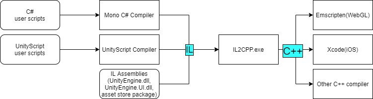

## 概述

IL2CPP 是 Unity 自 4.6.1p5版本 提出的一种新的 scripting backend 方式，为Unity提供了更加高效、更加便携的虚拟机。   
IL2CPP (Intermediate Language To C++) is a Unity-developed scripting backend   
which you can use as an alternative to Mono when building projects for various platforms. When building a project using IL2CPP, Unity converts IL code from scripts   
and assemblies to C++, before creating a native binary file (.exe, apk, .xap, for example) for your chosen platform.

  * increasing the performance

    * security

    * platform compatibility

> Scripting backend is a framework that powers scripting in Unity( 支持脚本的框架 ). 

IL2CPP分为两个独立的部分：

  * AOT编译器   
AOT编译器将 IL（由.Net编译器输出的中间语言）转换为C++源码

  * 运行时库   
运行时库则会提供诸如 **垃圾回收** 、 **线程/文件获取** （独立于平台，与平台无关）、 **内部调用直接修改托管数据结构的原生代码** 的服务与抽象。

## AOT编译器

AOT(Ahead Of Time)(运行前编译，静态编译)   
所谓AOT编辑器即 **il2cpp.exe**   
在 Windows 系统中你可以在 Editor\Data\il2cpp 目录中找到它，在 OSX 系统中你可以在 Contents/Frameworks/il2cpp/build，即Unity的安装目录中找到它。   
il2cpp.exe 是由C#编写的 **受托管的可执行程序** ，它 **接受我们在Unity中通过Mono编译器生成的托管程序集，并生成指定平台下的C++代码** 。



## 运行时库

**运行时库（libil2cpp）** 的存在是为了支持 **IL2CPP虚拟机** 的运行，几乎完全由C++代码编写，并作为一个静态库与最终的可执行程序链接。（值得一提的是，IL2CPP技术十分得益于使用了libil2cpp这一更轻便的运行时库）

你可以通过查看 libil2cpp 的头文件了解其的代码构成，例如你可以在 codegen/il2cpp-codegen.h 文件中看到 il2cpp.exe 生成C++代码的接口以及 运行时库 的接口。

运行时库的另一关键功能是提供了垃圾回收。

## AOT编译器是如何运行的

看一个例子（该例子运行在 Windows 系统下 Unity 5.0.1版本中）   
发布一个WebGL平台下的程序，并使用 Process Explorer 工具查看命令行调用过程

首先，Unity启动 mono.exe

`"C:\Program Files\Unity\Editor\Data\MonoBleedingEdge\bin\mono.exe"`   
接着启动 il2cpp.exe   
`"C:\Program Files\Unity\Editor\Data\il2cpp/il2cpp.exe`

```csharp 

"C:\Program Files\Unity\Editor\Data\MonoBleedingEdge\bin\mono.exe"

"C:\Program Files\Unity\Editor\Data\il2cpp/il2cpp.exe"

rem 传递给 il2cpp.exe ，而非传递给 mono.exe的参数(5个标识符)

rem 告诉 il2cpp.exe 不要复制生成的C++代码.

\--copy-level=None 

rem IL2CPP将会共享泛型以此来减少最终包体的大小。

\--enable-generic-sharing 

rem 支持通过反射获取的Unity事件，保证代码能够正确生成。

\--enable-unity-event-support 

rem 在生成的C++代码中，为类与方法使用更少的字符数来命名，这样会使得代码更难以调试，因为IL代码的命名将会发生改变（笔者注：应该类似于代码混淆），但是却能够被编译器更快编译，因为编译器所需要解析的字符数变少了。

\--output-format=Compact

rem 使用默认的额外类型文件 ，这个文件会被加入到你的Unity工程里，并告知 il2cpp.exe 哪些泛型类型或者数组类型没有在IL代码中出现，却会在运行时被创建。

\--extra-types.file="C:\Program Files\Unity\Editor\Data\il2cpp\il2cpp_default_extra_types.txt"

``` ```csharp 

"C:\Users\Josh Peterson\Documents\IL2CPP Blog Example\Temp\StagingArea\Data\Managed\Assembly-CSharp.dll"

"C:\Users\Josh Peterson\Documents\IL2CPP Blog Example\Temp\StagingArea\Data\Managed\UnityEngine.UI.dll"

``` 

il2cpp.exe 接受所有应该被转换的 IL 程序集，在这里例子中它应该包含我的 MonoBehaviour脚本、 Assembly-CSharp.dll 以及 GUI assembly 和 UnityEngine.UI.dll。   
我的脚本引用了 UnityEngine.dll 和 mscorlib.dll，但是它们却没有被包含在上述的命令行中。事实上，il2cpp.exe 在内部对这些程序集进行了处理，因此在上述的命令行中它们不是必须的，Unity只显式地需要 **根程序集** （不被任何程序集引用的程序集）在命令行中被提及。

```csharp 

"C:\Users\Josh Peterson\Documents\IL2CPP Blog Example\Temp\StagingArea\Data\il2cppOutput"

``` 

最后的一个参数表示 il2cpp.exe 的输出目录，即 il2cpp.exe 生成代码的输出位置，如果你对此感兴趣的话，可以看一看生成目录下的C++文件，而这一块内容我们也会在后续的文章中对其进行详解。此外，如果你希望浏览生成目录下的代码的话，推荐在出包的时候选择 **Development Player** 模式，这样一来将会移除 –output-format=Compact 命令行，使得你的代码更具可读性。

> PS:你可以通过改变 Player Settings 中的设置来观察 Unity 传递给 il2cpp.exe 的命令行的差异，例如将   
>  Enable Exceptions 设置为 Full，那么命令行中就会增加 –emit-null-checks、–enable-stacktrace 、 –enable-array-bounds-check 三项.

## IL2CPP没有做的工作

Unity官方并没有重写C#的标准库，因此当你发布一个Unity工程的时候，即使你选择了 IL2CPP 的方式来生成你的代码，所有在 mscorlib.dll、System.dll 等标准库中的代码都将使用Mono2X的方式来生成。

Ref: <https://www.jianshu.com/p/7cfcb7b0cfe7>

