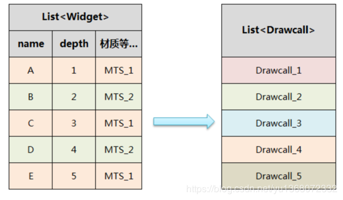
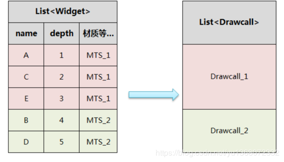

## 概念

Draw Call就是CPU调用图形编程接口，比如DirectX或OpenGL，来命令GPU进行渲染的操作。   
（DirectX中的DrawIndexedPrimitive命令，OpenGL中的glDrawElement命令）

命令缓冲区(Command Buffer)   
CPU向其中添加命令，而由GPU从中读取命令   
添加和读取的过程相互独立   
命令有很多种类，而Draw Call是其中的一种   
改变渲染状态（Shader，Texture）

#影响帧率

每次调用Draw Call之前，CPU需要向GPU发送很多内容，包括数据，状态，命令等。在这一阶段，CPU需要完成很多工作，例如检查渲染状态等。   
GPU的渲染能力很强，渲染速度往往快于CPU提交命令的速度。   
如果Draw Call的数量太多，CPU就会把大量时间花费在提交Draw Call命令上，造成CPU的过载。

## 如何减少Draw Call

### 批处理(Batching)

把很多小的Draw Call合并成一个大的Draw Call。

> 在CPU和RAM中合并网格，而 **合并网格** 本身是需要计算，消耗CPU时间，而且 **创建新网格** 也会占用内存。因此批处理的频次不宜太高，不然造成的消耗可能得不偿失

Unity内置了Draw Call Batching技术：在一次DrawCall中批量处理多个物体。只要物体的变换和材质相同，GPU就可以按完全相同的方式进行处理，即可以把它们放在一个Draw Call中。

条件: 合并的网格会在一次渲染任务中进行绘制，他们的渲染数据，渲染状态和shader都是一样的，因此合并的条件至少是： **同材质、同贴图、同shader** 。最好网格顶点格式也一致。

Unity提供了Dynamic Batching和Static Batching两种方式。

#### Dynamic Batching

Dynamic Batching是完全自动进行的，不需要也无法进行任何干预。

动态批处理的约束：

  1. 批处理动态物体需要在每个顶点上进行一定的开销，所以动态批处理仅支持小于900顶点的网格物体。

  2. 如果着色器使用顶点位置，法线和UV值三种属性，那么只能批处理300顶点以下的物体；如果着色器需要使用顶点位置，法线，UV0，UV1和切向量，那么只能批处理180顶点以下的物体。

  3. 不要使用缩放，分别拥有缩放大小（1,1,1）和（2,2,2）的两个物体将不会进行批处理。

  4. 统一缩放的物体不会和非统一缩放的物体进行批处理。

  5. 使用缩放尺度（1,1,1）和（1,2,1）的两个物体将不会进行批处理，但是使用缩放尺度（1,2,1）和（1,3,1）的两个物体将可以进行批处理。

  6. 使用不同材质的实例化物体将会导致批处理失败。

  7. 拥有lightmap的物体含有额外（隐藏）的材质属性，比如：lightmap的偏移和缩放系数等。所以，拥有lightmap的物体将不会进行批处理（除非他们指向lightmap的同一部分）。

  8. 多通道的shader会妨碍批处理操作。比如，几乎unity中所有的着色器在前向渲染中都支持多个光源，并为它们有效地开辟多个通道。

  9. 预设体的实例会自动地使用相同的网格模型和材质。 

  10. 网格合并的顶点数量有上限（Unity中好像是65535还是900？）

  11. 使用MultiplePass的shader也不会进行批处理

  12. 接受实时阴影的物体也不会进行批处理

#### Static Batching

Static Batching需要把静止的物体标记为Static，然后无论大小，都会组成Batch。   
如何对动态加载的静态物体进行静态合批操作：

```csharp 

GameObject go = (GameObject)Instantiate(...); 

go.isStatic = true;//将实例化的物体设置为静态

go.transform.parent = root.transform; 

gosList.Add(go); 

gos = gosList.ToArray(); 

StaticBatchingUtility.Combine(gos, root);静态合并 

``` 

> 可以通过CombineChildren脚本（StandardAssets/Scripts/UnityScripts/CombineChildren）手动把物体组合在一起，但这个脚本会影响可见性测试，因为组合在一起的物体始终会被看作一个物体，从而会增加GPU要处理的几何体数量，因此要小心使用。

##### 坏处：VBO增大，通过内存来换取性能

如果在静态批处理前有一些物体共享了相同的网格（例如这里的两个箱子），那么每一个物体都会有一个该网格的复制品，即一个网格会变成多个网格被发送给GPU。   
如果使用同一网格的对象很多，可能需要牺牲一定的渲染性能，避免使用静态批处理。例如，如果在一个使用了1000个重复树模型的森林中使用静态批处理，那么结果就会产生1000倍的内存，这会造成严重的内存影响。

#### Batching对提升性能的启发

  1. 避免使用大量小的网格，当确实需要时，考虑是否要合并。

  2. 首先是尽量减少场景中使用的材质数量，即尽量共享材质，对于仅纹理不同的材质可以把纹理组合到一张更大的纹理中。把纹理打包成图集，减少材质数量。

  3. 把不会移动的物体标记为Static。

  4. 合并本身有消耗，因此尽量在编辑器下进行合并

### 减少反光阴影等

尽量少的使用反光，阴影之类的，因为那会使物体多次渲染。   
同样的设置，如果将灯光的阴影效果打开，DrawCall会大幅增加，使用lightmap可以实现想要的阴影效果

### 遮挡剔除

对于复杂的静态场景，还可以考虑自行设计遮挡剔除算法，减少可见的物体数量同时也可以减少Draw Call。

### NGUI的优化

NGUI主要是有三大模块组成：UIPanel，UIWidget，UIDrawcall组成。其中UIPanel是用来管理UIWidget控件和UIDrawCall，而UIWidget是所有组件的基类。

在NGUI框架中，会有一个静态的list用来存放所有的Panel，然后每个单独的Panel下会保存自己的UIWidget和UIDrawCall，在每次绘制的时候panel会遍历自己下面的所有层级下的子物体，直到查找结束，或者遇到新的panel会跳出当前分支，继续寻找其他分支，直到全部查找结束。所以说在实际运行中，每次都会为一个UIWidget绘制一个DrawCall，如果这时候连续的多个UIWidget使用的材质和纹理一致，就会公用一个DrawCall。   
使用不同材质和纹理：


   
使用材质和纹理：



使用同一个图集，并且使用同样的材质在同一个panel下才会合并为一个Drawcall

> 如果使用同一个图集、材质，但是中间夹杂了其他的渲染状态，也会导致重新调用一次DrawCall。
> 
> 另外还需要注意一点就是在panel下如果动态的物体，就是为了实现某种效果，需要UI 进行位置移动，这种情况下，最好做成动态分离，因为只要panel下UI有移动，panle就会对清空之前的保存的UIWidget和UIDrawCall，重新进行渲染，这样就会造成性能浪费

对UI进行界面排布就需要对图集和层级做好规划，进而减少DrawCall次数

## 计算（值得以后研究，把这个公式运用到优化实践中）

NVIDIA 在 GDC 曾提出，25K batchs/sec 会吃满 1GHz 的 CPU，100的使用率。所以他们推出了一条公式，来预估游戏中大概可以 Run 多少个 Batch：   
举个例子：如果你的目标是游戏跑30FPS、使用2GHz的CPU、20%的工作量拨给Draw Call来使用，那你每帧可以有多少Draw Call呢？   
333 Batchs/Frame = 25K * 2 * (0.2/30)

Ref：   
<https://blog.csdn.net/yu1368072332/article/details/85676537>

