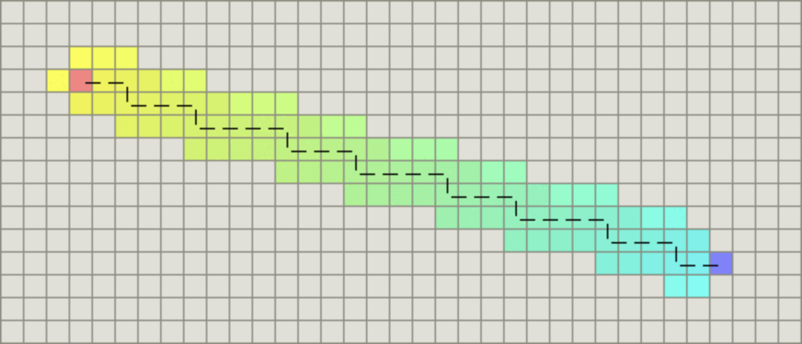
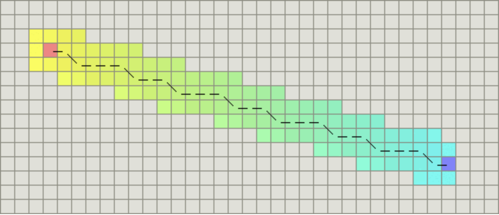
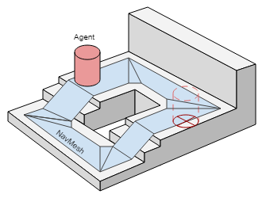
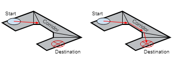
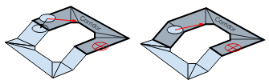
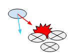
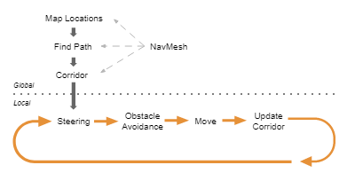
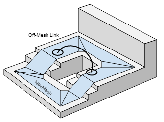

## 基础知识 - 寻路算法

### 其他寻路算法

广度优先（Breadth First）算法 - 从起点开始，首先遍历起点周围邻近的点，然后再遍历已经遍历过的点邻近的点，逐步的向外扩散，直到找到终点。

Dijkstra算法 - 加了移动代价的广度优先算法。计算每一个节点距离起点的总移动代价。对于所有待遍历的节点，放入优先队列中会按照代价进行排序。每次都从优先队列中选出代价最小的作为下一个遍历的节点。直到到达终点为止。

> 如果图形为网格图，并且每个节点之间的移动代价是相等的，那么Dijkstra算法将和广度优先算法变得一样。

最佳优先（Best First）算法 - 预先计算出每个节点到终点的距离。与Dijkstra算法类似，我们也使用一个优先队列，但此时以每个节点到达终点的距离作为优先级。从起点开始寻路，每次始终选取到终点移动代价最小（离终点最近）的节点作为下一个遍历的节点。

  * 优点：这样做可以大大加快路径的搜索速度

  * 缺点：如果起点和终点之间存在障碍物，则最佳优先算法找到的很可能不是最短路径

### A Star算法


 = 

 \+ 


 \- 节点n的综合优先级。当我们选择下一个要遍历的节点时，我们总会选取综合优先级最高（值最小）的节点。   


 \- 节点n距离起点的代价。   


 \- 节点n距离终点的预计代价，这也就是A*算法的 **启发函数** 。

```csharp 

* 初始化open_set和close_set； 

* 将起点加入open_set中，并设置优先级为0（优先级最高）； 

* 如果open_set不为空，则从open_set中选取优先级最高的节点n： 

* 如果节点n为终点，则： 

* 从终点开始逐步追踪parent节点，一直达到起点； 

* 返回找到的结果路径，算法结束； 

* 如果节点n不是终点，则： 

* 将节点n从open_set中删除，并加入close_set中； 

* 遍历节点n所有的邻近节点： 

* 如果邻近节点m在close_set中，则： 

* 跳过，选取下一个邻近节点 

* 如果邻近节点m也不在open_set中，则： 

* 设置节点m的parent为节点n 

* 计算节点m的优先级 

* 将节点m加入open_set中 

``` 

  * 在极端情况下，当启发函数

始终为0，则将由

决定节点的优先级，此时算法就退化成了Dijkstra算法。

  * 如果

始终小于等于节点n到终点的代价，则A*算法保证一定能够找到最短路径。但是当

的值越小，算法将遍历越多的节点，也就导致算法越慢。

  * 如果

完全等于节点n到终点的代价，则A*算法将找到最佳路径，并且速度很快。可惜的是，并非所有场景下都能做到这一点。因为在没有达到终点之前，我们很难确切算出距离终点还有多远。

  * 如果

的值比节点n到终点的代价要大，则A*算法不能保证找到最短路径，不过此时会很快。   
在另外一个极端情况下，如果

相较于

大很多，则此时只有

产生效果，这也就变成了最佳优先搜索。

**通过调节启发函数我们可以控制算法的速度和精确度**   
**在一些情况，我们可能未必需要最短路径，而是希望能够尽快找到一个路径即可**

#### 启发函数h(n)

曼哈顿距离 - 只允许朝上下左右四个方向移动



对角距离 - 允许斜着朝邻近的节点移动



欧几里得距离 - 两个节点之间的直线距离

## Unity NavMesh

The navigation system allows you to create characters that can intelligently move around the game world, using navigation meshes that are created automatically from your Scene geometry. 

### 组成

###

**NavMesh** (short for Navigation Mesh) - a data structure which describes the walkable surfaces of the game world and allows to find path from one walkable location to another in the game world. The data structure is built, or baked, automatically from your level geometry.

The walkable area is built automatically from the geometry in the scene by testing the locations where the agent can stand. Then the locations are connected to a surface laying on top of the scene geometry. This surface is called the navigation mesh (NavMesh for short).

The NavMesh stores this surface as **convex polygons**. Convex polygons are a useful representation, since we know that **there are no obstructions between any two points inside a polygon**. In addition to the polygon boundaries, **we store information about which polygons are neighbours to each other**. This allows us to reason about the whole walkable area.

#### Components

**NavMesh Agent component** help you to create characters which avoid each other while moving towards their goal. Agents reason about the game world using the NavMesh and they know how to avoid each other as well as moving obstacles.

**Off-Mesh Link component** allows you to incorporate navigation shortcuts which cannot be represented using a walkable surface. For example, jumping over a ditch or a fence, or opening a door before walking through it, can be all described as Off-mesh links.   
**NavMesh Obstacle component** allows you to describe moving obstacles the agents should avoid while navigating the world. 



### two problems

  * how to reason about the level to find the destination - global and static, in that it takes into account the whole scene.

  * how to move there - local and dynamic, it only considers the direction to move and how to prevent collisions with other moving agents.

##寻路分解

#### Finding Paths


   
The sequence of polygons which describe the path from the start to the destination polygon is called a **corridor**. The agent will reach the destination by always steering towards the next visible corner of the corridor. 

#### Following the Path


   
When dealing with multiple agents moving at the same time, they will need to deviate from the original path when avoiding each other. Trying to correct such deviations using a path consisting of line segments soon becomes very difficult and error prone.

Since the agent movement in each frame is quite small, we can use the connectivity of the polygons to fix up the corridor in case we need to take a little detour. Then we quickly find the next visible corner to steer towards.

#### Avoiding Obstacles



The steering logic takes the position of the next corner and based on that figures out a desired **direction** and **speed** (or velocity) needed to reach the destination. Using the desired velocity to move the agent can lead to collision with other agents.

Obstacle avoidance chooses a new velocity which balances between **moving in the desired direction** and **preventing future collisions** with other agents and edges of the navigation mesh. Unity is using **reciprocal velocity obstacles (RVO)** to predict and prevent collisions.

#### Moving the Agent

At this stage you can feed the velocity from the simulated agent to the animation system to move the character using **root motion** , or let the **navigation system take care of that**.

#### Global and Local



#### Two Cases for Obstacles

##### local obstacle avoidance

When an obstacle is moving, it is best handled using local obstacles avoidance. This way the agent can predictively avoid the obstacle. 

##### global pathfinding

静态：When the obstacle becomes stationary, and can be considered to block the path of all agents, the obstacles should affect the global navigation, that is, the navigation mesh.

动态改变：Changing the NavMesh is called carving. The process detects which parts of the obstacle touches the NavMesh and carves holes into the NavMesh. 

#### Off-mesh Links


   
This link can be later accessed when following the path, and the special action can be executed.

## 实践

### Building a NavMesh

NavMesh Baking - collects the Render Meshes and Terrains of all Game Objects which are marked as Navigation Static, and then processes them to create a navigation mesh that approximates the walkable surfaces of the level.

**Window > AI > Navigation**

  1. Select 

  2. Check Navigation Static

  3. Adjust   
Agent Radius   
Agent Height   
Max Slope   
Step Height 

  4. Click bake 

## Ref

<https://developer.aliyun.com/article/685477>

