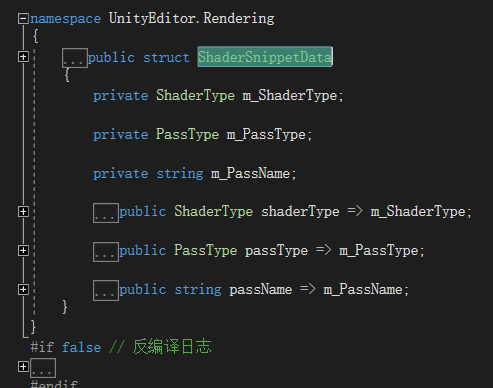
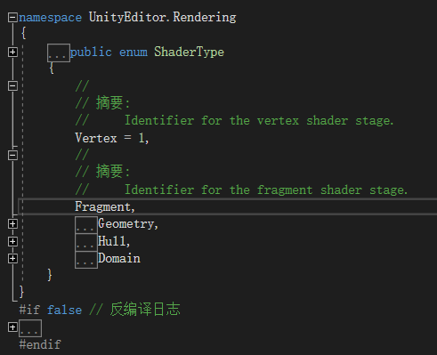
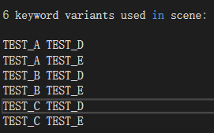
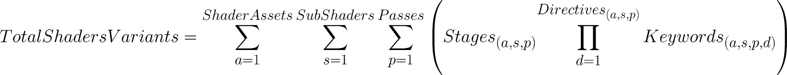
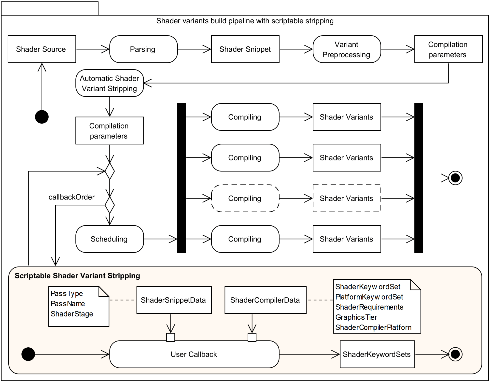
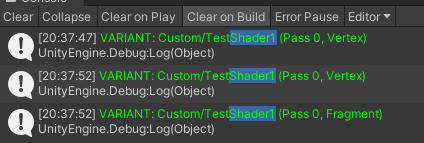
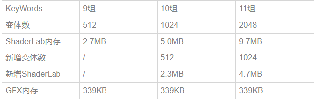

**标签：**|  _优化_  

By Prin@UWA on 2020/8/17

## 1 基础知识

### 1.1 Shader相关一些概念

  * 着色器资源（Shader asset）: The full file source code with properties（属性）, sub-shader（子着色器）, passes（通道）, and HLSL（HLSL代码）.

  * 着色器片段（Shader snippet）: The HLSL input code with dependencies for a single shader stage.(这个概念定义的不清楚)

  * 着色器阶段（Shader stage）: A specific stage in the GPU rendering pipeline, typically a vertex shader stage and a fragment shader stage.

  * 着色器关键字（Shader keyword）: A preprocessor identifier for compile-time branches across shaders.

  * 着色器关键字集（Shader keyword set）: A specific set of shader keywords identifying a particular code path.

  * 着色器变体（Shader variant）: The platform-specific shader code generated by the Unity shader compiler, for a single shader stage for a specific graphics tier, pass, shader keyword set, etc.

  * 超着色器（Uber shader）: A shader source that can produce many shader variants.

#### Shader snippet

对于snippet的概念，Unity官方的定义有点ambiguous。对此本文做了细致的研究。

##### 在Unity Documentation中

> Shader code is written by embedding “Cg/HLSL snippets” in the shader text. Snippets are compiled into low-level shader assembly by the Unity editor, and the final shader that is included in your game’s data files only contains this low-level assembly or bytecode, that is platform specific. 
> 
> HLSL program snippets are written between CGPROGRAM and ENDCG keywords, or alternatively between HLSLPROGRAM and ENDHLSL.
> 
> Each snippet must contain at least a vertex program and a fragment program, so #pragma vertex and #pragma fragment directives are required.（<https://docs.unity3d.com/Manual/SL-ShaderPrograms.html>）

Shader Snippet就是CGPROGRAM/HLSLPROGRAM 和 ENDCG/ENDHLSL之间的程序片段   
一个Snippet包含vertex shader和fragment shader 两个阶段（stage）

##### 在Shader Build Pipeline中

在Shader编译管线中，一个Snippet对应的是一个单独的Stage。一个pass中，CGPROGRAM和ENDCG之间的部分包含两个snippets，分别是vertex snippet和fragment snippet。   
对于包含两个stages（snippets）的pass，若关键字组合数为n，则一个snippet生成n个变体，一个pass生成2n个变体。

查看相关API的源码可以验证此结论:





Snippet类包含ShaderType属性，确定一个snippet是哪个stage的shader（Vertex、Fragment等）

#### Shader Variant

开发人员在写shader时，往往会在shader片段(Snippet)中定义一些关键字(Keyword)，并在代码中根据关键字开启与否控制物体的渲染过程，这样同一份shader源码可以具备多种不同的功能。最终编译的时候，引擎会根据不同的关键字组合生成多份shader程序(Program)。其中每一种组合对应的程序就是这个shader的一个变体(Variant)。

根据关键字产生shader变体的主要意义有：

  * GPU不擅长处理分支语句（if-else），通过变体可避免分支语句导致的性能下降

> GPU使用了不同于CPU的技术来实现分支语句。最坏的情况下，运行一个分支语句的时间相当于运行了所有分支语句的时间。如果在Shader中使用了大量的流程控制语句，那么这个Shader的性能可能会成倍下降。 ——《Unity Shader入门精要》

  * 游戏运行时可在代码中选择shader变体，动态改变着色器功能

Unity在打包时会把所有multi_compile产生的shader变体都打进包中

> 对所有的宏的值的组合情况都生成一份Shader的变体，这样在使用的时候直接匹配，避免在Shader代码中使用if-else判断语句。if-else在GPU的并行处理中会表现出低效的性能，因为它会把所有的if走一遍(根据条件决定是否真的运行)，再把所有的else走一遍。

#### Examples

```csharp 

Shader "MyShaderName"

{ 

Properties 

{ 

// material properties here

} 

SubShader // subshader for graphics hardware A

{ 

Pass 

{ 

// pass commands ...

} 

// more passes if needed

} 

// more subshaders if needed

FallBack "VertexLit" // optional fallback

} 

``` ```csharp 

Pass { 

// ... the usual pass state setup ...

CGPROGRAM 

// compilation directives for this snippet, e.g.:

#pragma vertex vert

#pragma fragment frag

// the Cg/HLSL code itself

ENDCG 

// ... the rest of pass setup ...

} 

``` ```csharp 

Shader "Tutorial/Display Normals" { 

SubShader { 

Pass { 

CGPROGRAM 

#pragma vertex vert

#pragma fragment frag

#include "UnityCG.cginc"

struct v2f { 

float4 pos : SV_POSITION; 

fixed3 color : COLOR0; 

}; 

v2f vert (appdata_base v)

{ 

v2f o; 

o.pos = UnityObjectToClipPos(v.vertex); 

o.color = v.normal * 0.5 \+ 0.5; 

return o; 

} 

fixed4 frag (v2f i) : SV_Target

{ 

return fixed4 (i.color, 1); 

} 

ENDCG 

} 

} 

} 

``` 

### 1.2 compile directives（编译指令）及变体的生成规则

At the start of the snippet, compilation directives can be given as #pragma statements. 

shader_feature更适用于材质的关键字，而multi_compile更适用于代码设置的全局关键字

#### multi_compile

multi_compile会默认生成所有的变体，因此应当谨慎适用multi_compile，否则将会导致变体数量激增。

```csharp 

#pragma multi_compile TEST_A TEST_B TEST_C 

#pragma multi_compile TEST_D TEST_E 

``` 



```csharp 

#pragma multi_compile __ TEST_ON 

``` 

This directive produces two shader variants: one with nothing defined (__), and one with TEST_ON defined.   
节省一个变量个数的占用（Unity中关键字有个数限制）   
如： 

#### shader_feature

```csharp 

#pragma shader_feature KW1 KW2 

``` ```csharp 

#pragma shader_feature KW_X 

#pragma shader_feature __ KW_X 

``` 

shader_feature is very similar to multi_compile. The only difference is that Unity does not include unused variants of shader_feature shaders in the final build.   
只生成对应的Material上关键字对应的变体。

  1. 预编译语句会默认生成开启第一个关键字的变体

  2. shader_feature 预编译语句行至少有两个关键字。如果只定义了一个关键字SF_A，则会默认生成一个下划线关键字” _“，默认SF_A不开启，生成一份开启关键字”_ “的变体。如果SF_A开启，则会生成分别开启”_”和”SF_A”的两份变体

  3. shader_feature 预编译语句行，如果定义了两个关键字”SF_C”和”SF_D”，则不生成下划线关键字。默认第一个关键字 “SF_C” 开启，生成一份变体。如果某个材质开启了”SF_D”，但没有材质开启”SF_C”，依然认为两个关键字都被使用到，生成两份变体。

  4. 如果同一个Material开启了同一个shader_feature行的两个关键字”SF_C”和”SF_D”，则认为开启无效，只按照默认情况生成一份变体（SF_C开启的变体）.

我们来看以下案例：   
Material-M使用原先使用的Shader为Shader-A，其上包含Shader-A中定义的关键字KW1、KW2，如果Material-M的Shader换成了Shader-B，且场景中没有其他Material使用Shader-A，那么，虽然Material-M上还记录了Shader-A中的关键字KW1和KW2，但是并不会对Shader-A生成的变体造成影响，Shader-A不会生成两份变体。   
即：Unity只会按照Shader实际对应的材质的关键字生成变体，没有使用Shader-A的材质Material-M上的关键字不会影响Shader-A的变体的生成。

#### Unity内置变体

multi_compile_fwdbase   
multi_compile_fwdadd   
multi_compile_fwdadd_fullshadows   
multi_compile_fog 

Most of the built-in shortcuts produce many shader variants. if you know the project doesn’t need them, you can use #pragma skip_variants to skip compiling some of them.

```csharp 

#pragma multi_compile_fwdadd 

#pragma skip_variants POINT POINT_COOKIE 

``` 

#### local keyword vs global keyword

The main disadvantage of shader_feature and multi_compile is that all keywords defined in them contribute towards Unity’s global keyword count limit (256 global keywords, plus 64 local keywords). 

The total number of local and global keywords per shader affects performance: in an ideal set-up, use more local keywords and fewer global keywords, to reduce the total keyword count per shader.

local keyword有助于提高项目的性能，同时也可以减少每个shader中keyword数量。

留坑: 这里笔者还存在两点疑惑

  1. local keyword 和 global keyword的区别在哪里

  2. If a Material has a local keyword enabled, and its shader changes to one that is no longer declared, Unity creates a new global keyword. 这句话实际是什么意思，它描述的问题笔者没有复现。

### 1.3 Material ShaderKeywords启用禁用宏

Material所包含的Shader Keywords表示启用shader中对应的宏，Unity会调用当前宏组合所对应的变体来为Material进行渲染。

在Editor下，可以通过将material的inspector调成Debug模式来查看当前material定义的Keywords，也可在此模式下直接定义Keywords，用空格分隔Keyword。   
在程序中，可用Material.EnableKeyword()、Material.DisableKeyword()、Shader.EnableKeyword()、Shader.DisableKeyword()来启用/禁用相应的宏。

### 1.4 变体数量

#### 计算公式



> For each supported graphics API in the project, we need a dedicated set of shader variants. (每个支持的graphics API都需要一套专用的变体集。)Shader data size are directly proportional to the number of supported graphics APIs.

#### 查看方法

在Shader的inspector面板中可以看到Shader的Compiled Code选项，点开后可以看到Shader Variants数量

### 1.6 Shader build pipeline

The shader compilation pipeline in Unity is a black box where each shader in the project is parsed to extract shader snippets before collecting the variant preprocessing instructions, such as multi_compile and shader_feature. This produces a list of compilation parameters, one per shader variant.



#### Build时，哪些变体会被编译打包？

  1. Scenes In Build里面的场景引用到的Shader

  2. Project Settings -> Graphics -> Always Include Shaders中的shader

  3. 任意位置的名为Resources的文件夹下的shaders

  4. 以上被编译的Shader脚本当中的fallback用到的shaders

#### 自动Shader变体去除

Unity executes an **automatic shader variant** stripping pass based on two heuristics(启发式方法). 

  * Project Settings

> 例如：如果虚拟现实支持（Virtual Reality Supported）被禁用，则VR着色器变体会被系统地移除掉。

  * configuration of Shader Stripping section of the Graphics Settings

下面这个着色器变体列表，里面的已启用关键字都被自动移除：

> Lightmap modes: LIGHTMAP_ON, DIRLIGHTMAP_COMBINED, DYNAMICLIGHTMAP_ON, LIGHTMAP_SHADOW_MIXING, SHADOWS_SHADOWMASK   
>  Fog modes: FOG_LINEAR, FOG_EXP, FOG_EXP2   
>  Instancing Variants: INSTANCING_ON

当虚拟现实支持被禁用时，带有下列内置关键字的着色器变体都会被移除：

> STEREO_INSTANCING_ON, STEREO_MULTIVIEW_ON, STEREO_CUBEMAP_RENDER_ON, UNITY_SINGLE_PASS_STEREO

当自动移除过程完成后，着色器构建管线会使用剩余编译参数集来安排并行着色器变体编译顺序，并根据平台所拥有的CPU核心线程尽可能多地启动多个同时编译过程。

#### 奇怪的现象——多生成一份Vertex Shader

在Build时，使用OnProcessShader对编译过程生成的变体进行输出，会发现每个Shader都会对Vertex Shader多生成一次 ，如下图，TestShader1只有一份变体。


   
观察编译过程，发现在Building Resources folder时先生成一份Vertex Shader，然后在编译结束后，会生成完整的Shader变体。那么整个编译过程是怎样的呢？为什么会预先生成一份vertex shader？笔者想对Build过程进行探索如下。   
Building Player显示的编译过程如下：

  1. Build Player

  2. Buiding scene 0: SampleScene

  3. Material1 - Custom/TestShader2 - Pass 0: Stripping Vertex programs

  4. Building Resources folder

  5. Packaging assets - globalgamemanagers.assets

  6. Standard - FORWARD: Stripping Vertex programs

  7. Skybox/Procedural - Pass 0: Stripping Vertex programs

  8. Legacy Shaders/Diffuse - FORWARD: Stripping Fragment programs

  9. Hidding/Internal-DefferedShading - Pass 0: 1 of 26 vp

  10. Hidden/Internal-ODSWorldTexture - Pass 0: Stripping Vertex programs

  11. Postprocessing Player

  12. Copying files to final destination

  13. Done

就目前得信息来看，可能在Shader变体的预处理阶段会首先生成一份Vertex Shader。

### 1.7 Shader的build及加载过程

#### Editor中

  * At import time, only do minimal processing of the shader (surface shader generation etc.).

  * Actually compile the shader variants only when needed.

  * Instead of typical work of compiling 100–10000 internal shaders at import time, this usually ends up compiling just a handful.

> Individual shader variant compilation results are cached in the project, under Library/ShaderCache folder. 

#### Build时

每个shader生成哪些变体会决定好，shader生成对应的变体之后，打进包中。   
All the “not yet compiled” shader variants are compiled, so that they are in the game data even if the editor did not happen to use them.

#### Runtime

场景加载时，加载到的object对应的Shader都会加载进内存当中，加载之后就会进行解析(Shader.Parse)   
实际进行渲染时，会将Shader写入GPU显存中(Shader.CreateGPUProgram)。

根据回答：<https://answer.uwa4d.com/question/5ce5467ad1d3d045c846d769>   
Shader进行Parse的时候，会将一部分Shader写入GPU当中，此时生成的GPU程序片段不全，在渲染实际的物体时，一定会将用到的Shader编译结果写入GPU显存。

如果提前进行warmup，就可以提前将GPUProgram写入显存。

  * 在Unity 4.x中，调用Shader.WarmupAllShaders()，可以自动编译该场景中用到的所有shader。该方法在Unity5中已经废弃

  * 没有使用5.x新的shader(Standard和StandardSpecular)，自定义shader也没有使用大量关键字等还是可以使用Shader::WarmupAllShaders

  * 调用ShaderVariantCollection.WarmUp()函数手动进行预热，编译shader并写入显存

  * 在ProjectSettings->Graphics中，设置PreloadedShaders，这样可以在加载场景时一并编译需要预加载的shader（是否会warmup不清楚）

> ShaderLab在相关shader加入内存时就已经产生，但如果没有被渲染的话不会触发CreateGPUProgram操作，如果提前在ShaderVariantCollection中收集了相关变体并执行了warmup（预热）的话，第一次渲染时就不会再CreateGPUProgram，对卡顿会有一定好处。因此第一次加载shader先warmup一下，虽然等待的时间长但是仅此一次，当你退出游戏下次再进入也不会再执行warmup，可以有效避免渲染卡顿

## 2 面对的问题

Shaders are small programs that execute on the GPU, and loading them can take some time.   
大量的Shader变体会造成以下两点问题：

  * Build时， **时间长，数据包体大**   
Large numbers of these shader variants increase game build time, and game data size.

  * Rumtime时， **占用内存高，加载耗时长（卡顿）**   
Loading large numbers of shader variants at runtime is slow and takes up memory.

我们希望 **在保证渲染效果正确的情况下，尽可能地控制项目重shader变体数量，避免产生冗余资源**

### 2.1 变体数与内存、显存的关系



变体数和ShaderLab的内存占用基本成正比，而和GFX无关。说明没有参与渲染的Shader变体是不会经历CreateGPUProgram统计到GFX内存中的。

> 一般来说shader片段中multi_compile类关键字每增加一个，或者启用的shader_feature类关键字增加一个，该Shader的变体数量就会x2，是以指数函数的方式增长的。

### 2.2 Shader变体的打包方式

Shader与Material打在一个包中，变体根据material中的keywords自动生成

  * 多个不同的material包中可能存在相同的shader变体，造成资源冗余

  * 若程序运行时动态改变material的keyword，使用shader_feature定义的宏，其 变体可能并没有被生成

Shader单独打包，使用multi_compile定义的全部宏全部变体都被生成，不会发生需要的变体未生成的情况。

  * 生成的变体数量庞大，严重浪费资源

Shader单独打包，shader_feature（需要使用ShaderVariantCollection生成变体）与multi_compile（还是生成所有变体）结合使用能够有效控制shader_feature变体数量。

  * 容易遗漏需要生成的变体，特别是需要动态替换的变体

### 2.3 Unity Material关键字的坑

实际打进包中的Shader变体数量和在Editor下预览的还是不一样的，实际打进包中的变体数量要多于Editor下预览的，并且发现了有很多隐藏的关键字，这些关键字其实根本没有显式的引用，但是却在打包的时候出现了，并且增加了Shader变体数量。

Unity关键字有个坑：   
材质球里会记录之前使用的关键字，打个比方 ：Shader A 需要开启关键字 _AKW ，Shader B需要开启关键字 _BKW ，材质球 M 起初使用了Shader A ，开启了关键字_AKW，由于某个原因这个材质球不想使用Shader A 了，切换到Shader B，开启了_BKW，那么这个材质球就会包含_AKW 、_BKW 这两个关键字。

不过如果Shader B中如果没有定义_KWA，则残留的关键字_KWA不会对变体数造成影响。旧的关键字的残留对项目的影响在实际研发中进一步考证。

## 3 工具与方案

### 3.1 Shader变体数量统计小工具

```csharp 

using UnityEditor; 

using UnityEngine; 

using System.Reflection; 

using System.IO; 

using System.Text; 

public class ShaderVariantCntGetter

{ 

[MenuItem("Tools/GetShaderVariant")] 

public static void GetAllShaderVariantCount()

{ 

System.Type t = typeof(Editor).Assembly.GetType("UnityEditor.ShaderUtil"); 

MethodInfo method = t.GetMethod("GetVariantCount", BindingFlags.Static | BindingFlags.Public | BindingFlags.NonPublic); 

var shaderList = AssetDatabase.FindAssets("t:Shader"); 

var output = System.Environment.GetFolderPath(System.Environment.SpecialFolder.DesktopDirectory); 

string pathF = string.Format("{0}/ShaderVariantCount.csv", output); 

FileStream fs = new FileStream(pathF, FileMode.Create, FileAccess.Write); 

StreamWriter sw = new StreamWriter(fs, Encoding.UTF8); 

EditorUtility.DisplayProgressBar("Shader统计文件", "正在写入统计文件中...", 0f); 

int ix = 0; 

sw.WriteLine("ShaderFile, VariantCount"); 

foreach (var i in shaderList) 

{ 

EditorUtility.DisplayProgressBar("Shader统计文件", "正在写入统计文件中...", ix / shaderList.Length); 

var path = AssetDatabase.GUIDToAssetPath(i); 

Shader s = AssetDatabase.LoadAssetAtPath(path, typeof(Shader)) as Shader; 

var variantCount = method.Invoke(null, new System.Object[] { s, true }); 

sw.WriteLine(path + "," \+ variantCount.ToString()); 

++ix; 

} 

EditorUtility.ClearProgressBar(); 

sw.Close(); 

fs.Close(); 

} 

} 

``` 

### 3.2 Shader Control

查看Shader的变体数量，冗余关键字、查看哪些材质引用了这个Shader的哪些关键字

ShaderControl的Clear All Material功能，批量清除了材质球中残留的关键字。

#### 使用方法

Assets -> Browse Shaders

查看：   
In ‘Build View’ click “Quick Build’ and make a normal build. 

> Notice the build completes very fast because this is a special build in which Shader Control only collects data about the shaders.

剔除：   
see a list of shaders compiled in your build. You can toggle the “Include” checkbox to include or not that shader or keyword in future builds.

We want to remove some keywords from the source code of the shader so we reduce the total keywords used in our project:

  1. Select ‘Project View’.

  2. Click “Scan Project”. Shader Control will quickly scan your project for shaders using keywords and will show them.

  3. show used keywords.

  4. Disable any keywords and click “Save”. Colors will change depending on which keywords are enabled in the shader.

The Build View gives you full control on which shaders or keywords are compiled (making the compilation faster and reducing the build size).   
The Project View gives you full control on keywords in shaders that are in your project by modifying them automatically (reducing count of keywords in your project).

Clean All Materials   
will scan all materials and prune any disabled keywords. This option is provided to ensure no materials are referncing a disabled shader keyword.   
批量清除了材质球中残留的关键字。

### 3.3 ShaderVariantCollection

#### 作用

> ShaderVariantCollection records which shader variants are actually used in each shader.

##### (1) 编译时，强制打包要使用的变体

有些Shader变体在运行时可能由C#脚本调用到，而在build时无法预知该变体是否会被访问，那么使用SVC可以对这部分变体进行强制打包。

##### (2) 运行时warmup

This is used for shader preloading (“warmup”), so that a game can make sure “actually required” shader variants are loaded at startup (or level load time), to avoid shader compilation related hiccups later on in the game.   
取代Shader.WarmupAllShaders()接口，提前warmup防止运行时打嗝（hiccup, 卡顿），又避免Warmup所有的Shader造成时间与内存的浪费。

#### 局限性

有了变体集之后，打包shader时，依然对shader进行了长时间的编译。由此推断，SVC无法减少Build时打包的变体数量，需要我们自行过滤排除。   
在使用ShaderVariantCollection收集变体打包时，只对shader_feature定义的宏有意义，multi_compile的变体不用收集也会被全部打进包体。

### 3.4 从Shader代码上入手：Improving shader code design

  1. First, we should make sure that every keyword is actually useful. If we can guarantee these keywords are never used, then we should remove them. 去除从未使用的关键字

  2. Second, we should combine keywords that effectively produce a single code path. 去除无效的关键字组合

```csharp 

#pragma multi_compile COLOR_ORANGE COLOR_VIOLET COLOR_GREEN COLOR_GRAY // color keywords 

#pragma multi_compile OP_ADD OP_MUL OP_SUB // operator keywords 

``` ```csharp 

#pragma multi_compile ADD_COLOR_ORANGE MUL_COLOR_VIOLET MUL_COLOR_GREEN 

#if defined(ADD_COLOR_ORANGE) 

#define COLOR_ORANGE 

#define OP_ADD 

#elif defined(MUL_COLOR_VIOLET) 

#define COLOR_VIOLET 

#define OP_MUL 

#elif defined(MUL_COLOR_GREEN) 

#define COLOR_GREEN 

#define OP_MUL 

#endif 

``` 

### 3.4 scriptable shader variants stripping(本文简写做SVS)

> 原Shader编译管线的缺陷——受编译时间的限制   
>  Unity can’t automatically select only the necessary shader variants at build time because those shader variants depend on runtime C# execution. 

SVS: Massively reduce Player build time and data size by allowing developers to control which Shader variants are handled by the Unity Shader compiler and included in the Player data.

发布版本：2018.2 beta

功能：

  * strip all the shader variants with invalid code paths, 

  * strip shader variants for unused features 

  * create shader build configurations such as “debug” and “release” without affecting iteration time or maintenance complexity.

In Unity 2018.2 beta, the shader pipeline architecture introduces a new **stage** right **before the shader variant compilation scheduling** , allowing users to **control the shader variant compilation**. This new stage is exposed via C# callbacks to user code, and **each callback is executed per shader snippet**.

**OnProcessShader** is called right **before the scheduling of the shader variant compilation**.

Each combination of **a Shader** , **a ShaderSnippetData** and **ShaderCompilerData** instances is an identifier for **a single shader variant** that the shader compiler will produce. To strip that shader variant, we only need to remove it from the ShaderCompilerData list.   
Every single shader variant that the shader compiler should generate will appear in this callback. 

#### Use Case

  1. systematically strip invalid shader variants of a render pipeline due to the various combinations of shader keywords.   
HDRP和URP分别实现了自己的Shader variants stripping功能。

  2. Another use case is a script to strip all the rendering features of a render pipeline that are not used for a specific project.

#### Tips on writing SVS code

回调序列：callbackOrder 决定了IPreprocessShaders类中Shader处理函数OnProcessShader的调用顺序(in order of increasing callbackOrder)。因此，可以在Project中写多个类继承IPreprocessShaders，在编译时，编辑器会按照callbackOrder增加的顺序，逐个调用OnProcessShader函数。

**separate the scripting per purpose**   
Script 1: Systematically strips all the shader variants with invalid code paths.   
Script 2: Strips all the debug shader variants.   
Script 3: Strips all the shader variants in the code base that are not necessary for the current project.   
Script 4: Logs the remaining shader variants and strips them all for fast iteration time on the stripping scripts.(这个没有看懂)

#### Process for writing a SVS script

  1. In the Project view, filter for all shaders.

  2. Select a shader and, in the Inspector, click Show to open the list of keywords / variants of that shader. There will be a list of keywords that are always included in the build.

  3. Make sure that you know which specific graphics features the project uses.

  4. Check whether the keywords are used in all shader stages. Only one variant is necessary for stages that don’t use these keywords.

  5. Strip shader variants in the script.

  6. Verify the visuals in the build.

  7. Repeat steps 2–6 for each shader.

#### 应用示例（两个较成熟的stripping实现）

<https://github.com/lujian101/ShaderVariantCollector>   
<https://github.com/SixWays/UnityShaderStripper>

## 4 Others

### 4.1 Standard Shader造成变体数过多的原因

由于Standard的变体太多了，所以当引用了Standard的时候，往往会存在多个Standard变体，占用大量的内存。

#### 模型导入导致

模型导入的时候，“Import Materials”是默认勾选的。所以当模型导入时，Unity会在同目录创建“Materials”目录，并创建相应的材质，而这个材质默认是使用 **Standard** 。   
解决方法: 把“Import Materials”去掉，并把没有使用的默认材质删除。

问题补充：   
没有勾选“Import Materials”的模型文件，在实例化Prefab时，ShaderLab会存在一份“Standard”的shader内存，而这个shader的引用是指向一个“Default-Material”文件（可是这文件并不存在）。   
但是，在模型和Prefab在相同的AssetBundle中，或者使用Resources加载时，却不会有“Standard”和“Default-Material”的出现。

解决方案：在需要模型与Prefab分开打包时，勾选“Import Materials”，直接使用和修改默认生成的材质。

#### 默认模型（Cube、Sphere）创建导致的

早期场景搭建时，为了方便定位和可视化，曾经使用Cube等系统默认的Mesh作为锚点，然后在启动游戏时禁用掉。   
由于这些Cube不启用，性能消耗很轻微。所以就没有理会了。   
可是，就因为是系统默认的Mesh，所以创建时，赋予的材质就是默认的材质“Default-Material”，而这个材质使用的着色器就恰恰是“Standard”。

解决的方案：删掉这些mesh或者是替换材质。

### 4.2 其他ShaderLab内存优化方案（未研究）

<https://zhuanlan.zhihu.com/p/39337699>

## 5 其他注意事项

  1. 内存中ShaderLab的大小和变体成正比关系。从减少内存方面应该尽量减少变体数量，可以使用 #pragma skip_variants。

  2. 在使用ShaderVariantCollection收集变体打包时，只对shader_feature定义的宏有意义，multi_compile的变体不用收集也会被全部打进包体。

  3. 2018.2新功能OnProcessShader可以移除无用的shader变体。比#pragma skip_variants更合理。

  4. 项目前期介入美术效果制作流程，规范shader宏定义使用，防止TA为了美术效果过度使用宏定义的情况，以过往项目经验来看，到后期进行此项工作导致的资源浪费非常之大。

  5. ShaderLab在相关shader加入内存时就已经产生，但如果没有被渲染的话不会触发CreateGPUProgram操作，如果提前在ShaderVariantCollection中收集了相关变体并执行了warmup的话，第一次渲染时就不会再CreateGPUProgram，对卡顿会有一定好处。

## Ref

<https://zhuanlan.zhihu.com/p/27336202>   
<https://www.cnblogs.com/msxh/p/12987632.html>   
<https://zhuanlan.zhihu.com/p/68888831>   
<https://www.jianshu.com/p/5a2388c9963a>   
<https://blogs.unity3d.com/cn/2018/05/14/stripping-scriptable-shader-variants/>   
<https://docs.unity3d.com/Manual/SL-ShaderPrograms.html>   
<https://docs.unity3d.com/Manual/ShaderTut2.html>   
<https://github.com/lujian101/ShaderVariantCollector>   
<http://imgtec.eetrend.com/d6-imgtec/blog/2018-06/16669.html>   
参考：<https://zhuanlan.zhihu.com/p/68888831>

