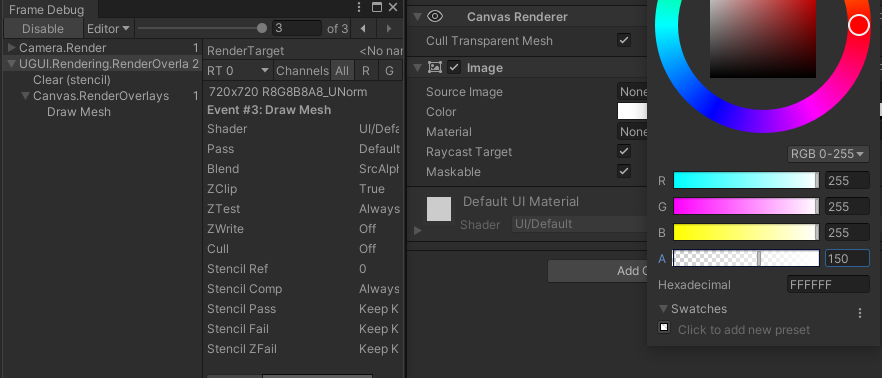
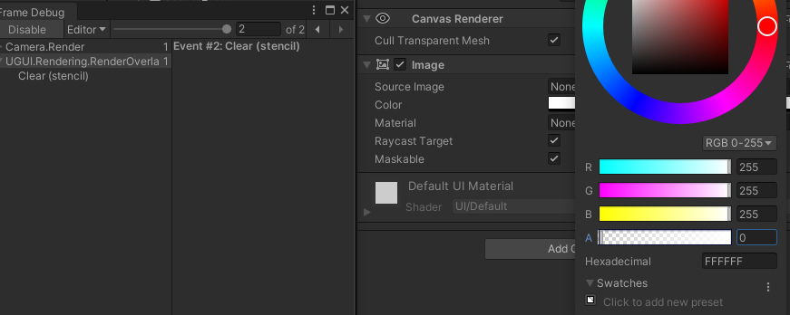

## Audio

### ImportSettings

Force To Mono：将多声道音频混合为单声道，一般手机使用单声道足够满足需求   
Load In Background：When this option is enabled, the loading of the clip will happen at a delayed time on a separate thread, without blocking the main thread. 分线程加载， 不阻塞主线程   
Ambisonic：是否环绕声

Load Type：加载方式

**Decompress On Load** ：在音频 **加载后马上解压缩** 。对 **较小的压缩声音** 使用此选项可以避免动态解压缩的性能开销，不过在加载时解压缩Vorbis编码的声音将使用大约十倍于内存的内存（对于ADPCM编码约为3.5倍），因此请勿对大文件使用此选项。   
**Compressed In Memory** ：将声音压缩在内存中并在 **播放时解压缩** 。 此选项具有轻微的性能开销（特别是对于Ogg / Vorbis压缩文件），因此仅将其 **用于加载时解压缩将使用大量内存的较大的文件** 。 解压缩发生在 **混音器线程** 上，可以在探查器窗口的音频窗格中的”DSP CPU(Digital Signal Processor)”部分进行监视。   
**Streaming** ： **动态解码** 声音。 此方法使用 **最少量的内存来缓冲从磁盘中逐步读取并在运行中解码的压缩数据** 。 解压缩发生在单独的流线程上，可以在Profiler窗口的音频窗格的”Streaming CPU”部分中监视其CPU使用情况。 即使没有加载任何音频数据，Streaming的剪辑也有大约200KB的消耗。

Preload Audio Data：预加载

Compression Format   
PCM：此选项以 **更大的文件** 大小为代价提供 **更高的质量** ，并且最适 **合非常短的声音** 效果。   
ADPCM：这种格式对于 **包含大量噪音** 且 **需要大量播放** 的声音非常有用，例如脚步声，撞击声，武器。 **压缩比** 是PCM的 **3.5倍** ，而且 **CPU使用率** 远 **低** 于MP3 / Vorbis格式，这使其成为上述类别声音的首选。   
Vorbis/MP3：压缩为较小的文件，但与PCM音频相比 **质量稍低** 。 **压缩量** 可通过”质量”滑块进行 **配置** 。 此格式最适合 **中等长度** 的音效和音乐。

Sample Rate Setting： 采样率设置   
Preserve Sample Rate: 保留采样率   
Optimize Sample Rate：此设置根据分析的最高频率内容自动优化采样率。   
Override Sample Rate：此设置允许手动覆盖采样率，因此可以有效地避免采样内容丢失。

> 要关注:   
>  OriginalSize:磁盘大小   
>  ImportedSize:内存大小   
>  Ratio:ImportedSize占OriginalSize比例

### 设置建议

  1. 建议都勾选ForceToMono：将多声道音频混合为单声道

  2. 在iOS上请使用MP3格式，在Android上使用Vorbis

  3. 场景等长音效使用Streaming + Vorbis/MP3

  4. 技能等短音效使用DecompressOnLoad + ADPCM

  5. 采样率选择手动控制到22050左右

  6. 短音频可选格式aifff或wav，长音频可选格式mp3或ogg

### 导入后处理脚本

```csharp 

using System; 

using UnityEngine; 

using System.Collections; 

using UnityEditor; 

public class MyAudioProcessor : AssetPostprocessor

{ 

public void OnPreprocessAudio()

{ 

if (!assetPath.StartsWith("Assets/MyAudio")) return; 

AudioImporter audioImporter = (AudioImporter)assetImporter; 

audioImporter.forceToMono = true; 

//Android设置

AudioImporterSampleSettings androidSettings = new AudioImporterSampleSettings(); 

androidSettings.loadType = AudioClipLoadType.DecompressOnLoad; //长音效用Streaming，短的用DecompressOnLoad

androidSettings.compressionFormat = AudioCompressionFormat.Vorbis; //Android用Vorbis

androidSettings.quality = 100; 

androidSettings.sampleRateSetting = AudioSampleRateSetting.OverrideSampleRate; //采样率控制到22050左右

androidSettings.sampleRateOverride = 22050; 

audioImporter.SetOverrideSampleSettings("Android", androidSettings); 

//iOS设置

AudioImporterSampleSettings iOSSettings = new AudioImporterSampleSettings(); 

iOSSettings.loadType = AudioClipLoadType.DecompressOnLoad; //长音效用Streaming，短的用DecompressOnLoad

iOSSettings.compressionFormat = AudioCompressionFormat.MP3; //iOS用MP3

iOSSettings.quality = 100; 

iOSSettings.sampleRateSetting = AudioSampleRateSetting.OverrideSampleRate; //采样率控制到22050左右

iOSSettings.sampleRateOverride = 22050; 

audioImporter.SetOverrideSampleSettings("iOS", iOSSettings); 

} 

} 

``` 

> Ref:   
>  <https://blog.csdn.net/LeoHiJack/article/details/95228708>   
>  <https://blog.csdn.net/u013244147/article/details/104548393>   
>  <https://zhuanlan.zhihu.com/p/27438828>

## Cull Transparent Mesh

Unity2018.2加入的新功能：Image对应的CanvasRenderer组件上可以勾选Cull Transparent Mesh

> 官方描述：Indicates whether geometry emitted by this renderer can be ignored when the vertex color alpha is close to zero for every vertex of the mesh.

若Image的Color属性的Alpha值接近于0，则该Image是看不见的，如果对其进行渲染，则会造成不必要的渲染性能开销。   
如果在Image对应的CanvasRenderer开启Cull Transparent Mesh，则Unity进行渲染时会对该Image的Color的Alpha值进行检测，若该值接近于0，就忽略该Image，不进行绘制，节约性能。




   
如上图，第二张图Image组件的Alpha值为0，由FrameDebugger可见，Unity没有对该Image进行绘制。

更具体的，可见讨论：   
I assume this culling test has a cost, which is why it’s not enabled by default/done automatically.

实现上：   
this checkbox toggles a shader feature to cull pixels in the fragment shader with very low alpha value.

Docs would seem to indicate this uses the vertex colour alpha at the vertex stage:

<https://docs.unity3d.com/ScriptReference/CanvasRenderer-cullTransparentMesh.html>

But e.g:

[https://github.com/TwoTailsGames/Un…er/DefaultResourcesExtra/UI/UI-Default.shader](https://github.com/TwoTailsGames/Un...er/DefaultResourcesExtra/UI/UI-Default.shader)

> Ref:   
>  <https://twitter.com/dmitriy_focus/status/1166706421389496321?lang=en>   
>  <https://docs.unity3d.com/ScriptReference/CanvasRenderer-cullTransparentMesh.html>   
>  <https://forum.unity.com/threads/practical-effect-of-cull-transparent-mesh.746711/>

