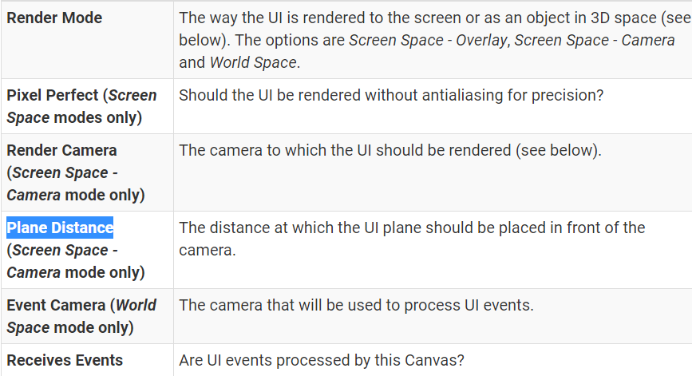
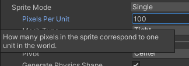
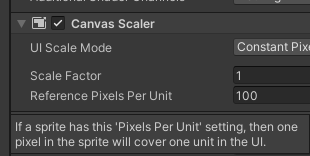
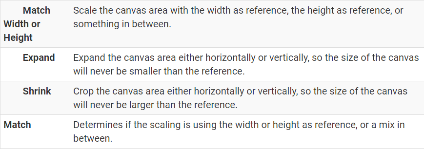
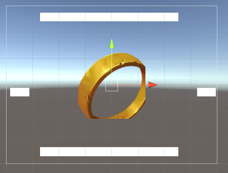
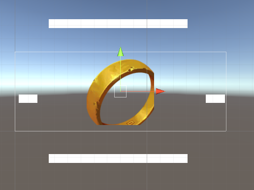
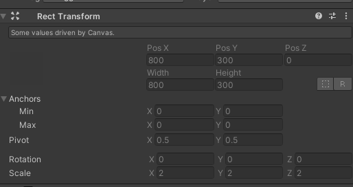
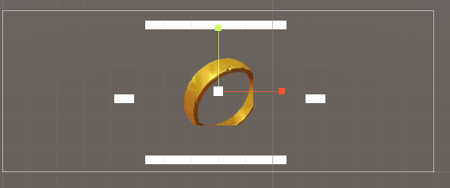

## Canvas渲染

### 一些参数

   
Pixel Perfect - 使UI元素像素对应，效果就是边缘清晰不模糊。

### RenderMode

#### Screen Space-Overlay

the Canvas is scaled to fit the screen and then rendered directly without reference to the scene or a camera

If the screen’s size or resolution are changed then the UI will automatically rescale to fit. 

The UI will be drawn over any other graphics such as the camera view.   
此模式只适合单纯的UI开发

#### Screen Space - Camera

the Canvas is rendered as if it were drawn on a plane object some distance in front of a given camera. 

The onscreen size of the UI does not vary with the distance since it is always rescaled to fit exactly within the camera frustum.

If the screen’s size or resolution or the camera frustum are changed then the UI will automatically rescale to fit.

可以用来实现在UI上显示3D模型的需求

参数：   
Render Camera:渲染摄像机   
Plane Distance:画布距离摄像机的距离   
Sorting Layer   
Order in Layer

#### World Space

the plane need not face the camera and can be oriented however you like.

参数Event Camera - 用来指定接受事件的摄像机

## 分辨率自适应 - Canvas Scaler

### 关于Pixels Per Unity

Sprite中的设置：

   
对于256x256的图片，这个值设置成100，意味着这个图的大小是 2.56x2.56 Units。

Canvas中的设置：

   
指的是元素的1Unit对应UI屏幕上的多少像素。   
2.56x2.56 Units的图片，对应屏幕上的256x256的像素。

For sprites that have the same Pixels Per Unit as the Reference Pixels Per Unit in the Canvas, the pixel density will be one to one.

### 自适应方法

Reference Resolution - 开发时的分辨率。以后缩放就参考它。

适应屏幕分辨率，本质是选择一个合适的缩放Canvas的方式。屏幕的宽高比会变化，Canvas的宽高比要与屏幕永远一致。Unity提供了几种方式 ，用来对Canvas进行缩放，来保证Canvas的宽高比与实际屏幕一致。

#### Match

Match - Determines if the scaling is using the width or height as reference, or a mix in between.   
处于中间某处时，对上述两者的影响进行权重加成 。所以一般我们都把其放在0.5的位置（0.618）

缩放时，UI元素之间的相对位置的比例是不变的。   
Canvas进行 **等比缩放** 。

如图，Reference Resolution为800x600。

Match Width - 匹配Width，保持Canvas的Width与Reference一致，缩放Heigth来保证比例与屏幕一致。比例一致后，Scale指的是当前的Canvas最终画到手机上时，应该进行的缩放。

当Resolution为1600x800时，Width不变，缩放Canvas的Height来保持比例与屏幕一致。因此，Canvas变为800x300。Scale为2，表示 屏幕 = Canvas x 2 ，Canvas放大两倍后画到屏幕上。

一般是Match Height，保持Canvas的高度不变，背景图的宽度画的长一点，用来适配不用的屏幕。UI元素的锚点设置为四个角即可。

#### Expand & Shrink

Expand - Expand the canvas area either horizontally or vertically, so the size of the canvas will never be smaller than the reference.   
Shrink - Crop the canvas area either horizontally or vertically, so the size of the canvas will never be larger than the reference.

## Ref

<https://docs.unity3d.com/Packages/com.unity.ugui@1.0/manual/class-Canvas.html>

