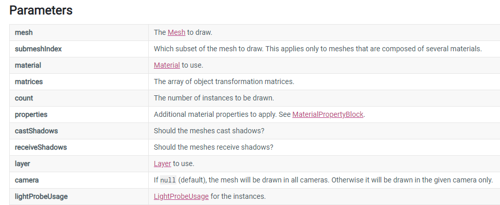

从引擎提供的接口的层面去看渲染相关知识体系。

## CommandBuffer

List of graphics commands(rendering commands - “set render target, draw mesh, …”) to execute. 

> Command Buffers - **“list of things to do” buffers**

Command buffers can be created and then executed many times if needed.   
Typically they would be used to extend Unity’s rendering pipeline in some custom ways. For example, you could render some additional objects into deferred rendering g-buffer after all regular objects are done, or do custom processing of light shadow maps. 

相关API：

  * Camera.AddCommandBuffer

  * Light.AddCommandBuffer

  * Graphics.ExecuteCommandBuffer

Some of its Public Methods：

  * Blit - Add a “blit into a render texture” command.(Note that Blit changes the currently active render target. After Blit executes, dest becomes the active render target.)

  * DrawMesh - Add a “draw mesh” command.

  * DrawMeshInstanced

  * SetComputeBufferParam - Adds a command to set an input or output buffer parameter on a ComputeShader.

  * DrawRenderer - Add a “draw renderer” command.

### low-level & high-level command buffer

**A command buffer in graphics** is a low-level list of commands to execute. For example, 3D rendering APIs like Direct3D or OpenGL typically end up constructing a command buffer that is then executed by the GPU. Unity’s multi-threaded renderer also constructs a command buffer between a calling thread and the “worker thread” that submits commands to the rendering API.

**In Unity scripting API** , the “commands” are somewhat higher level. Instead of containing things like “set internal GPU register X to value Y”, the commands are “Draw this mesh with that material” and so on.

For example, you could render some additional objects into deferred shading G-buffer after all regular objects are done. Or render some clouds immediately after skybox is drawn, but before anything else. Or render custom lights (volume lights, negative lights etc.) into deferred shading light buffer after all regular lights are done. And so on; we think there are a lot of interesting ways to use them.

## Renderer

A renderer is what makes an object appear on the screen. Use this class to access the renderer of any object, mesh or Particle System. Renderers can be disabled to make objects invisible, and the materials can be accessed and modified through them. 

Some of its Properties:

  * bounds 

  * isVisible 

  * lightmapIndex 

  * sharedMaterial 

  * sortingOrder 

  * worldToLocalMatrix 

Public Methods:

  * GetPropertyBlock 

  * SetPropertyBlock 

Messages:

  * OnBecameVisible 

  * OnBecameInvisible 

### Mesh Renderer

  * Mesh Renderer

  * Materials

  * Lighting

  * Lightmapping

### Line Renderer

The Line Renderer component takes an array of two or more points in 3D space, and draws a straight line between each one. You can use a Line Renderer to draw anything from a simple straight line to a complex spiral.

### Trail Renderer

The Trail Renderer component renders a trail of polygons behind a moving GameObject. This can be used to give an emphasized feeling of motion to a moving object, or to highlight the path or position of moving objects. 

## RenderBuffer

Color or depth buffer part of a RenderTexture.

RenderTexture = RenderBuffer combination.

A single RenderTexture object represents both color and depth buffers, but many complex rendering algorithms require using the same depth buffer with multiple color buffers or vice versa.

Related API

  * RenderTexture.colorBuffer

  * RenderTexture.depthBuffer

  * Graphics.activeColorBuffer

  * Graphics.activeDepthBuffer

  * Graphics.SetRenderTarget.

## RenderTexture

Render textures are textures that can be rendered to.   
They can be used to implement image based rendering effects, dynamic shadows, projectors, reflections or surveillance cameras.

RenderTexture是unity定义的一种特殊的Texture类型,它是连接着一个FrameBufferObject的存在于GPU端的Texture(Server-Side Texture)

One typical usage of render textures is setting them as the “target texture” property of a Camera (Camera.targetTexture), this will make a camera render into a texture instead of rendering to the screen.

Static Properties:

  * antiAliasing 

  * colorBuffer 

  * depthBuffer

  * sRGB 

  * useMipMap 

Public Methods:

  * Create 

  * GenerateMips 

  * IsCreated 

  * Release 

Static Methods:

  * GetTemporary 

  * ReleaseTemporary 

### RenderTexture.active

Currently active render texture.   
All rendering goes into the active RenderTexture. If the active RenderTexture is null everything is rendered in the main window.

Setting RenderTexture.active is the same as calling Graphics.SetRenderTarget. 

```csharp 

using UnityEngine; 

using System.Collections; 

// Get the contents of a RenderTexture into a Texture2D

public class ExampleClass : MonoBehaviour

{ 

static public Texture2D GetRTPixels(RenderTexture rt)

{ 

// Remember currently active render texture

RenderTexture currentActiveRT = RenderTexture.active; 

// Set the supplied RenderTexture as the active one

RenderTexture.active = rt; 

// Create a new Texture2D and read the RenderTexture image into it

Texture2D tex = new Texture2D(rt.width, rt.height); 

tex.ReadPixels(new Rect(0, 0, tex.width, tex.height), 0, 0); 

// Restorie previously active render texture

RenderTexture.active = currentActiveRT; 

return tex; 

} 

} 

``` 

## Graphics

Raw interface to Unity’s drawing functions.   
This is the high-level shortcut into the optimized mesh drawing functionality of Unity.

Static Properties

  * activeColorBuffer - Currently active color buffer (Read Only).

  * activeColorGamut - Returns the currently active color gamut.

  * activeDepthBuffer - Currently active depth/stencil buffer (Read Only).

Static Methods

  * Blit(位块传送) - Copies source texture into destination render texture with a shader.

  * DrawMesh - Draw a mesh.

  * DrawMeshInstanced - Draw the same mesh multiple times using GPU instancing.

  * DrawMeshInstancedIndirect - Draw the same mesh multiple times using GPU instancing.

  * DrawMeshInstancedProcedural - Draw the same mesh multiple times using GPU instancing. This is similar to Graphics.DrawMeshInstancedIndirect, except when the instance count is known from script, it can be supplied directly using this method, rather than via a ComputeBuffer.

  * DrawMeshNow - Draw a mesh immediately.

  * DrawTexture - Draw a texture in screen coordinates.

  * ExecuteCommandBuffer - Execute a command buffer.

### Graphics.Blit

Copies source texture into destination render texture with a shader.   
Blit sets dest as the render target, sets source **_MainTex** property on the **material** , and draws a full-screen quad.

This is mostly used for implementing post-processing effects.

If you are using the Built-in Render Pipeline, when dest is null, Unity uses the screen backbuffer as the blit destination. However, if the main camera is set to render to a RenderTexture (that is, if Camera.main has a non-null targetTexture property), the blit uses the render target of the main camera as destination.   
If you are using a Scriptable Render Pipeline (like HDRP or Universal RP), to blit to the screen backbuffer using Graphics.Blit, you have to call Graphics.Blit from inside a method that you register as the RenderPipelineManager.endFrameRendering callback.

Note that if you want to use a depth or stencil buffer that is part of the source (Render)texture, you have to manually write an equivalent of the Graphics.Blit function - i.e. Graphics.SetRenderTarget with destination color buffer and source depth buffer, setup orthographic projection (GL.LoadOrtho), setup material pass (Material.SetPass) and draw a quad (GL.Begin).

Graphics.Blit changes RenderTexture.active. Keep track of the previously active RenderTexture if you need to use it after calling Graphics.Blit.

### Graphics.SetRenderTarget

This function sets which RenderTexture or a RenderBuffer combination will be rendered into next.   
Use it when implementing custom rendering algorithms, where you need to render something into a render texture manually.

Calling SetRenderTarget with just a RenderTexture argument is the same as setting RenderTexture.active property.

### Graphics.DrawMeshInstanced

Draw the same mesh multiple times using GPU instancing.

> Similar to Graphics.DrawMesh, this function draws meshes for one frame without the overhead of creating unnecessary game objects.

The transformation matrix of each instance of the mesh should be packed into the matrices array. You can specify the number of instances to draw, or by default it is the length of the matrices array. Other per-instance data, if required by the shader, should be provided by creating arrays on the MaterialPropertyBlock argument using SetFloatArray, SetVectorArray and SetMatrixArray.



Note: You can only draw a maximum of 1023 instances at once.

### Graphics.DrawMeshInstancedIndirect

Similar to Graphics.DrawMeshInstanced, this function draws many instances of the same mesh, but unlike that method, the arguments for how many instances to draw come from bufferWithArgs.

## GL

Low-level graphics library.   
Note that in almost all cases using Graphics.DrawMesh or CommandBuffer is more efficient than using immediate mode drawing.

GL immediate drawing functions use whatever is the “current material” set up right now (see Material.SetPass). The material controls how the rendering is done (blending, textures, etc.), so unless you explicitly set it to something before using GL draw functions, the material can happen to be anything. Also, if you call any other drawing commands from inside GL drawing code, they can set material to something else, so make sure it’s under control as well.

GL drawing commands execute immediately. That means if you call them in Update(), they will be executed before the camera is rendered (and the camera will most likely clear the screen, making the GL drawing not visible).

The usual place to call GL drawing is most often in OnPostRender() from a script attached to a camera, or inside an image effect function (OnRenderImage).

## Matrix4x4

A standard 4x4 transformation matrix.   
A transformation matrix can perform arbitrary linear 3D transformations (i.e. translation, rotation, scale, shear etc.) and perspective transformations using homogenous coordinates. 

Matrices in Unity are column major. - 列优先存储（不同于GLSL的行优先）

### Matrix4x4.TRS

```csharp 

public static Matrix4x4 TRS(Vector3 pos, Quaternion q, Vector3 s); 

``` 

Creates a translation, rotation and scaling matrix.

The returned matrix is such that it places objects at position pos, oriented in rotation q and scaled by s.

## Quaternion

### Quaternion.LookRotation

Creates a rotation with the specified forward and upwards directions.

Z axis will be aligned with forward, X axis aligned with cross product between forward and upwards, and Y axis aligned with cross product between Z and X.

## Ref

Unity Documentation   
<https://www.jianshu.com/p/fa73c0f6762d>

