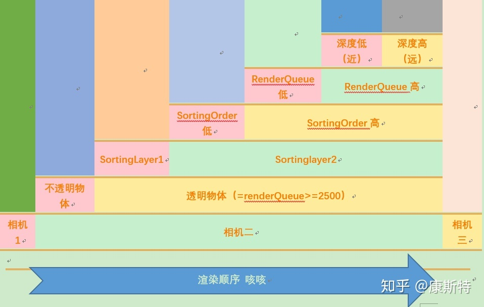
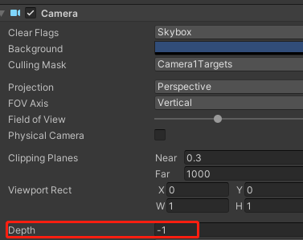
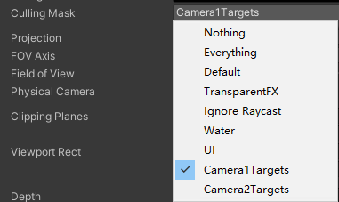
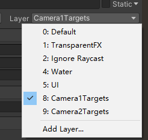
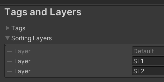
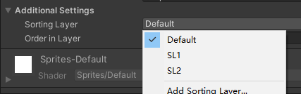
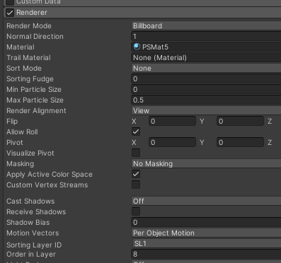
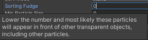

## 决定渲染顺序的因素

### Camera Depth

按照Camera的Depth值从低到高的顺序，逐个Camera进行渲染。

每个Camera绘制的内容可以在CullingMask当中设置——设置绘制哪些Layers的物体

   
物体的Layer可以在Inspector面板进行设置。

### Opaque-Skybox-Transparent

Queue<=2500 - Opaque   
Queue>=2501 - Transparent

### Sorting Layers + Order in Layer

可在Project Settings->Tags and Layers->SortingLayers中添加Layer。

在ParticleSystem、Sprite等Unity动态生成网格的Component中设置Sorting Layer与Order in Layer，来决定物体绘制的顺序，绘制时按从小到大排序。

### RenderQueue

RenderQueure是Material的一个属性。   
按照渲染队列，从低到高绘制。

Background (1000) - rendered before any others. You’d typically use this for things that really need to be in the background.

Geometry (default) (2000) - this is used for most objects. Opaque geometry uses this queue.

AlphaTest (2450) - alpha tested geometry uses this queue. It’s a separate queue from Geometry one since it’s more efficient to render alpha-tested objects after all solid ones are drawn.

Transparent (3000) - this render queue is rendered after Geometry and AlphaTest, in back-to-front order. Anything alpha-blended (i.e. shaders that don’t write to depth buffer) should go here (glass, particle effects).

Overlay (4000) - this render queue is meant for overlay effects. Anything rendered last should go here (e.g. lens flares, UI).

### Sorting Fudge

Particle System组件还有一个属性：Sorting Fudge，在其他值都相同时，这个值会影响绘制的先后顺序，值比较高的先绘制。

### 深度排序

按照 **包围盒** 中心点的深度进行排序

  * 不透明物体 - 由近到远（从前向后）

  * 透明物体 - 由远到近（从后向前）

## 实践建议

### 明确分层

例如UI上的半透明（特效、面片）始终在3D场景之上，则一般分多个相机来绘制。   
大片填充率的物件，例如地形，天空等，一般为提高深度命中，都会选择在延后批次绘制。   
Draw character before the terrain.

## Ref

<https://zhuanlan.zhihu.com/p/55762351>

