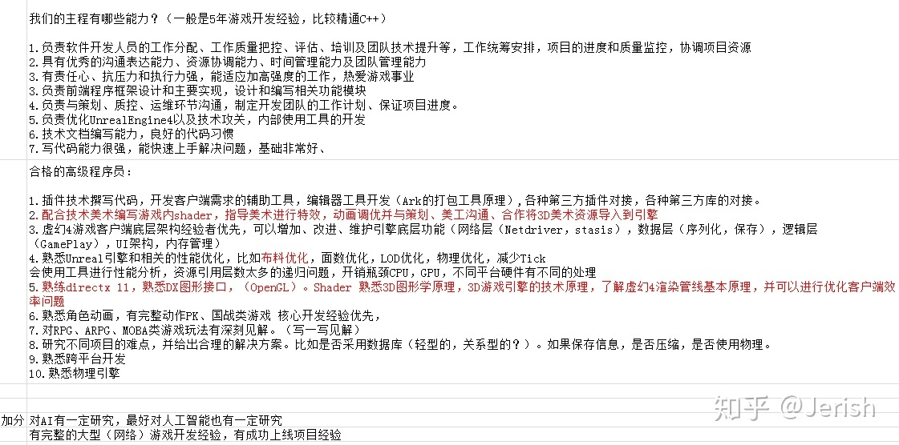

# 信息提取

## 道理

**缓解焦虑的唯一办法，只有提高能力。**

## 研究领域

  1. 客户端渲染
  2. 服务器架构
  3. gameplay专家，游戏逻辑
  4. 技术管理/主程序
  5. 优化
  6. 引擎功能开发

# 内容搜集

## MaxwellGeng

什么叫“数学比较差，做不了图形的东西”？ 我也软件工程在读，我数学底子也差（微分和积分一个BC一个C了解一下？），现在起码通了一遍PBR的材质和后处理特效了，也跟着GDC和Siggraph分享以及Github上众多前辈留下的脚印比着葫芦画瓢写了一套晃晃悠悠的渲染管线了，这不叫“图形学的东西”吗？CPP底子薄？谁CPP底子不薄啊？？生下来就会啊？！

## Jerish

我有价值，起码当前的我是有竞争力的，我在UE4上（以及相关技术）的功底就是我当前的核心竞争力。我有一个特点，就是能钻研，你只要有源码我就能看，愿意主动看，而且还尽可能要求自己都看懂，看懂还能给人讲明白，能正确的修改其中的问题。

**竞争力就是你的必要性以及不可替代性。必要性是指你所在的技术位置很重要，很多游戏团队都需要。不可替代性是指花同样的成本（或稍微高一些）去找一个能替代你的人很困难。**

在完成自己的任务后就开始研究身边人的工作内容，看看他们做的东西难点在哪？我有没有办法解决？差距在哪里？同时，我在空闲时间就去看各大游戏公司的招聘条件，主程什么要求、高级程序员什么要求，我离这个要求有多远。实在一点的说，衡量你竞争力的标准就是你能不能找到工资更高的工作，所以你完全可以通过网络，技术qq群等去查找你需要的能力。  

  
专心搞技术，那么就 **客户端渲染** 、 **服务器架构** 选一个不停的深入研究  
国内短期还不会需要 **gameplay专家**  
如果想走 **技术管理** ，那就不要在意客户端服务器gameplay，能学多少学多少，然后多跟项目，了解各方面的技术与项目管理细节。我在和主程沟通的时候，发现他什么都懂，可以流畅的与所有程序沟通不同的技术，定制目标，安排任务，还能提出建议给出参考资料。这就是 **主程序** 的竞争力。

## flashyiyi

做架构的，做图形的，做战斗的，做UI的，做优化的，做工具的

程序员只靠技术，竞争力确实比较有限，但只要你能稍微跨点界，你的竞争力都会飞速上涨，跨美术或者策划都行， **管理能力强** ，也是优点。

**架构** 就不用说了，基本都是老资格。重要程度也不用多说。

做 **优化** 的不是说只做优化，而是会做优化。你会做优化，你就有了自己的核心竞争力。说的明白点就是搞底层的。

**做工具的——引擎功能开发** 要点是了解各个开发者的真实需求，而且架构能力要好，通用性要高，做出来的东西不至于没人愿意用（随便找个人来做这个的结果通常都是没人用）。我这个名字可能不太好，其实就是做引擎的。但现在没必要做引擎，所以就是做通用组件，搞编辑器啥的。  
我举个具体的例子，一个数据编辑器的要点是什么？1.修改简单，具体做法就是通过元标签生成界面。2.热更，修改数据后在游戏内部就能生效。然而这种需求，基本上不要指望策划或者美术会给你提，他们只会缺什么要什么。这得靠你的悟性。当然实现上也不能说没有难度。

**图形** 好像也不用提，因为稍微有点门槛。图形后面还可以转TA，必要性更高，即使是国内的低级项目也有需求（高级的图程，不做牛逼东西，确实不太用得上）。

做 **战斗** 的，基本就是写逻辑，oop能力要强，基本也不会没人要。而且做战斗的经常会直接参与战斗细节的调整，因为自己调比暴露参数快多了，细节参数需求也很难到位，尤其遇到纠缠在一起的复杂逻辑。能自己调战斗的程序员必然是有竞争力的，没有也有，毕竟逻辑足够复杂，而且招到合适的不比招个图程容易。如果有人觉得图程更难，说明他们游戏的逻辑部分太简单。逻辑这东西，难度是随着复杂度指数级上升的。

## 顾煜

**缓解焦虑的唯一办法，只有提高能力。**  
不是只有做图形学才是做游戏开发的唯一出路，游戏开发领域值得学习的东西太多了。

先打好基础。游戏开发本质上还是软件开发，编程语言本身、设计模式、架构、软件工程知识等，都要深入学习。

再从Gameplay切入。寻路、人物行为、高层动画、网络同步方案、UI界面、各种脚本，高层gameplay一般比较直观，不存在太多的前置技术需求，每一个领域都是可以快速切入，在几个月里面深入熟悉。

然后考虑偏底层的模块。多线程、资源管理、内存管理、性能优化、工具链、渲染等等。这些领域需要一些前置的技术学习，但每一个领域也都不是学不会的，只是费时更久些。

最后方方面面知识都接触过了，融会贯通，培养技术的想象力，能结合各种技术，随时结合已有的技术，解决具体的问题。

## gougou槐宏文

最稀缺的人才，就是高质量独立游戏制作者的模式，一个人可以包揽设计和实现，一个人可以完成迭代，从设计到打磨玩法全部做好（需要动画美术支持可能），这是最理想的gameplay最稀缺的人才。

做游戏是工程学，不是做研究。一个好的工作室的技术积累，大部分的时间不是研究高精尖的算法，而是 **在优化自己的生产管线** 。也就是说，如何 **提高自己工作室某个类型开发过程的效率** ，降低开发成本，优化迭代速度，靠着强大的产出工具链产出内容，完成优秀的产品。如果你仔细看看很多gdc关于pipeline的talk，看看虚幻引擎的工具集，等等，你会发现，这里面不只是技术的积累，更是在某一个游戏领域经验的积累。比如ue4的cinematic的工具集，没有做过很多大型3A游戏的cine的经验是没有办法优化的如此好的，这里面当然需要好的程序技术，但是也需要对这个行业，对游戏开发很懂的人才能做出来，这不是一个算法的问题。好的pipeline可以极大的节省成本，优化流程，是一个游戏工作室最核心的竞争力和技术积累之一。
