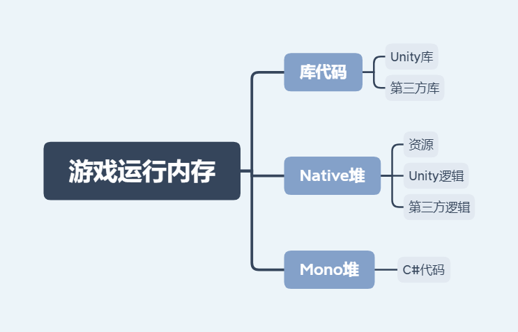

## Terms

Ref: <https://blog.csdn.net/greedylin/article/details/103711555>   
物理内存

### 1.1 Cache

CPU访问内存是一个慢速过程，因此会使用cache来加速访问，CPU如果在Cache中没有找到数据，称为一次Cache Missing，如果内存数据 指令是不连续的，会导致大量的Cache Missing

Unity的ECS和DOTS的目的之一就是提高内存的连续性，减少Cache Missing

> 台式设备与移动设备的内存架构差异很大   
>  CPU板上面积更小，缓存级数更少，大小也更小，例如一台台式机，L3的大小为8-16M,而移动的CPU,例如骁龙845，只有2M，Cache Missing的概率更大

### 1.2 显存

移动设备没有独立显卡以及显存，有的时候，你的内存使用并不大，但还是会内存溢出，例如在Android上，可以看一下有没有OpenGL的out of memory的log，这意味这显存使用太大了

### 1.3 虚拟内存

  1. 内存交换   
**移动设备不支持内存交换** （注：就是把部分物理内存中的数据保存在硬盘上）   
谷歌的解释是移动设备和台式设备的IO **速度** 是不一样的，因此移动设备在做内存交换的时候会耗费大量的时间在IO上，并且移动设备的存储介质的 **可擦写次数** 和台式设备差距也很大

  2. iOS可以进行内存压缩   
把不活跃的内存压缩起来，放在特定的内存空间中，以节约物理内存，所以在iOS上可以看到有的时候实际使用的内存比物理内存大很多

### 1.4 内存寻址范围

32位CPU和64位CPU   
严格来说，它们的寻址范围是无法确定谁高谁低的，CPU的位数指的是运算位数，不是MCU位数，只是目前大部分是对应的，即32位CPU对应32位的寻址范围，64位CPU对应64位的寻址范围

### 1.5 栈内存

主要存储小而短的数据。主要是一些值类型得数据，分配和回收很简单，快捷。

### 1.6 堆内存

主要存储大而时间长的数据，主要是引用类型数据。

#### 堆内存分配步骤：

  1. 检查堆中分配单元是否足够，如果充足则直接分配，如果不够则执行b步骤。

  2. 检测到堆内存不足则出发gc释放内存（耗时），再次检查堆中分配单元是否足够，如果充足则直接分配，如果不够则执行c步骤。

  3. 扩大堆内存大小（非常耗时），再来分配内存。

#### 堆内存回收方式有三种：

  1. 系统定期自动回收。

  2. 分配内存不足时触发内存回收。

  3. 我们自己手动触发回收（执行：System.GC.Collect()）。

### 其他术语

OOM - Out Of Memory

## 2 硬件设备

### 2.1 显存

显存，也被叫做帧缓存，它的作用是用来存储显卡芯片处理过或者即将提取的渲染数据。如同计算机的内存一样，显存是用来存储要处理的图形信息的部件。

PC上，显存是显卡上的一部分，是一块独立的存储设备。   
移动设备上，内存与显存在硬件层面上是一体的，在软件层面上，将内存中的一部分划分出来作为显存。

#### 显卡

显卡是主板上一个BGA封装的chipset，类似于CPU（Central Processing Unit），业内叫GPU(Graphics Processing Unit），市场上主要有nVIDIA和AMD两个厂商。图形芯片相当于显卡的CPU，不过它的主要任务是处理显示信息，在处理信息的过程中，它会产生大量的临时数据（未处理的、正在处理的、已经处理完成的），这就需要一个专门的地方来存放这些临时数据，那就是显存了，它也可能是一个芯片，也可能只是芯片的一部分，这要看硬件的设计（独立显卡和集成显卡）。

显卡的工作原理是：在显卡开始工作(图形渲染建模)前，通常是把所需要的材质和纹理数据传送到显存里面。开始工作时候(进行建模渲染)，这些数据通过AGP总线进行传输，显示芯片将通过AGP总线提取存储在显存里面的数据，除了建模渲染数据外还有大量的顶点数据和工作指令流需要进行交换，这些数据通过RAMDAC转换为模拟信号输出到显示端，最终就是我们看见的图像。

## 3 Unity内存

### 3.1 U3D开发使用的三种内存

Ref: <https://gameinstitute.qq.com/community/detail/103695>   
实际上，Unity3D游戏开发使用的内存一共有三种：程序代码、托管堆(Managed Heap)以及本机堆(Native Heap)。

#### 程序代码

包括了所有的Unity3D游戏开发 **引擎** ，使用的 **库** ，以及你所写的所有的 **游戏代码** 。在编译后，得到的运行文件将会被加载到设备中执行，并占用一定内存。这部分内存实际上是没有办法去“管理”的，它们将在内存中从一开始到最后一直存在。一个空的Unity3D游戏开发默认场景， _什么代码都不放_ ，在 _iOS设备_ 上占用内存应该在 _17MB_ 左右，而加上一些自己的代码很容易就飙到20MB左右。想要减少这部分内存的使用，能做的就是减少使用的库。

> Editor和Runtime是完全不同的，不仅是内存大小不同，分配时机，方式都不同，例如一个asset，在Runtime下，不主动load，不会进内存，Editor下，只要打开Unity，就可能会加载进内存，这种策略是为了保证编辑时的流畅，这种策略也导致首次打开Unity项目耗时特别长，会转换资源，再load相关资源，在2019.3中有了新的策略，按需导入和加载

#### 托管堆(Managed Heap)(Mono堆内存)

是被Mono使用的一部分内存。Mono是一个开源的.net框架的一种实现，对于Unity开发，其实充当了基本类库的角色。托管堆用来存放类的实例(比如用new生成的列表，实例中的各种声明的变量等)。

“ **托管** ”的意思是Mono“应该” **自动地改变堆的大小来适应你所需要的内存** ，并且定时地使用垃圾回收(Garbage Collect)来释放已经不需要的内存。关键在于，有时候你会忘记清除对已经不需要再使用的内存的引用，从而导致Mono认为这块内存一直有用，而无法回收，这就是内存泄露。

ManagedHeap的内存值是由所写的C#代码来引起并造成的, 与GameObject数量、资源量无关。

同时，Managedheap的大小完全是由Mono来决定的，用户所写的任何脚本均是由Mono来负责解析。 **Mono的堆内存** 是 **只升不降** 的，这是Mono的一个问题，Unity暂时也无法对其进行修改。因此，只能建议开发者在编写代码时尽可能地优化代码，避免不需要的堆内存分配。其原理如下：

> 在Unity环境下， **Mono堆内存的占用，是只会增加不会减少的** 。具体来说，可以将Mono堆，理解为一个内存池，每次Mono内存的申请，都会在池内进行分配；释放的时候，也是归还给池，而不会归还给操作系统。如果某次分配，发现池内内存不够了，则会对池进行扩建——向操作系统申请更多的内存扩大池以满足该次的内存分配。需要注意的是，每次对池的扩建，都是一次较大的内存分配，每次扩建，都会将池扩大6-10M左右

##### 一些概念

Reserved Mono内存：Mono向操作系统申请的总内存   
Used Total：Mono内存池的代码使用到的内存

> Reserve：预定，储备，拥有
> 
> 如果是在Editor中运行时，那么该数值是会比较大，因为编辑器运行游戏时，底层会做很多额外的事情，比如更多的log输出等，从而占据较多的堆内存。而如果在真机运行时看到该数值时，那么80M是比较大的，这个需要你对你的代码来进行优化，避免一些不必要的堆内存分配。比如，不要总是new一个class、array、container等等。   
>  可以在CPU Profiler中的GC Alloc处查看游戏每帧的堆内存分配。   
>  建议时刻关注CPU Profiler中的GC Collect值，查看由哪些选项分配较大或不断分配GC Allocation。这个是造成Managed Heap不断增大的原因。

#### 原生堆(Native Heap)

是Unity3D游戏开发引擎进行申请和操作的地方，比如贴图，音效，关卡数据等。Unity3D 使用了自己的一套内存管理机制来使这块内存具有和托管堆类似的功能。基本理念是，如果在这个关卡里需要某个资源，那么在需要时就加载，之后在没有任何引用时进行卸载。

听起来很美好也和托管堆一样，但是由于Unity3D有一套自动加载和卸载资源的机制，让两者变得差别很大。自动加载资源可以为开发者省不少事儿，但是同时也意味着开发者失去了手动管理所有加载资源的权力，这非常容易导致大量的内存占用(贴图什么的你懂的)，也是Unity3D给人留下“吃内存”印象的罪魁祸首。

### 3.2 Profiler中的内存划分

#### Simple模式

Total: Accumulated value from all areas below

Unity: The amount of memory allocations in native Unity code, tracked by the native memory manager system and allocated in memory pools according to their type, source and platform specific allocation patterns.

Mono: The total heap size and used heap size managed code uses. This memory is garbage collected.

GfxDriver: The estimated amount of memory the driver uses on Textures, render targets, Shaders, and Mesh data.

> 用来显示的数据，如Mesh、Texture等，Unity加载出来就会直接放在显存当中，需要显示时，不需要在内存中来读取。加载时，（如果没有开启Read/Write），有短暂的时间在内存当中，有一个从内存向显存传输数据的过程。传输结束就会把内存当中的部分删除掉。   
>  如果Mesh等开启Read/Write，为了方便对其进行读写，内存当中的数据不会被清除掉，内存与显存中各有一份。

Audio: The Audio system’s estimated memory usage

Video: The Video system’s estimated memory usage

Profiler: Total memory the Profiler uses

#### Detailed模式

Assets — 当前从 scenes, Resources 和 Asset Bundles加载的总资源。   
Built-in Resources — Unity Editor 资源 或者 Unity default 资源,   
Not Saved — 被标记为 DontSave的GameObjects   
Scene Memory — GameObject和它附属的Components   
Other — 其他不在上面几条分类中的。

Other 下的一些内容：

  * Objects - 实际上这里值是由一些BUG导致的。这一项表示各种从Object继承的对象，包括纹理，Mesh等等。它们在某个时刻和实际上的对象断开了链接，可以忽略。

  * System.ExecutableAndDlls：这是Unity的猜测值。它尝试通过汇总文件大小来猜测已加载的二进制代码消耗的内存。

#### Used和Reserved

Used和Reserved均是物理内存   
Reserved是unity向系统申请的总内存，Unity底层为了不经常向系统申请开辟内存，开启了较大一块内存作为缓存，即所谓的Reserved内存，而运行时，unity所使用的内存首先是向Reserved中来申请内存，当不使用时也是先向Reserved中释放内存，从而来保证游戏运行的流畅性。

> 建议尽可能地控制Used Total的大小，Used Total越大，则Reserved Total越大，而当Used Total降下去后，Reserved Total也是会随之下降的（但并不一定与Used Total同步）。

通过PSS来查看移动端的内存是相当不准确的。   
而PSS中多出的内存大致分为两部分

  1. App在运行会调用底层的一些核心库，这些库都会占用一定的内存

  2. 第二部分则是移动系统决定的，即虽然游戏中已经将资源卸载掉，但在系统层面上，系统并不会及时将其清除，而是将其缓存住，这样做的处理是为了便于以后该资源的复用效率，同时，当系统的内存分配达到上限时，系统本身会调用内存清理机制来轮询这些缓存区域，进而释放内存。

#### GfxDriver

GfxDriver可以理解为GPU显存开销，主要由Texture，Vertex buffer以及index buffer组成。所以尽可能地减少或释放Texture和mesh等资源，即可降低GfxDriver内存。

### 3.3 ★★★ Unity内存管理机制与GC

#### Destroy机制与Custom Null Check of Unity

##### 现象

Destroy了B对象所在的GameObject后，遍历打印B的引用都为Null，在Inspector面板上看是missing。而这时候进行GC，堆内存其实并未释放这些B对象。只有当A对象中的数组被清空后，再调用GC，才可释放这些对象所占内存。

##### 解释

Unity中对Null的检测做了特殊的处理，在Unity中MonoBehaviour对象除了存在于Managed Heap中作为“壳”(wrapper objects)，在Native内存中还会有一个相对应的“实体”，在调用Destroy时，真正被释放的正是这个“实体”。而在判断一个MonoBehaviour对象是否为Null时，Unity会首先检测“实体”是否已经被销毁，如果是则返回为true，但此时Managed Heap中的“壳”实际上依然是被引用的，从而就会出现对象的Null判断为true，但实际上还是被引用着，无法被GC释放的问题。   
如果作为Unity.GameObject对象是null，而作为System.Object对象不是null，说明这个对象已经被Unity标记为销毁了，Unity.GameObject重载的==运算符让游戏逻辑认为它是空的。

> 官方解释：<http://blogs.unity3d.com/2014/05/16/custom-operator-should-we-keep-it/>   
>  When you get a c# object of type “GameObject”[2], it contains almost nothing. this is because Unity is a C/C++ engine. All the actual information about this GameObject (its name, the list of components it has, its HideFlags, etc) lives in the c++ side. The only thing that the c# object has is a pointer to the native object. We call these c# objects “wrapper objects”. The lifetime of these c++ objects like GameObject and everything else that derives from UnityEngine.Object is explicitly managed. These objects get destroyed when you load a new scene. Or when you call Object.Destroy(myObject); on them. Lifetime of c# objects gets managed the c# way, with a garbage collector. This means that it’s possible to have a c# wrapper object that still exists, that wraps a c++ object that has already been destroyed. If you compare this object to null, our custom == operator will return “true” in this case, even though **the actual c# variable is in reality not really null**.   
>  downsides: 
> 
>   * It is counterintuitive.
> 
>   * Comparing two UnityEngine.Objects to eachother or to null is slower than you’d expect.
> 
>   * The custom ==operator is not thread safe, so you cannot compare objects off the main thread. (this one we could fix).
> 
>   * It behaves inconsistently with the ?? operator, which also does a null check, but that one does a pure c# null check, and cannot be bypassed to call our custom null check.
> 
> 

##### 总结：Destroy机制

将Native对象Destroy掉（是否立刻释放Native层的内存不清楚），C#层的壳不做处理，访问C#层对象时，会进行判空——根据引用的C#层对象，访问相应的Native层对象，看是否被Destroy，如果Native对象是Destroyed，则返回null。此时的null是fake null，C#层的对象壳还在被引用，无法被GC。只有将C#层手动置空，或者所在的容器Clear掉，才能被GC。

##### create an instance of a MonoBehaviour derived class只能通过AddComponent

更详细的解释：<http://answers.unity3d.com/questions/745685/nullreferenceexception-on-startcoroutine.html>   
In C# / .NET / Mono instances actually can’t be destroyed since they live in a managed memory environment. Objects are destroyed when all references to the object are gone, no longer valid. After that the garbage collector eventually kicks in and removes the object.

However in Unity, since it’s core is written in C++, (native) objects can be destroyed on command (with Destroy to be more precise). The Destroy method actually only destroys the object on the c++ side. The managed representation of the object (your MonoBehaviour script) will still be there since the GC can only collect the object when there are no references anymore. That’s why Unity actually “fakes” that the reference is null when the object has lost it’s native counterpart.

If you use the “new” keyword to create an instance of a MonoBehaviour derived class the instance doesn’t have a native counterpart and will always pretend to be null. If you want to create an instance at runtime it has to be attached to a gameobject. This is done with AddComponent

#### Native对象的种类及回收方式的理解

Native层的对象类型：

  1. Component类型，创建出来是一个component类的对象实例。这部分实例可以Destroy。Destroy掉Native对象就会销毁，C#层的壳不会销毁，由C#的GC进行管理

  2. 资源类型（Assets，Component会引用到，类似于Texture、Mesh等）。在Destroy某个GameObject时，component会被销毁，而component所引用的资源（Texture、Mesh等）不会立刻销毁。如果这部分资源没有被引用，那么调用UnloadUnusedAssets可以卸载掉，释放内存。或者使用UnloadAsset()进行强制卸载。

至于说component类的资源在Destroy后是否能够立刻释放内存，不太清楚。这一点不好测试，也不需要关注，因为component对象本身在Native层占用的内存也很小。可能是立刻释放内存，也可能是将引用断掉，统一回收处理。

#### 关于Native层资源垃圾回收机制的思考

由于在之前对加载资源时过程的内存进行监控时，发现当Native层内存过高时，加载资源时，内存会下降。猜想在Native层也存在类似于Mono层的GC机制，当内存到达一定数值时，会对未被引用的资源进行卸载。   
之所以会crash，是因为GC在试图卸载未被引用的资源以后，还是空间不足，那么再强行加载资源，就会因为内存分配不出来而crash。（有大部分资源因为被引用而无法卸载）

#### 场景切换时的内存

场景切换的时候：Load a scene non-additively. This will destroy all Objects in the current scene and invoke `Resources.UnloadUnusedAssets` automatically.   
Destroy掉前一个场景中的GameObject，如果GameObject上挂载的Monobehaviour没有被其他地方引用的话，调用GC.Collect()会回收掉他占用的内存。

虽然GameObject被Destroy掉了， 如果Monobehaviour被其他在场景切换时无法销毁的对象所引用，那么其Mono层的对象是无法被回收的。比如：MonoBehaviour类中的某个函数注册了SceneManager类的sceneLoaded事件，那么这个对象就被SceneManager静态地引用了，该对象就无法销毁，Mono层地内存就无法释放。

## 4 Unity的垃圾回收相关接口

## 5 Unity内存管理的一些经验

### 5.1 管理方式

  * 引擎管理内存

  * 用户管理内存, 即profiler中C#分配的托管内存

#### 一次完整的GC流程：

  1. 音频等其他由逻辑触发的资源释放；

  2. C#的GC：GC.Collect()；

  3. 释放无用资源：Resources.UnloadUnusedAssets()；

  4. Lua的GC。

### 5.2 Unity监测不到的内存

  * 用户分配的native内存

  * 例如自己写的一个C++插件分配的内存

  * lua分配的内存

### 5.3 优化建议

Mono内存和native内存是PSS内存主要的组成部分，mono内存更多的起到内存调用的功能，因此常常成为了开发人员优化内存的起点；

而native内存中包含了大量对象的资源，也是内存优化中的重要部分。

#### 以NGUI或者说UGUI为例如何去做优化

通常一个Panel会产生1个或多个Draw Call，以一个Panel为单位，Draw Call 的数量通常由当前 Panel 中使用的Atlas、Font的数量所决定。   
要降低UI渲染时的 Draw Call数量则需要对 Atlas 的制作进行合理的规划，即在保证使用较少的 Atlas 的同时，还需要保证 Atlas之间不会存在交叉遮挡。   
要注意UI Texture的使用，每个UITexture自身会占用一个Draw Call，同时如果其Depth值穿插在了其他来自相同Atlas的UISprite中，还会导致Draw Call的打断，造成不必要的额外Draw Call。   
另外还可以借助Panel Tool和Draw Call Tool来对UI部分的Draw Call进行分析，前者可以显示每个UIPanel包含了多少个Draw Call，而后者可以显示每个Draw Call由哪些UIWidget组成。

### 5.4 几个方面的内存管理及涉及到的要点

#### Unity Native Memory

Unity重载了C++所有内存分配的操作符

  * Allocator与memory lable   
memory lable是内存操作符需要的一个参数，就是在profiler中的各种lable，作用是将这块内存分配到哪一个类型的Allocator池中，每一个Allocator池单独做自己的跟踪

  * NewAsRoot   
所有的Allocator的生成都是在执行NewAsRoot的操作符的前提下生成的，NewAsRoot会生成memory island作为一个root，在这个root下面会有很多子内存，例如一个shader，加载一个shader的时候，会生成该shader的root，每个shader会有很多的子数据，例如subshader pass等，会作为该root的子内存，在统计Runtime的内存时，只会统计root

  * 会及时返还给系统

##### Scene

注意scene中GameObject的数量是否过多，数量过多会导致native内存显著增涨，在创建一个GameObject的时候，Unity会在C++中构建一个或者多个的Object来保存相关信息，因此，当发现Native内存过大时，优先检查Scene中的GameObject数量

##### Audio

  1. DSP buffer   
Unity中对应多档的设置，当需要播放声音时，会向CPU发送对应指令，如果指令发送太频繁，会导致CPU和IO压力 ,因此很多的音频插件，例如Unity中使用的，会使用DSP buffer，当这个buffer被填满之后，再发送指令，所以当这个buffer越大，CPU压力越小，内存占用越多，声音延迟也越大，因为每次都要等这个buffer被填满后才能播放，在一些Android设备上常常出现声音延迟过大，可以优先看看这个选项

  2. Force to mono   
很多的音频都是双声道的，但是左右声道完全一致，这就会导致内存和包体空间的浪费，在这种情况下，开启这个选项，会强制为单声道，减少内存和包体大小，对音质要求不高的项目可以使用（注：测试发现，只是把音频文件变为单声道，实际播放的时候，例如是双声道播放，还是双声道的，只是播放的是一样的）

##### code size

很多人忽略的问题，代码本身也占内存（也会导致cache missing），其中一个主要的问题是模板泛型的滥用，编译C++时，会把所有的泛型展开为静态类，如果一个类使用了四个泛型，编译出来的cpp文件可能高达25M，这对il2cpp的编译速度造成很大影响，因为一个单一的cpp文件，是无法并行编译的

##### AssetBundle

  1. TypeTree   
用于不同版本构建的AssetBundle可以在不同版本的Unity上保持兼容，防止序列化出错，如果Build AssetBundle的Unity版本和运行时的版本一致，可以关闭这个功能，关闭之后有三个好处   
a. 减少内存占用   
b. 减小包体大小   
c. build和运行时会变快，因为当需要序列化有TypeTree的AssetBundle时，会序列化两次，先序列化TypeTree信息，再序列化数据，反序列化也需要两次

  2. LZ4&Lzma   
LZ4是一种trunk-base的压缩技术，速度几乎是Lzma的10倍，但是压缩的体积会高出30%，trunk-base的压缩方式，在解压时可以减少内存占用，因为不需要解压整个文件，解压每个trunk的时候，可以复用buffer（在中国增强版中会推出一个基于LZ4的AssetBundle加密功能）

  3. Size&Count   
就是AssetBundle的颗粒度控制，尽量减少AssetBundle的数量，可以减少AssetBundle头文件的内存和包体大小占用，有的资源的头文件甚至比数据还大，官方建议一个AssetBundle的大小在1-2M之间，不过这个建议是考虑网络带宽的影响，实际使用可以根据自身的环境设置

##### Resources文件夹

能不用就不用，在打包的时候，Unity也会为所有的Resources下面的资源构建一个头文件，一棵红黑树(R-B Tree)，在游戏启动的时候就会加载进内存，并且不会卸载，因此也会拖慢启动速度，因为红黑树没有加载分析完，是不会进入游戏的，目前这种方式主要用于Debug，甚至一些公司在Debug也不会使用Resources，而使用AssetBundle了

##### Texture

  1. upload buffer   
和DSP buffer类似，就是填满多少Texture数据时，向GPU push一次

  2. r/w   
如果没有必要就不要开启，一个Texture正常的加载流程为   
加载进内存 -> 解析 -> upload buffer -> 从内存中delete   
开启选项后，不会从内存delete，导致内存和显存中都存在一份（注：貌似iOS不会存在两份，而是使用一个虚拟指针，指向同一块数据，具体细节可以查证一下）

  3. mip maps   
例如UI这些就别开启了，也能减少内存占用

##### Mesh

  1. r/w   
和Texture r/w类似，能不开就不开

  2. compression   
需要注意的是，在某些版本中，开了还不如不开，需要自己测试一下

##### Assets

可以看看Unity官方的最佳实践（<https://blog.csdn.net/greedylin/article/details/80645860>）

#### Unity Managed Memory

详见我的笔记：Unity游戏Mono内存管理与泄漏

##### VM内存池

  1. VM会返还内存给OS吗？   
会的，条件是同一个内存block，6次GC都没有访问到时，就会返还，所以概率很小，特别是mono，il2cpp几率还会高一点

  2. 当VM内存池高于某个阈值时，会根据一些条件，乘出一块内存

  3. 注意，有时候托管内存已经释放了，实际内存可能还会涨，因为内存碎片化的问题，导致一些内存块无法复用，建议操作内存时，先使用大内存，再使用小内存

##### GC机制考量

  1. Throughput（回收能力）   
一次回收，能够回收多少的内存

  2. Pause times（暂停时长）   
回收时，对主线程的影响有多大

  3. Fragmentation（碎片化）   
回收之后，回收的内存会对整体碎片化贡献多少

  4. Mutator overhead（额外消耗）   
回收行为本身的消耗

  5. Scalability（可扩展性）   
能否扩展到多线程

  6. Portability（可移植性）   
能否在不同平台使用

##### Boehm

Unity当前使用的GC算法

  1. Non-generational（不分代式）   
分代的特征是指：例如会将大块内存 小内存以及超小内存 长久内存（例如一块长时间未访问的内存会移入长久内存）会放在不同的内存区域管理，Unity未采用的一个考量是，不分代式的速度很快

  2. Non-compaction（非压缩式）   
压缩是指：当一块内存被回收时，会移动其他内存，使之紧密连接，Unity目前不会压缩，会把它空着，如果下次分配的内存小于空着的内存，就会再次使用

  3. 为什么选择这种听起来不合理的GC算法呢？   
a. 历史原因（Unity和Mono的恩怨，导致一直使用老版本的Mono）   
b. 目前Unity的重点转向了il2cpp，采用了Incremental GC（渐进式GC），解决主线程卡顿问题，原理是分帧进行，将一次卡顿峰值平摊到多帧里面，平摊卡顿时间   
c. 未来考虑使用SGen算法或升级Boehm？   
SGen是一种分代的GC算法，可以减少碎片化，调用执行快，或者考虑升级Boehm算法   
d. 目前il2cpp上面是Unity自己写的Boehm算法，在策略上会更激进

##### Zombie Memory（僵尸内存）

  1. 无用内存   
代码设计不好，以为可以释放，但是没有释放的内存，所以大家要关注活跃度不高的内存

  2. 通过代码管理和性能工具来分析

##### 实践注意点

  * Don’t Null it,but Destroy it   
不要置空就完事了，记得显式调用Destroy

  * Class VS Struct   
可以关注Unity的DOTS和ECS

  * Closures and anonymous methods（闭包和匿名函数）

  * Coroutines（协程）   
协程可以看作闭包和匿名函数的特例，在il2cpp中，每一个闭包和匿名函数，都会new一个对象出来，只是无法访问，里面的数据，即使是你认为用完就丢的局部变量，在你用完了之后，也不会立即释放，而是等到这个对象释放才释放，有的项目在游戏一开始就开启一个协程，一直到游戏结束，这样使用是错误的，会导致闭包中的数据一直占用内存，正确的做法是用到的时候生成一个协程，不用的时候就扔掉，协程的设计不是当作线程使用的

  * configurations（配置表）   
如果配置较大，不要一下全部加载进内存，有两个解决方案：

    1. 通过网络流量获得相关的配置信息

    2. 按需加载，例如进入一个关卡时，再加载这个关卡的配置

  * Singleton（单例）   
一定要慎用，在C++的年代，这就是万恶之源，不要什么都往这里面扔，会导致内存无法释放，注意单例的引用关系，当引用关系变得复杂时，很难确定哪些东西没有及时释放

## 6 内存相关工具

### Unity Profiler

#### Profiler Detailed 中的一些参数

## 7 关于Unity的闪退与卡顿

### Unity程序闪退与卡顿原因

1.闪退   
原因1：程序吃内存。表现为内存泄露或加载资源时闪退等。   
原因2：程序吃CPU。表现为​程序执行复杂运算时闪退等。   
原因3：系统内存回收机制。它按照优先级回收内存。如果内存很紧张的时候会回收掉前 台进程，有可能就把我们的程序给杀掉。   
原因4：兼容性问题。​程序对目标设备的软硬件环境的兼容情况也会造成闪退。

2.卡顿   
原因1：某帧堆积的任务过多。建议采用多线程或把任务量平摊到多个帧执行。

原文地址：<http://blog.sina.com.cn/s/blog_80cc3d870102vefy.html>

### Unity内存不足引起崩溃的几种原因

At some points a game may crash with “out of memory” though it in theory it should fit in fine. When this happens compare your normal game memory footprint and the allocated memory size when the crash happens. If the numbers are not similar, then there is a memory spike. This might be due to:

在某些时刻，一个游戏可能由于“内存不足”而崩溃。尽管理论上它最后应当是合适的。当这个问题发生而引发崩溃时，对比你的正规的游戏内存轨迹和已分配内存大小。如果得到的数字不是类似的，那么这就发生了一个内存峰值。这可能是由于：

  * Two big scenes being loaded at the same time - use an empty scene between two bigger ones to fix this.   
两个大场景被同时加载——为了解决它，在两个更大的场景中间使用一个空的场景。

  * Additive scene loading - remove unused parts to maintain the memory size.   
附加的场景加载——移除没有用到的部分来维护内存大小。

  * Huge asset bundles loaded to the memory   
巨大的资源包被加载到内存

  * Loading via WWW or instantiating (a huge amount of) big objects like:   
通过WWW加载或是实例化（大量的实例化）庞大的对象，例如：

    * Textures without proper compression (a no go for mobiles).   
没有合适压缩的贴图（对于移动设备是无效的）。

    * Textures having Get/Set pixels enabled. This requires an uncompressed copy of the texture in memory.   
被启用了 获取/设置像素 的贴图。这需要在内存中创建一个贴图的未压缩的复制品。

    * Textures loaded from JPEG/PNGs at runtime are essentially uncompressed.   
动态地从JPEG/PNGs加载的贴图没有基本上被压缩。

    * Big mp3 files marked as decompress on loading.   
在加载时，巨大的mp3文件被标记为解压缩。

  * Keeping unused assets in weird caches like static monobehavior fields, which are not cleared when changing scenes.   
在怪异的缓存中（像静态monobehavior区域，当变换场景时它不会被清理）保留了未使用的资源。

Ref:   
<https://blog.csdn.net/y90o08u28/article/details/87202259>   
<https://blog.csdn.net/jxw167/article/details/74555351>   
<https://www.cnblogs.com/msxh/p/12987632.html>

