## Animation System Overview

### Animation Type

#### Generic

The Root node allows Unity to establish consistency between Animation clips for a generic model.

#### Humanoid

With rare exceptions, humanoid models have the same basic structure. This structure represents the major articulated parts of the body: the head and limbs. The first step to using Unity’s Humanoid animation features is to set up and configure an Avatar. Unity uses the Avatar to map the simplified humanoid bone structure to the actual bones present in the Model’s skeleton.

#### Legacy Animation System

Our legacy animation system is only included for backward compatibility with old projects, and it has a very limited feature set compared with our current animation system. The only reason you should use it is for legacy projects built using the old system.

#### pros and cons

  * Humanoid allows for retargeting animations on all humanoid type characters. Mecanim allows a better integration of humanoid avatars.

  * Generic allows for characters that aren’t humanoid and doesn’t match the humanoid mecanim structure.

Humanoid requires you to have only 2 spine bones. Generic doesn’t have that restriction.

* * *

The Humanoid system is used for animating human body types. This can mean humans, robots, upright animals, or whatever else you can think of that looks like a human. In any case, for this type of animation, it is best to create the animations in a separate modelling program, and then import them to Unity. If the model is correctly rigged, everything should import very smoothly.

The Generic system is very simple. It is used for any type of animation that is not humanoid. You can use it to open a door, fire a gun, etc.. For this type of animation, it is probably easier to use the animation editor that Unity provides to make your animations.

* * *

Humanoid与Generic是不太可能完全相同的。Humanoid模式其本质是让通过Unity引擎自己的Avatar模板来驱动的，这个模板仅有30~35根骨骼（具体数字忘记了），而一般3D Max做出来的模型，其骨骼是很难与之一一对应，比如你上图中的手骨，其在3D Max中很可能是有动画的，而在Humanoid中主要还是映射过去计算的。这样就存在了部分骨骼之间的骨骼位置不一致，从而导致了Skinning后的结果也会不一致。

Humanoid模式使用的精髓还在于Retargeting，而这一点就基本上决定了不可能与原始动画完全一致，如果想要完全一致，Unity提供了另一种模式：Generic。   
<https://answer.uwa4d.com/question/5a38b5775f86da7f0e37863d>

* * *

> Legacy is outdated and probably going to be phased out. So there are no pros with it.

#### 性能差异

```csharp 

Generic vs Humanoid，Generic的耗时约为Humanoid的60%。但是Humanoid在运行中内存占用、文件大小和加载效率都会比Generic要小。追求性能的话可转换为Generic，不常用的模型可将格式设置为Humanoid，这样两者兼顾。 

``` 

作者： _ArayA_   
链接：<https://www.jianshu.com/p/6fc0332357e8>   
来源：简书   
著作权归作者所有。商业转载请联系作者获得授权，非商业转载请注明出处。

### 关于 “Mecanim 动画系统”

Mecanim integrated humanoid animation retargeting, muscle control, and the state machine system.   
Mecanim 并没有清楚的定义与边界。   
“Mecanim” has now simply come to mean our main animation system.   
Unity的Mecanim动画系统，是一套基于状态机的动画控制系统，是一个面向动画应用的动画系统。

> Mecanim operated only with humanoid characters, our legacy animation system was still required for animating non-humanoid characters and other keyframe-based animation of gameobjects within Unity.

## 角色模型动画Workflow

1.通过建模软件创建角色模型网格（涉及建模软件的使用）   
2.针对角色姿态，以及动画布置，创建角色骨骼   
3.进行骨骼的蒙皮，将网格和角色网格绑定起来（顶点权重调整）   
4.利用绑定好骨骼的角色制作动画，导出资源   
5.Unity提取资源文件中的人物模型，提取动画切片（Clip）   
6.通过Mecanim动画系统进行编辑，创建动画状态，动画的融合、过渡调整，设定过渡条件，结合脚本控制，将动画应用到游戏开发中

> 需要我们在网格建立的时候考虑应用动画是对于网格的拉伸，扭曲，需要有好的拓扑结构   
>  在创建骨骼时，要符合15块骨骼为基准的骨骼结构   
>  对于蒙皮，可能要结合需要被应用的动画资源，或是对于目前已制作出的动画效果，对权重进行反复的调整   
>  Unity无法解析physique蒙皮，因此我们必须使用Skin进行网格的蒙皮

## ImportSettings操作

ImportSettings影响的是对AnimationClip的导入，导入之后，曲线就只能手动编辑关键帧了，所以，影响到整体曲线形成方式的操作都在ImportSettings当中设置。

Loop Pose：Enable to make animation loop seamlessly. （使动画首尾姿态尽量无缝衔接，避免出现突变。实质上就是动画末尾到开头的过渡效果。）

Bake Into Pose：将角色对应属性的变换植入到身体（Pose）的运动中，让根节点对应属性的运动不发生改变。勾选Bake Into Pose，将消除根节点对应的运动属性，在切片播放时，角色对应的旋转/位移，将不会被植入到Unity中。

### ApplyRootMotion

动画的运动包括根节点的运行（RootMotion）和各个骨骼节点相对于根节点的运动。其根节点（Root）默认为Animator所在的物体。

动画导入后，如果不Bake，运动分为Root的运动和子节点骨骼的运动两部分。

  * 在播放动画时，不ApplyRootMotion，则不会进行根节点的运动，也就是只看到人物各个骨骼在相对于根节点做动作，而人物整体不运动。例如对于奔跑的动作，如果人物的位移与旋转是由根节点的位移与旋转实现的，播放时，人的手和脚在摆动，而位置不变。

  * 播放动画时，勾选了ApplyRootMotion，则会将动画资源中Root的运动数据应用到根节点上，根节点会进行相应的位移和旋转。而RootMotion执行的是相对于初始位置的运动，因此奔跑的动作循环播放会导致人物一直前进。

如果Bake，则会将RootMotion运动的信息烘焙到各个骨骼点上 ，导入的动画就没有Root节点运动的信息，无论是否ApplyRootMotion，角色的根节点的transform都不会改变，而骨骼节点执行的是相对于根节点的运动，并且是原先根节点运动(前进转身等)运动与骨骼节点运动（摆手臂等）的叠加。

总之RootMotion记录的是根节点相对于动画初始transform的运动。如果Bake，就将整体运动信息烘焙到骨骼上，根节点不动，动画循环播放，每次会从原位置开始运动。如果不Bake，不ApplyRootMotion，动画只有骨骼节点的运动， 没有整体的运动。如果ApplyRootMotion，就会将根节点的整体运动执行，每次开始播放动画，都相对于当前动画的位置运动。

#### 自定义RootMotionNode

在ImportSettings中可以设置RootMotionNode：

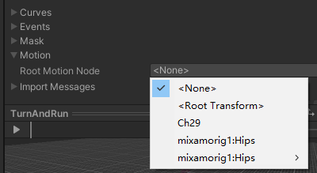
   
如果设置了RootMotionNode，则会进行Bake，以所选节点为Root，将运动信息烘焙到子节点上，运行时，依然看到根节点transform是不变的，但是角色会前进一段后回到原位置。

#### 性能问题

如果不进行Bake，并且ApplyRootMotion的话，每一帧都需要更新根节点的位置，并在此基础上确定各个骨骼的位置，会有一定的开销。   
如果ApplyRootMotion勾选，Unity每帧都会在ApplyOnAnimatorMove函数中调用ApplyBuiltinRootMotion。

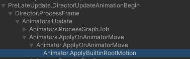
   
如果不勾选，则不会调用：

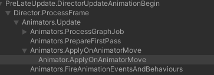

### 动画剪辑

通过Clips下方的加号来新建AnimationClip，在下方可以更改AnimationClip的名字，在Length条上可以对动画进行裁剪。

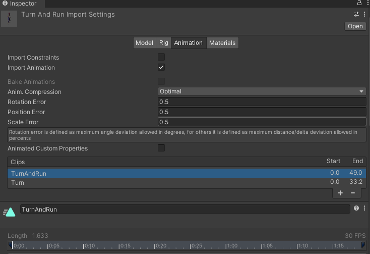
   
剪辑时，下方将会显示出曲线图。通过红色/黄色/绿色，来标记剪切出的剪辑中，角色的某种姿态属性是否能够构成循环。（绿色可以，红色不可以，黄色取中间值）。   
裁剪的结果是否能循环体现在Bake选项后的红色提示灯上，用于在Bake时参考：

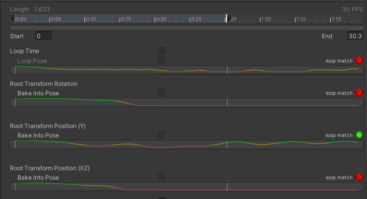
   
由于Bake后Root是不动的，动画会循环播放，因此，绿色状态下才建议开发者进行Bake。如果是红色状态 ，Bake后动画的播放就会不连续。

### 其它参数

Cycle Offset：应是一个0到1之间的数值，否则无效，可以设定循环时起始播放位置的偏移

Base Upon：对应属性的改变要以什么为参照（通常保持默认即可）   
—original 引用FBX文件中原先的位置，方位坐标，并以此为参照，通常对Y轴启用，对Rotation启用可能导致人物初始朝向不是Z轴正方向，对XZ平面启用可能导致人物不在原点位置   
—Body Orientation 按身体的朝向变化为参照，通常对Rotation启用   
—Center Of Mass 按身体重心位置为参照，选定时，身体重心位置会被至于原点，通常不对Y轴启用，而对XY平面启用   
—feet 按脚底的Y轴高度为参照（Y轴高度的另一个参照）

Mirror：左右镜像翻转动画，可以节省动画师的工作量

## Animator组件的属性

Controller：状态机的配置资源文件，整合Clip资源，创建状态机状态（State），设置动画 **过渡** 与 **融合** 。

Avatar：动画节点导引替身，与动画复用（尤其是人形动画复用）有关，通过配置和应用Avatar，可以实现不同FBX模型之间的动画复用

Update Mode：状态机播放动画的时间模式。

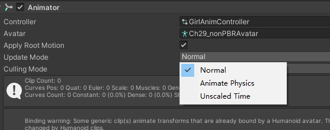
   
Normal：使用游戏Upadte的更新模式   
Animate Physics：使用物理周期的更新模式（使用Unity中的物理系统实现位移，角色需要与场景中的物体进行物理交互）   
Unscaled Time：不受TimeScale影响的更新模式（通常应用于GUI界面的动画）

Culling Mode：剔除模式

Always Animate：无论物体是否被摄像机可见，总是计算所有节点的运动，完整的进行动画播放   
Cull Update Transforms：当物体不被摄像机可见时，仅计算根节点的位移植入，保证物体位置上的正确   
Cull Completely：当物体不被摄像机可见时，完全终止动画的运行

## AnimationController

### Sub-State Machine

创建一个子动画组。创建的指向动画组的过渡，当过渡触发时，就会来到该动画组的Entry，并进入该动画组的初始状态。

指向Exit的过渡 - 当触发时，就会返回上一层的Entry并进入上一层的初始状态。

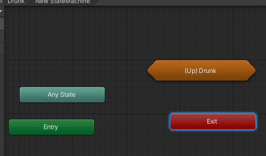

### Blend Tree

动画融合树

### 动画过渡

**Has Exit Time** ：勾选时上一个状态对于的动画片段必须被播放到末尾，才允许这个过渡被触发，不勾选可以在任意时刻进行过渡

**Eixt Time** ：CurrentState所对应的动画片段，开始进行过渡融合的位置对起始位置的偏移（百分比）   
**Transition Duration(s)** ：过渡融合的区间长度（百分比或秒）   
**Transition Offset** ：过渡：NextState动画，进行过渡融合对应起始位置的偏移（百分比）

**Fixed Duration** ：过渡区间的计算方式（决定Transition Duration的单位），不勾选按照对CurrentState动画的相对百分比长度计算，勾选按照恒定的秒时长计算

**Interruption Source** ：打断来源，允许该过渡被来自CurrentState或NextState的其它过渡打断   
被CurrentState打断则发生了“跳转”，NextState的指向被改变（例如受击打断了攻击）   
被NextState打断则发生了“跃进”，动画迅速的完成了两个状态的过渡（例如从站立状态快速过渡到冲刺斩，奔跑状态被越过）

**合理的运用打断，实现快节奏的状态切换，是制作动作游戏的基础**

Ordered Interruption：针对CurrentState出发的过渡，是否只允许比当前过渡优先级高的过渡打断该过渡

### State配置

Motion：这个State所引用的动画片段

Speed：动画片段的播放速度（置为-1可倒放动画）

Multiplier：Speed的一个倍率因子，需要勾选Parameter，可选定一个浮点动画参数来动态控制这个因子

Normalized Time：片段播放位置，0到1之间浮点，需要一个被控制的浮点动画参数来作为输出映射，从而我们可以在脚本中获取这个片段的播放进度（Normallize Time * 片段帧长度，可以得到当前片段播放到第几帧）

Mirror：是否进行左右翻转，可以勾选要Parameter，可选定一个布尔动画参数来动态控制

Cycle Offset：偏移量（和之前Clip中的偏移相同），0到1之间的浮点值，可勾选Parameter选定一个浮点动画参数来动态控制

Foot IK：脚部的IK反向力学修正，针对人物上坡，上楼梯时的踏空而行进行修正

Write Default：初始化属性，如果一个Clip对于角色某个节点的某个属性完全不涉及，那么播放该Clip时，对于不涉及的属性值，是要置为初始状态，还是置为其它Clip末尾时对该值的修改结果。勾选则置为0帧初状态，不勾选则应用之前播放的Clip对其修改的结果

Write Default主要是针对人物骨骼之外的一些节点，例如武器，跟随物，这些节点只在部分互动动作之中被用到，那些没有使用该节点的动作执行时，是要让节点处于初始状态，还是上一次互动动作末尾时的状态

## Animator Override Controller

Animator Override Controller 也是一种Controller状态机配置资源文件，它可以继承一种指定的Animator Controller，并在此基础上进行修改，从而在复用Controller的同时，做出针对性的修改。   
Override Controller与AnimationController作用相同，只是可以替换AnimationClip的取值。

## 事件机制

AnimationState面板上可以添加StateMachineBehaviour类Script，通过Override相关函数响应相关事件。

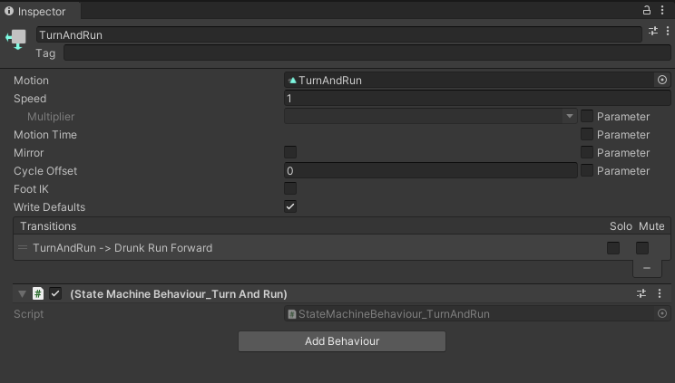

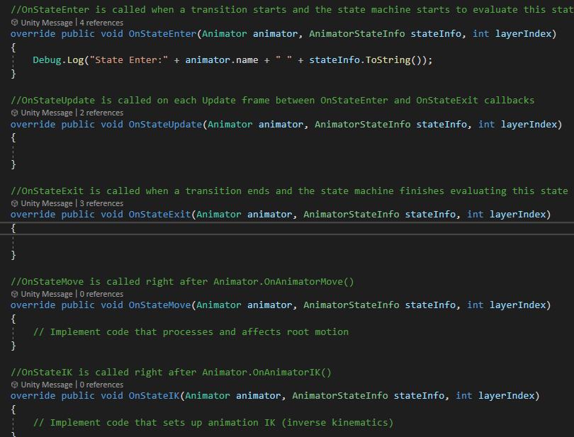

AnimationClip编辑时，可在关键帧添加AnimationEvent。

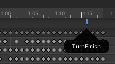
   
关键帧触发事件时，调用AnimationClip所在物体上的脚本中的同名函数。

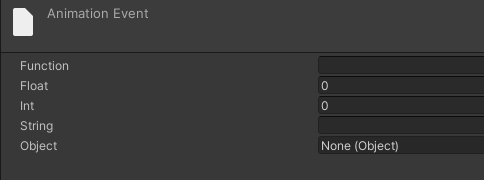

### Mono—>SMB的通信

  1. 拖动赋值 —— 序列化的方法

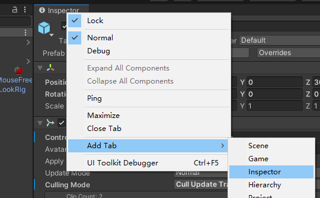

  2. API

```csharp 

//Awake OR Start

var smb = animator.GetBehaviour<StateMechine>(); 

//这里会是从父动画组到子动画组以及其中包含的State，这个遍历顺序下，遇到的第一个StateMechine

var smbS = animator.GetBehaviours<StateMechine>(); 

//返回一个数组包含Controller中所有的StateMechine

``` 

### SMB—>Mono的通信

  1. 依然是序列化方法，同样需要用到两个Inspector窗口

  2. 在Mono中获取到该SMB，之后在Mono的Awake/Start对SMB中的Mono挂点进行赋值（逆向设置）

## Avatar相关

Avatar能够复用的条件是，生成源Avatar的FBX模型中的骨骼层级结构及名称与当前FBX相同

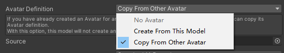

复用方式：Avatar的存在主要是为了解决人物动画的复用问题，不同来源的FBX中，对于骨骼节点的层级结构，以及命名可能不尽相同，因此Unity以Avatar作为一个中介，不同的FBX都对Avatar中的标准人物骨骼结构去创建映射关系。在Animator状态机进行动画控制时，依照人物模型创建的Avatar，将人物动画片段对标准人物骨骼中的节点控制，映射到当前的人物模型当中，从而就实现了对不同来源FBX中，人物动画的复用。

## 一些API

```csharp 

animator.GetFloat(blendHash); 

animator.SetFloat(blendHash, Input.GetAxis("Horizontal")); 

int layerID = animator.GetLayerIndex("Base Layer"); 

animatorStateInfo = animator.GetCurrentAnimatorStateInfo(layerID); 

animatorStateInfo = animator.GetNextAnimatorStateInfo(layerID); 

transitionInfo = animator.GetAnimatorTransitionInfo(layerID); 

int idleHash = Animator.StringToHash("Idle"); 

int layerID = animator.GetLayerIndex("Base Layer"); 

animatorStateInfo = animator.GetCurrentAnimatorStateInfo(layerID); 

if (animatorStateInfo.shortNameHash == idleHash)//判定当前状态是否是Idle状态

{ 

Debug.Log("OnState Idle"); 

} 

int flyHash = Animator.StringToHash("Base Layer.FlyMechine.Fly"); 

animatorStateInfo = animator.GetCurrentAnimatorStateInfo(0); 

if (animatorStateInfo.fullPathHash == flyHash) 

{ 

Debug.Log("OnState Fly"); 

} 

int tagHash = Animator.StringToHash("tagName"); 

if(animatorStateInfo.tagHash==tagHash){ 

//do something

} 

``` 

## 动画系统性能

**Mesh** 面片数对Camera.Render的影响最大，而对其他Animator.Update、MeshSkinning.Update几乎没有影响。   
**骨骼数量** 增多时则主要影响Animator.Update，MeshSkinning.Update

当我们打开多线程渲染 **Multithread Rendering** 后，会开启Render Thread。然后主线程Camera.Render的耗时则会大幅下降，并且之前开销越大，则下降幅度越明显。

而打开 **Optimize Game Objects** 选项后，Animator.Update，MeshSkinning.Update的耗时则会大幅下降

当开启 **Apply Root Motion** 后，主线程中Animator.Update函数开销会增加很多，主要增加开销的函数是ApplyBuiltinRootMotion。有没有办法优化这块呢，答案是肯定的。只要勾选上Optimize Game Objects，这个函数的大部分计算就会放到子线程Worker Thread中去运算了。所以当你要用到Apply Root Motion时，记得一定要开启Optimize Game Objects。

推荐大家使用Optimal来进行动画压缩。

### 多角色场景解决方案

#### Bake Mesh

利用SkinnedMeshRender.BakeMesh来对场景中同种模型角色进行烘焙，将蒙皮网格SkinnedMesh转换成普通Mesh。根据所要播放的动画及播放时间可以在网格中获取对应的网格数据从而进行渲染。   
使用Bake Mesh的优点是能大幅降低CPU的开销，但是同时也会增加运行时的内存占用，具体的内存占用跟Mesh的面片数和动画片段长度成正比，因此在使用此方案时要特别注意降低Mesh的面片数和动画片段。

#### GPU Skinning

Skinning过程转移到GPU中

## Ref

<https://www.jianshu.com/p/6fc0332357e8>   
<https://zhuanlan.zhihu.com/p/105029905>

