程、异步执行究竟有什么关系？

程、异步执行究竟有什么关系？

## 概述

```csharp 

yield return <expression>; 

yield break; 

``` 

如果你在语句中使用 yield 上下文关键字，则意味着它在其中出现的方法、运算符或 get 访问器是迭代器，向编译器指示它所在的方法是迭代器块。 

使用 yield return 语句可一次返回一个元素。可通过使用 foreach 语句或 LINQ 查询来使用从迭代器方法返回的序列。 foreach 循环的每次迭代都会调用迭代器方法。 迭代器方法运行到 yield return 语句时，会返回一个 expression，并保留当前在代码中的位置。 下次调用迭代器函数时，将从该位置重新开始执行。

在 yield return 语句中，将计算 expression 并将结果以值的形式返回给枚举器对象；expression 必须可以隐式转换为 yield 类型的迭代器。

可以使用 yield break 语句来终止迭代。

实现原理 - 编辑器遇到上面的情况会将生成一些类来保存yield return的所有调用都一一做分支处理（状态机分支），下次对IEnumerator.moveNext时会从上次的状态开始（如：迭代到第几个）

## 迭代器模式的实现与Enumerator

### foreach的原理

在 C# 中，foreach 其实是一个语法糖，在编译成 IL 代码时，foreach 会变成基于迭代器 IEnumerator 的调用方式。

foreach编译成的IL代码如下：

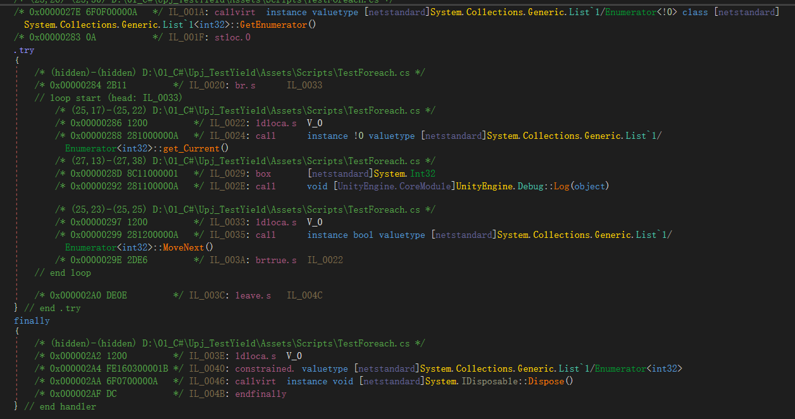
   
以下两段代码效果相同：

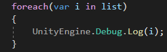

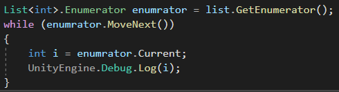

### 迭代器模式的实现

有许多种方法可以把对象堆起来成为一个集合，你可以把它们放进数组、链表、树、散列表等等不同的数据结构中，每一种对象的组织方式都有它的优点和适合的使用场景。   
迭代器模式使我们在遍历集合时，不需要清楚集合的内部实现方式。不同集合存储方式的细节不同，但遍历方式的统一的。

> 设计思想原则：隐藏细节，开放接口

遍历集合时，处理好三件事即可：

  * 能够以某种顺序一个一个访问集合中的元素

  * 能够获得当前元素的值

  * 能够重新回到集合的开头

为此，IEnumerator接口分别定义了三个方法：MoveNext, get_Current, Reset

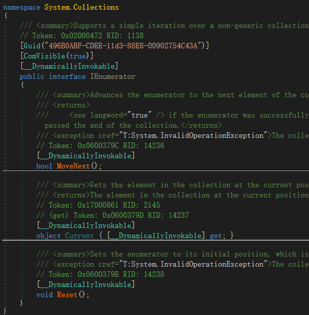

.NET 系统库提供的 List、ArrayList、Dictionary 等集合都实现了 Enumerator。以List为例看看具体的实现：   
`List<T>`实现了`IEnumerable<T>`和`IEnumerable`接口，这两个接口也就定义了`GetEnumerator`方法：

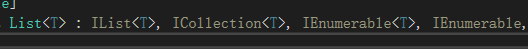

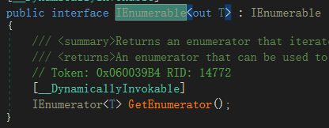

而`Enumerator`是List类中的一个结构体类型，该结构体实现了`IEnumerator`接口。

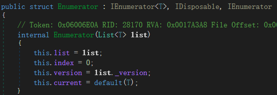

当对`List<T>`调用GetEnumerator()方法时，返回的的`List<T>.Enumerator`类的一个对象。

> 使用迭代器进行遍历时，不能进行Remove和Add操作，因为这两个操作会导致元素整体移动，导致当前Index指向的元素位置偏移，遍历结果错误。

### 自己实现一个List

```csharp 

using System.Collections; 

using System; 

public class MyList<T> : IEnumerable

{ 

private static readonly T[] _emptyArray = new T[0]; 

private const int _defaultCapacity = 4; 

private T[] _items; 

private int _size; 

private int _version; 

private Func<T, bool> _filterFunc; 

public int Count => _size; 

IEnumerator IEnumerable.GetEnumerator() 

{ 

return GetEnumerator(); 

} 

public MyList()

{ 

this._items = _emptyArray; 

} 

/// <param name="func"></param>

public MyList(Func<T, bool> func)

{ 

this._items = _emptyArray; 

_filterFunc = func; 

} 

public IEnumerator GetEnumerator()

{ 

return new Enumerator(this); 

} 

public void Add(T item)

{ 

if (this._size == this._items.Length) 

this.EnsureCapacity(this._size + 1); 

this._items[this._size++] = item; 

++this._version; 

} 

/// <summary>

/// 扩容机制

/// </summary>

/// <param name="min"></param>

private void EnsureCapacity(int min)

{ 

if (this._items.Length >= min) 

return; 

int num = this._items.Length == 0 ? 4 : this._items.Length * 2; 

if ((uint)num > 2146435071U) 

num = 2146435071; 

if (num < min) 

num = min; 

this.Capacity = num; 

} 

public int Capacity 

{ 

get => this._items.Length; 

set //有点子监听的感觉

{ 

if (value == this._items.Length) 

return; 

if (value > 0) 

{ 

T[] objArray = new T[value]; 

if (this._size > 0) //扩容真正实现在这里

Array.Copy((Array)this._items, 0, (Array)objArray, 0, this._size); 

this._items = objArray; 

} 

else

this._items = _emptyArray; 

} 

} 

/// <summary>

/// 迭代器定义

/// </summary>

public struct Enumerator : IEnumerator 

{ 

private MyList<T> _list; 

private int _index; 

private int _version; 

private T current; 

internal Enumerator(MyList<T> list)

{ 

this._list = list; 

this._index = 0; 

this._version = list._version; 

this.current = default(T); 

} 

public bool MoveNext()

{ 

if (this._version != _list._version || (uint)this._index >= (uint)_list._size) 

return this.MoveNextRare(); 

this.current = _list._items[this._index]; 

++this._index; 

//当不满足过滤条件时，foreach遍历Current返回为空

if (_list._filterFunc != null && !_list._filterFunc(this.current)) 

this.current = default(T); 

return true; 

} 

private bool MoveNextRare()

{ 

this._index = this._list._size + 1; 

this.current = default(T); 

return false; 

} 

public object Current => this.current; 

public void Reset()

{ 

_index = 0; 

current = default(T); 

} 

} 

} 

``` 

## Enumerator与yield return

You use a yield return statement to **return each element one at a time**.

When a yield return statement is reached in the iterator method, **expression is returned** , and **the current location in code is retained**. Execution is restarted **from that location the next time** that the iterator function is called.

```csharp 

public static void TestGetVs()

{ 

IEnumerator<int> enumerator = GetVs(); 

while(enumerator.MoveNext()) 

{ 

int current = enumerator.Current; 

Debug.Log(current); 

} 

} 

public static IEnumerator<int> GetVs()

{ 

//for (int i = 0; i < 3; i++)

//{

// yield return i;

//}

yield return 3; 

yield return 4; 

yield return 5; 

} 

``` 

底层原理：   
如果写了一个函数，返回值类型为IEnumerator，方法体中有yield return，那么编译器会为这个方法自动定义一个类型，这个类型实现IEnumerator接口。

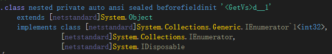

这个类型有两个字段：

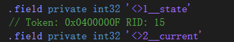
   
state保存当前执行到的位置，current为当前的返回值。

使用foreach对这个方法的返回值进行遍历，实质上就是对这个迭代器进行遍历。每次调用MoveNext()，从state指向的位置开始执行，直到遇到下一个yield return，将返回的结果存到current当中，保存当前位置到state中。MoveNext函数的IL语言形式如下：

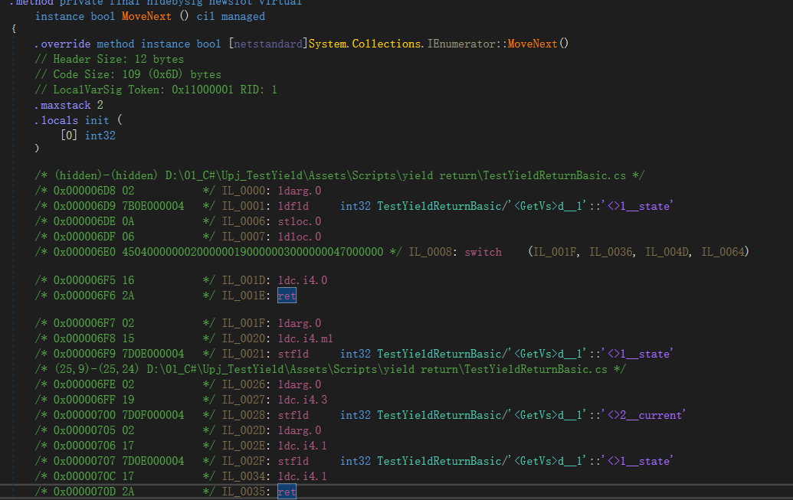

总结：使用IEnumerator与yield return的方式，可以实现有多个返回值的方法，对多个返回值进行遍历，每访问一个值，执行一段代码，不需要先计算出所有的值，再进行遍历。其本质是把函数(例子当中为GetVs)的代码放到Enumerator类型的MoveNext当中，用state进行控制，每调用一次，执行不同的段落。

## Unity3D协程

Ref: <https://www.cnblogs.com/Roz-001/p/11205700.html>

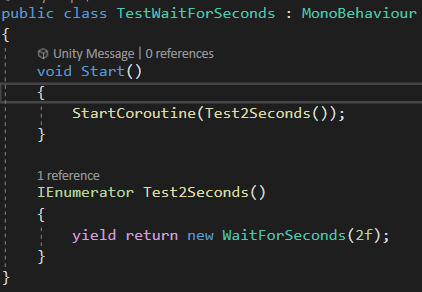
   
以上代码，实质上是调用Test2Sceonds方法，返回一个Enumerator对象，然后传递给StartCoroutine方法。

StartCoroutine是在Native层实现的。从行为上来看，当StartCoroutine后，Unity会每一帧执行一次MoveNext。

如果yield return 返回的对象为WaitForSecond等，Unity会据此判断下一次调用MoveNext是什么时候。如以上代码，Unity会在2秒后，再次调用MoveNext。

### 本质是什么

协程是一种异步执行代码的方式，是一种假的多线程。本质上，是 **将一件任务，分到多个帧中去执行** 。

多线程（并发）与迭代器、枚举器、容器是毫不相干的两个概念，Unity为什么就把这两个概念联系到一起了呢？为什么实现协程要用到枚举类型？这种实现方案，本质上是用了Enumerator的什么特性呢？这是笔者一直困惑的。

如果一个技术A，要用到技术B，那么A的需求，一定与B的特性是有共同点的，否则A不会用到B。那么我们从这个角度去思考上述问题。

  * 协程，本质是异步执行，把一个任务（一段代码），分多帧去执行。

  * .NET当中的Enumerator与yield return的机制，恰好本质上是把一段代码拆分为多个段落（部分），每次调用MoveNext，执行一段逻辑，获取一个返回值。

那么，两个技术自然就关联到了一起——Unity对Enumerator的MoveNext进行调用，就实现了将一个任务分多次去执行的需求。每一帧调用一次MoveNext，就实现了每一帧执行一部分任务。而Native层还对yield return返回的类型进行了判断，根据返回类型的不同 ，控制下一次调用MoveNext的时机，例如，如果返回值是new WaitForSeconds(2)，那么Unity会在2秒后调用下一个MoveNext，并获取返回值。如果返回值是UnityWebRequest.SendWebRequest，那么Unity会在相应的请求执行完后，继续执行后面的部分。

### yield return 的一些特殊含义

```csharp 

//程序在下一帧中从当前位置继续执行

yield return 0; 

//程序在下一帧中从当前位置继续执行

yield return null; 

//程序等待N秒后从当前位置继续执行

yield return new WaitForSeconds(N); 

//在所有的渲染以及GUI程序执行完成后从当前位置继续执行

yield new WaitForEndOfFrame(); 

//所有脚本中的FixedUpdate()函数都被执行后从当前位置继续执行

yield new WaitForFixedUpdate(); 

//等待一个网络请求完成后从当前位置继续执行

yield return WWW; 

//等待一个xxx的协程执行完成后从当前位置继续执行

yield return StartCoroutine(xxx); 

//如果使用yield break语句，将会导致协程的执行条件不被满足，不会从当前的位置继续执行程序，而是直接从当前位置跳出函数体，回到函数的根部

yield break; 

yield return IEnumerator自己定义实现类，等待到自定义的时间或事件结束。 

``` 

### 一些Demo

```csharp 

//下面定义了一个协程函数，注意必须使用IEnumerator作为返还值才能成为协程函数。 

IEnumerator Test() 

{ 

for(int i = 0; i<1000 ; ++i) 

{ 

ans += i; yield return 0;//挂起，下一帧再来从这个位置继续执行。 

} 

j+=2; 

yield return 0;//挂起，下一帧再来从这个位置继续执行。 ++j; 

yield return 0;//挂起，下一帧再来从这个位置继续执行。

} 

``` 

Demo1:

```csharp 

//3s后执行Debug.Log

IEnumerator Test()

{ 

for(float timer = 0.0f; timer < 3.0f ; timer += Time.DeltaTime){ 

yield return 0;//挂起，下一帧再来从这个位置继续执行。

} 

Debug.Log("启动协程3s后"); 

} 

``` 

Demo2:

```csharp 

IEnumerator TestWaitForSeconds()

{ 

//3s后执行Debug.Log;

yield return new WaitForSeconds(3.0f); 

Debug.Log("启动协程3s后"); 

} 

``` 

### AssetBundle异步加载

```csharp 

/// <summary>

/// 从文件进行异步加载

/// </summary>

/// <param name="abFullPath">ab包的绝对路径</param>

/// <param name="finishCallBack">完成加载回调，返回加载的AssetBundle</param>

/// <param name="updateCallBack">加载过程中的更新回调，返回加载进度</param>

/// <returns></returns>

IEnumerator LoadABFileAsync(string abFullPath,Action<AssetBundle> finishCallBack, Action<float> updateCallBack=null)

{ 

AssetBundleCreateRequest request = AssetBundle.LoadFromFileAsync(abFullPath); 

while (!request.isDone) 

{ 

if(updateCallBack != null) 

{ 

updateCallBack(request.progress); 

} 

yield return null; 

} 

yield return request; 

if(finishCallBack!=null) 

finishCallBack(request.assetBundle); 

} 

private void Start()

{ 

assetPath = Application.dataPath + "/../MyAssetBundles/"; 

StartCoroutine(LoadABFileAsync(assetPath + assetBundleName, OnFinish, OnUpdate)); 

} 

private void OnUpdate(float obj)

{ 

Debug.Log(obj); 

} 

private void OnFinish(AssetBundle obj)

{ 

Instantiate(obj.LoadAsset(loadPrefabName)); 

obj.Unload(false); 

} 

``` 

### UnityWebRequest

```csharp 

using UnityEngine; 

using UnityEngine.Networking; 

using System.Collections; 

public class TestWebRequest : MonoBehaviour { 

void Start() { 

StartCoroutine(GetText()); 

} 

IEnumerator GetText() { 

UnityWebRequest www = new UnityWebRequest("http://www.my-server.com"); 

www.downloadHandler = new DownloadHandlerBuffer(); 

yield return www.SendWebRequest(); 

if (www.result != UnityWebRequest.Result.Success) { 

Debug.Log(www.error); 

} 

else { 

// Show results as text

Debug.Log(www.downloadHandler.text); 

// Or retrieve results as binary data

byte[] results = www.downloadHandler.data; 

} 

} 

} 

``` 

## Ref:

<https://docs.microsoft.com/zh-cn/dotnet/csharp/language-reference/keywords/yield>

