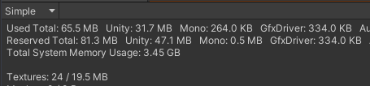
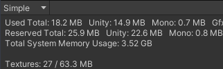
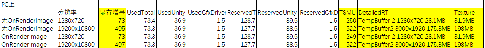
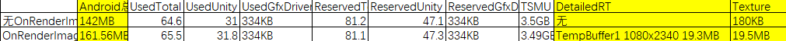

By Prin@UWA

## 相关知识点

### windows查看nvidia显卡（GPU）的利用率和温度

对可执行程序nvidia-smi.exe直接调用就可以显示显卡相关信息：   
GPU的名称、温度、显存占用情况、GPU利用率、正在工作的GPU进程

笔者的nvidia-smi.exe程序在C:\Windows\System32目录下。

### Android上查看程序占用内存大小

#### adb dumpsys 命令查看每个程序的内存信息

以下命令查看程序的PID（app_name可以不全）

```csharp 

adb shell top | grep app_name 

``` 

以下命令查看程序的内存使用情况

```csharp 

adb shell dumpsys meminfo <package_name>

adb shell dumpsys meminfo <PID>

``` 

Total 的 PSS 信息就是你的应用真正占据的内存大小

#### 查看整体内存信息

```csharp 

adb shell cat /proc/meminfo 

``` 

其他有用命令：

>   * adb shell kill PIDNumber 死你想杀死的后台进程来模拟某种 bug 的复现条件。
> 
>   * adb shell ps 查看当前终端中的进程信息
> 
> 

### DontSave——保留对象到新场景

如果GameObject对象被HideFlags.DontSave标识，则在新scene中GameObject的所有组件将被保留下来

  1. 其子类GameObject对象不会被保留到新scene中

  2. 不可以对GameObject对象的某个组件如Transform进行HideFlags.DontSave标识，否则无效。

  3. 即使程序已经退出，被HideFlags.DontSave标识的对象会一直存在于程序中，造成内存泄漏，对HideFlags.DontSave标识的对象在不需要或程序退出时需要使用DestroyImmediate手动销毁。

Demo:

```csharp 

using UnityEngine; 

using System.Collections; 

public class DontSave_ts : MonoBehaviour { 

public GameObject go; 

public Transform t; 

void Start()

{ 

//GameObject对象使用HideFlags.DontSave可以在新scene中被保留

go.hideFlags = HideFlags.DontSave; 

GameObject Pl = GameObject.CreatePrimitive(PrimitiveType.Plane); 

Pl.hideFlags = HideFlags.DontSave; 

//不可以对GameObject的组件设置HideFlags.DontSave，否则无效

Transform tf = Instantiate(t, go.transform.position + new Vector3(2.0f, 0.0f, 0.0f), Quaternion.identity) as Transform; 

tf.hideFlags = HideFlags.DontSave; 

//导入名为newScene_unity的新scene

Application.LoadLevel("newScene2_unity"); 

} 

} 

``` 

在场景2中：

```csharp 

using UnityEngine; 

using System.Collections; 

public class NewScene2_ts : MonoBehaviour { 

GameObject cube, plane; 

void Start () { 

Debug.Log("这是NewScene2！"); 

} 

//当程序退出时用DestroyImmediate()销毁被HideFlags.DontSave标识的对象

//否则即使程序已经退出，被HideFlags.DontSave标识的对象依然在Hierarchy面板中

//即每运行一次程序就会产生多余对象，造成内存泄漏

void OnApplicationQuit()

{ 

cube = GameObject.Find("Cube0"); 

plane = GameObject.Find("Plane"); 

if (cube) 

{ 

Debug.Log("Cube0 DestroyImmediate"); 

DestroyImmediate(cube); 

} 

if (plane) 

{ 

Debug.Log("Plane DestroyImmediate"); 

DestroyImmediate(plane); 

} 

} 

} 

``` 

## 问题来源

给场景添加以下脚本：

```csharp 

public class Test_OnRenderImage : MonoBehaviour

{ 

private void OnRenderImage(RenderTexture source, RenderTexture destination)

{ 

Graphics.Blit(source, destination); 

} 

} 

``` 

Build后在安卓设备上运行，使用Profiler进行分析，会发现Detailed信息当中多了一张较大的RenderTexture：TempBuffer 1，如下图，其大小为60+MB：


   
而在统计的（Used/Reserved）Unity内存和GfxDriver内存都低与60MB。


   
也就是说，Unity Profiler并没有把这个RT占用的内存统计到Unity或GfxDriver当中。笔者比较好奇，这个RT是什么情况下才会生成？放在内存的哪一部分？为什么不会统计到Unity或GfxDriver当中？什么样的会统计到什么样的不会被统计到？于是做了如下实验。

## 实验

创建空场景，在任意物体上添加上文提到的 `Test_OnRenderImage` 脚本。

### PC平台上测试

首先在PC Standalone上进行测试。按照是否添加Test_OnRenderImage 脚本和屏幕分辨率的高低进行组合，分别导出4个包，运行时通过`nvidia-smi.exe`获取显存信息，通过UnityProfiler分析内存情况，实验结果如下（使用黄色填充标注发生变化的值）：


   
（注：TSMU表示Total System Memory Usage）   
结论：在屏幕上绘制需要把绘制的信息放在 **TempBuffer** 中，也就是一张RenderTexture当中。这张RT存储在 **显存** 当中，其 **大小可以跟所绘制的分辨率有关** ，分辨率越大，其占用空间越大。

在PC平台上，不论是否重写`OnRenderImage`函数，都会在显存当中存在一个TempBuffer，其占用空间不会被Profiler统计到Unity当中。会在Texture当中统计到，也可以在在Detailed当中找到。

> **官方对Profiler的介绍** ：The values in the Profiler are different to those displayed in your operating system’s task manager, because the Memory Profiler does not track all memory usage in your system. This includes memory some drivers and plug-ins use, and memory used for executable code. On platforms that support getting the total memory size of the application from the operating system, the **Total System Memory Usage** is over 0 and is **the same size in a task manager.**

### Android平台测试

在PC平台上的测试已经可以说明TempBuffer的大小与分辨率之间的关系，在Android平台上主要测试OnRenderImage函数与该TempBuffer的存在与否以及与所占据的Android内存之间的关系：


   
（注：程序占用的Android总内存通过命令`adb shell dumpsys meminfo <PID>`得到。）

结论：通过OnRenderImage函数调用Blit，会在Android设备中产生一张额外的RT（TempBuffer），占用一定的内存，其大小取决于屏幕分辨率。若不调用OnRenderImage函数，就不会生成该RT，不会占据额外内存。

> 另外，笔者通过另一个实验证明，若只写OnRenderImage函数，函数体为空，不写Blit，也会生成RT：TempBuffer。只是由于RenderTexture destination为空，屏幕显示黑屏。
> 
> OnRenderImage的实现原理可参考：<https://gameinstitute.qq.com/community/detail/112744>

## Ref

<https://zhuanlan.zhihu.com/p/29005381>

