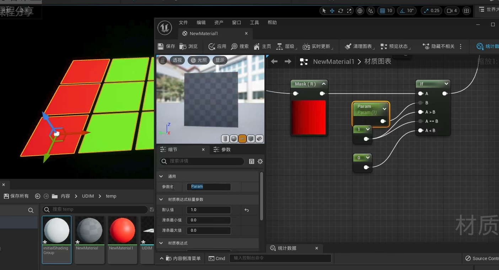
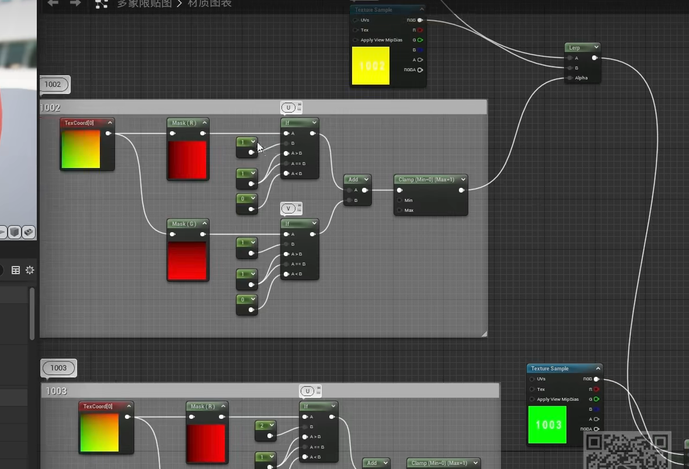
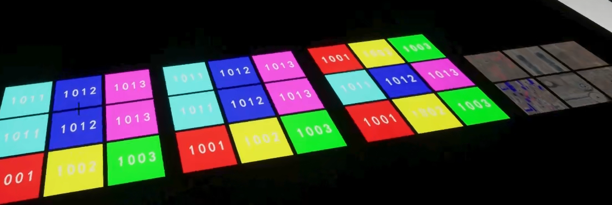

U-Dimension (or "UDIM") is a texture naming convention that enables multiple texture images to map to separate UV regions on a Static Mesh or Skeletal Mesh model.

UDIM（U-Dimension）是一套多想先贴图映射技术，是目前UV Mapping中比较流行的技术。  是对 UV 贴图和纹理工作流程的增强

UDIM 只是一个自动 UV 偏移系统，它将图像分配到特定的 UV 平铺上，它允许您对相邻表面使用多个较低分辨率的纹理贴图，从而产生更高分辨率的结果，而不必求助于使用单个、超高分辨率图像。

UV 映射是将三维表面转换为平面位图图像的二维坐标系.  原始表面的每个顶点在 UV 贴图上都有一个坐标，中间的像素值在平坦的多边形表面上进行插值，以实现高度精确的纹理控制。UV贴图坐标值被组织到一个网格系统中，其中图像本身出现在网格的0-1区域中，而此图块外部的区域仅向外重复图像。因此，传统上实际上只使用过UV 0-1空间（好在控制表面如何平铺图像的方式之外）。

使用 UDIM 工作流，每个完整的切片部分（0-1、1-2、2-3 等）都可以分配给它自己的独立图像映射，所有这些都在同一表面内。每个图像也可以有自己的分辨率。

普通的UV是在其他象限图像都不断重复的UDIM，UDIM是每个象限图像都不同的UV。

Maya操作：

材质 - 贴图 -UVTilingMode:UDIM

把1001贴图选中，会自动识别UDIM贴图序列。

引擎实现：

编辑 - 项目设置 - 渲染 - 启用虚拟纹理支持，重启UE。 会编译Shader（空工程要等41分钟）

选择UDIM的第一张导入UE Editor，就会自动生成VT

纹理赋值给基础颜色

Shader实现原理：能根据U的值确定使用哪张纹理，也能根据V的值决定使用哪张纹理，那么，完成逻辑：分别根据U和V的范围，决定使用哪张纹理即可。

可以把一大段材质的逻辑打包成材质函数。  

UDIM贴图：组成的贴图数量太多的情况下，双击打开时，可能会挂掉

相关资源：<https://sketchfab.com/tags/udim>

<https://sketchfab.com/3d-models/high-quality-mulberry-tree-scan-419735850f414ff98c8d417b508585da>
