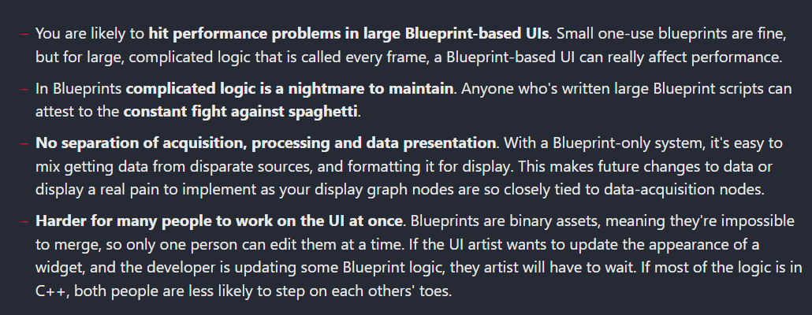
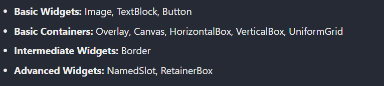

## 技术方案说明

### Why Should we Use C++?


  
https://benui.ca/unreal/ui-cpp-basics/

### mix Blueprints and C++

put all **the data-related logic in C++** , and **the visual logic in Blueprints**.

### UMG vs. Slate

Slate is the old Unreal UI system, and is what the UMG and the editor are built on. It uses some funky-looking C++ to simplify setting up widgets. It's important to understand that just because it's the "old" system doesn't mean it's obsolete. You will gradually need to learn Slate in order to add more complicated functionality to your UIs.

UMG is the newer UI system that was added as part of Unreal 4. It is designed to be more Blueprint-friendly and let designers visually lay out their UIs in the editor. Each UMG widget generally has an almost-identically named Slate class inside it. The **xxSlate** class handles most of the logic, and its corresponding UMG class is a wrapper around it. e.g. UImage is the UMG class, and it contains a SImage instance inside it.

UMG is simply a editor- and Blueprint-friendly **wrapper for Slate**.

#### 同行经验

UE引擎内如果开发Editor插件的话，界面UI是用UMG还是Slate比较合适?  
Slate.  
UMG是针对runtime的，因此一些editor的控件不会提供，比如propertyEditor  
当然slate也会更底层一些，性能更高  
一般是尽量做个slate底层，然后导出各种蓝图接口，然后就可以用脚本植入主体逻辑

## UMG

Unreal Motion Graphics UI Designer (UMG)

最好的UI Dev上手方法： **try out each widget and see what you can do with it**

Slots - When a widget is put inside another, we can customise how it behaves inside its parent through its Slot property.

### Widgets



### UserWidgets

UserWidgets are used to create reusable objects with custom logic for user interfaces.

#### Creating a UserWidget in C++

```csharp #pragma once #include "CoreMinimal.h" #include "Blueprint/UserWidget.h" #include "ExampleWidget.generated.h" // We make the class abstract, as we don't want to create // instances of this, instead we want to create instances // of our UMG Blueprint subclass.UCLASS(Abstract) class UExampleWidget : public UUserWidget{ GENERATED_BODY() protected: // Doing setup in the C++ constructor is not as // useful as using NativeConstruct. virtual void NativeConstruct() override;}; ``` ```csharp #include "ExampleWidget.h" void UExampleWidget::NativeConstruct(){ Super::NativeConstruct(); // Here is where I typically bind delegates, // and set up default appearance } ``` 

#### Creating new UWidgets in C++

```csharp // .h file UCLASS() class UExampleOverlay : public UOverlay { GENERATED_UCLASS_BODY() public: #if WITH_EDITOR virtual const FText GetPaletteCategory() override;#endif protected: // UWidget interface virtual TSharedRef<SWidget> RebuildWidget() override; // End of UWidget interface }; ``` ```csharp // .cpp file #define LOCTEXT_NAMESPACE "ExampleUMG" TSharedRef<SWidget> UExampleOverlay::RebuildWidget() { auto Result = Super::RebuildWidget(); for (UPanelSlot* InSlot : Slots) { // Do something custom } return Result; } #if WITH_EDITOR const FText UExampleOverlay::GetPaletteCategory() { return LOCTEXT("ExampleUI", "ExampleOverlay"); } #endif ``` 

## Slate

## Refs

https://benui.ca/unreal/ui-cpp-basics/  
https://benui.ca/unreal/ui-introduction/
