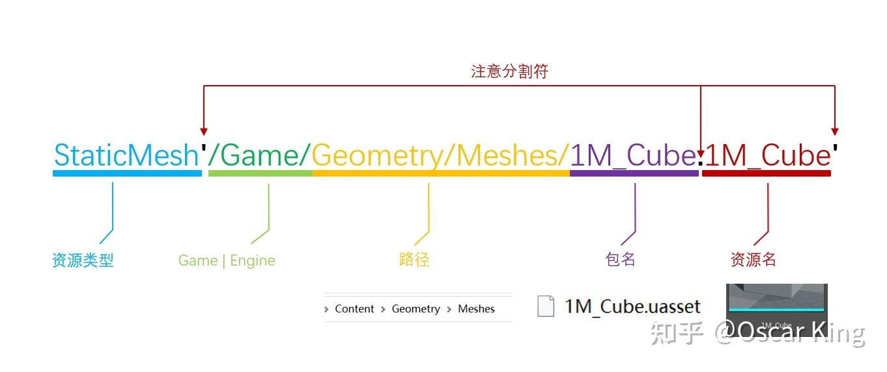

# Unity->Unreal

可以通过Unity那边的概念、结构、操作方式来理解Unreal。但是又不能完全类比，不能期待一方中的操作方法在另一方里面一定有，如果完全一致的话，两个就变成同一个引擎了。接近本质的点上可以对照去看，比如序列化、反序列化，比如内存管理、资源管理等，是独立于引擎的，都要有的。而上层的、操作习惯上的点就不能一一对照了。

## Unity->UE 官方

### Glossary

Unity -> Unreal

* * *

Prefab -> Blueprint Class  
Mesh -> Static Mesh  
Skinned Mesh -> Skeletal Mesh  
Shader -> Material, Material Editor  
Material -> Material Instance  
Material Instance -> ?  
Sprite -> EditorPaper2D  
Mecanim -> Persona , Animation Blueprint  
UI -> UMG (Unreal Motion Graphics)

Raycast -> Line Trace, Shape Trace

Rigid Body -> Collision, Physics

### Projects and Files

Content - Assets

Map file - Scene, Map files store data about your Level and the objects in it, as well as lighting data and certain level-specific settings.

Edit->Project Settings->Platforms->Android/... - "player settings" in Unity

Source sub-folder -

### Actor

In Unity, GameObject is C# class which you cannot directly extend.  
In UE4, Actor is a C++ class which you can extend and customize using inheritance.

  * 任意可以被放置到关卡中的游戏物体都是一个 Actor

  * Actor 可以被认为维系了一些特殊 Object 的容器，这些特殊 Object 被称为组件（Component）

  * Actor像是Prefab一样，可以在场景中实例化多个，当Actor进行了修改，那么场景中的物体会同样被修改

### Blueprint vs. Prefab

UE4中，Unity的Prefab使用Blueprint Class替代。Blueprint Class支持继承，修改公共的Function很方便。

蓝图-Code挂Asset  
Prefab-Asset挂code

### Component

BeginPlay = Initialize Component = Unity Start()  
Tick Component = Unity Update

### Blueprint or C++?

Most projects will use a mix of Blueprints and C++. Many developers prototype game functionality using Blueprints, because it is so easy and fun, and later move some or all of it to C++ for performance and engineering rigor.

### Transform Components

Root Component - any subclass of Scene Component

A Scene Component gives the Actor a location, rotation, and scale in the world which is applied hierarchically to all components underneath it.

### Actor

Actors are most common class used for gameplay in UE4 and the only type that can be Spawned into the World. So everything you place in your level will be an Actor.

Object is actually the base class of all Unreal classes, including Actor and many others.

### Gameplay Framework

https://docs.unrealengine.com/4.27/en-US/InteractiveExperiences/Framework/  
customized built-in Actor classes  
replication and networking features

### Programming

#### Event Functions

Remember, in UE4 it is important to call the parent class' version of method.

A - Actor sub-class  
U - Object sub-class  
F - plain data structures or non-UObject classes

#### Unity功能在Unreal中实现

文档中查阅：https://docs.unrealengine.com/4.27/en-US/Basics/UnrealEngineForUnityDevs/

Instantiating GameObject / Spawning Actor  
Casting from One Type to Another

Destroying GameObject / Actor  
Destroying GameObject / Actor (With 1 Second Delay)  
Disabling GameObjects / Actors

Accessing the GameObject / Actor from a Component  
Accessing a Component from the GameObject / Actor  
Finding GameObjects / Actors  
Adding tags to GameObjects / Actors  
Adding tags to MonoBehaviours / ActorComponents  
Comparing tags on GameObjects / Actors and MonoBehaviours / ActorComponents

##### Physics: RigidBody vs. Primitive Component

Layers vs Channels  
RayCast vs RayTrace  
Triggers

Kinematic Rigidbodies

##### Input events

Engine-Input

#### Exception

check() - You can pass in an error message.  
ensure() - log an error with a full call stack

## Unity->UE经验博客

### Actor Lifecycle

https://docs.unrealengine.com/4.27/en-US/ProgrammingAndScripting/ProgrammingWithCPP/UnrealArchitecture/Actors/ActorLifecycle/  
Destroy  
EndPlay  
OnDestroy - 不要用这个，要用EndPlay

#### 销毁对象

```csharp // 针对AActor子类可调用 MyActor->Destroy(); // 针对UObject的子类，可调用 MyObj->MarkPendingKill(); MyObj = nullptr; ``` 

### Garbage Collection

#### Advanced GC

Clustering -: builds clusters of objects that are all destroyed together

Cluster Merging - For example, a particle system asset may reference a material asset, but if cluster merging is turned off, the material and the particle system will remain in separate clusters for garbage collection purposes. With cluster merging turned on, the particle asset cluster will be merged with the material cluster due to the particle system referencing the material.

### 对象查找

```csharp // Find Actor by name (also works on UObjects) AActor* MyActor = FindObject<AActor>(nullptr, TEXT("MyNamedActor")); // Find Actors by type (needs a UWorld object) for (TActorIterator<AMyActor> It(GetWorld()); It; ++It){ AMyActor* MyActor = *It; // ... } // Find UObjects by type for (TObjectIterator<UMyObject> It; It; ++It){ UMyObject* MyObject = *It; // ... } // Find Actors by tag (also works on ActorComponents, use TObjectIterator instead) for (TActorIterator<AActor> It(GetWorld()); It; ++It){ AActor* Actor = *It; if (Actor->ActorHasTag(FName(TEXT("Mytag")))) { // ... }} ``` 

### Referencing Assets

Direct Property Reference  
Construction Time Reference  
Indirect Property Reference

### Actor与蓝图的加载、生成

```csharp void ATestBPProjectile::OnHit(UPrimitiveComponent* HitComp, AActor* OtherActor, UPrimitiveComponent* OtherComp, FVector NormalImpulse, const FHitResult& Hit){ …… DEFINE_LOG_CATEGORY_STATIC(LogBPDynamicLoad, Warning, All); // 方法1：通过蓝图对象的GeneratedClass取得类型描述 UBlueprint* BlueprintObj = LoadObject<UBlueprint>(nullptr, TEXT("Blueprint'/Engine/Tutorial/SubEditors/TutorialAssets/Character/TutorialCharacter.TutorialCharacter'")); UE_LOG(LogBPDynamicLoad, Warning, TEXT("Blueprint GeneratedClass:%s"), *BlueprintObj->GeneratedClass->GetName()); GetWorld()->SpawnActor(BlueprintObj->GeneratedClass, &GetTransform()); // 方法2：加载蓝图对象的UClass，注意资源路径后要加_C，不然加载出来为null UClass* BlueprintClass = LoadClass<AActor>(nullptr, TEXT("Blueprint'/Engine/Tutorial/SubEditors/TutorialAssets/Character/TutorialCharacter.TutorialCharacter_C'")); UE_LOG(LogBPDynamicLoad, Warning, TEXT("Blueprint Class:%s"), *BlueprintClass->GetName()); GetWorld()->SpawnActor(BlueprintClass, &GetTransform());} ``` 

### 资源路径



目前UE4采用每个资源一个包，以前UE3和UE2时代，一个包中可以有多个资源对象，因此现在包名和资源名都是一样的，除非有手动重命名过。

```csharp Material'/Game/Geometry/Meshes/CubeMaterial.CubeMaterial' World'/Game/FirstPersonCPP/Maps/FirstPersonExampleMap.FirstPersonExampleMap' Blueprint'/Game/FirstPersonCPP/Blueprints/FirstPersonCharacter.FirstPersonCharacter' Texture2D'/Game/FirstPerson/Textures/FirstPersonCrosshair.FirstPersonCrosshair' SoundWave'/Game/FirstPerson/Audio/FirstPersonTemplateWeaponFire02.FirstPersonTemplateWeaponFire02' AnimBlueprint'/Game/FirstPerson/Animations/FirstPerson_AnimBP.FirstPerson_AnimBP' AnimSequence'/Game/FirstPerson/Animations/FirstPerson_Fire.FirstPerson_Fire' AnimMontage'/Game/FirstPerson/Animations/FirstPersonFire_Montage.FirstPersonFire_Montage' StaticMesh'/Engine/BasicShapes/Cone.Cone' Material'/Engine/BufferVisualization/AmbientOcclusion.AmbientOcclusion' Blueprint'/Engine/EditorBlueprintResources/ActorMacros.ActorMacros' SoundCue'/Engine/EditorSounds/GamePreview/EjectFromPlayer_Cue.EjectFromPlayer_Cue' Texture2D'/Engine/EngineMaterials/Grid.Grid' ``` 

## Unreal vs. Unity

## Ref

https://zhuanlan.zhihu.com/p/444044071
