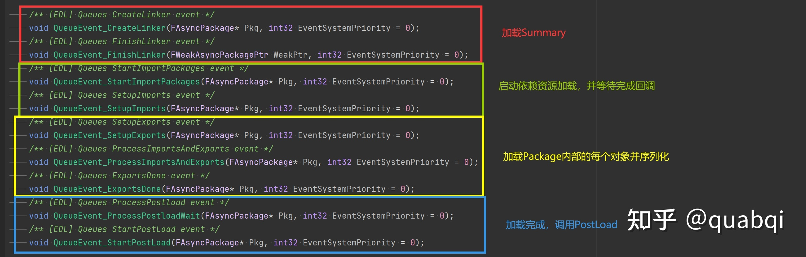
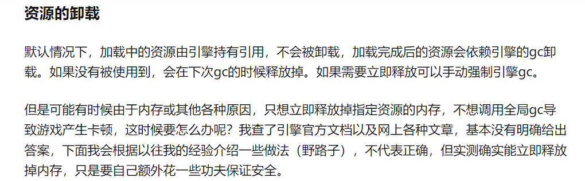
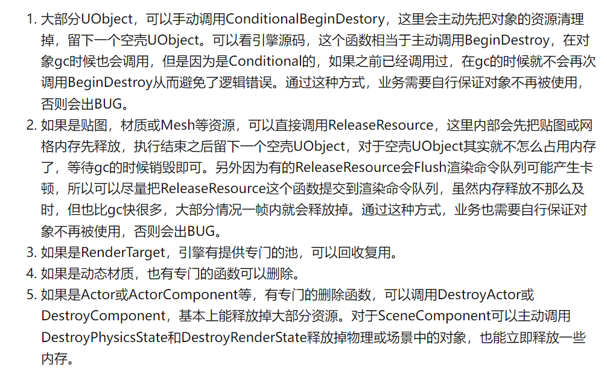

说明：较大的篇幅整理自知乎答主quabqi的文章。链接：https://zhuanlan.zhihu.com/p/357904199

## UE4的资源文件和内存里对象的关系是什么？

Content目录下的资源：uasset（大部分）, umap 作为后缀  
在打包时，这些文件可能会根据平台需要，被cook成更小的平台专用文件，然后被放在后缀是pak的压缩包里。  
游戏运行时，程序就会挂载解压这些pak包，然后加载包中的资源文件来使用。  
程序在用资源的时候，把这些文件转化为UObject或其他程序可以用的内存对象。

Asset is a UObject that can be dumped down to file (uasset package) and can be loaded back to the memory from that file and in is mainly used to store game resources, when you load them they are avable in memory as UObject objects like UBlueprint, UTexture2D, USkeletalMesh. USoundWave and so on. Every type of asset you see in content browser has corresponding class and each asset you see in “content Browser” is a UObject that is in memory or can be loaded in memory.

> 网格资源文件，程序用的实际是UStaticMesh对象

## 资源->UObject对象

把资源文件，转变为内存里的UObject对象

  * 读取资源文件的数据到内存
  * 根据内存的二进制数据，把空壳对象反序列化成实际的对象
  * 如果这个对象有依赖其他对象，就递归的去做1和2的操作，直到这个对象完整可用
  * 调用对象的初始化函数，并将对象加入到引擎的对象管理中

## 加载与查找

### 查找

FindObject  
FindObjectFast  
FindObjectChecked  
FindObjectSafe  
FSoftObjectPath::ResolveObject

在内存中查找对象，找到就会返回，找不到会返回nullptr，不会触发加载。  
如果传入了Outer，就会在Outer所在的Package下面找对应的资源对象，如果没有Outer就会在全局找这个资源对象。

### 同步加载资源

LoadObject  
LoadClass  
LoadPackage

先调用FindObject在内存中找，找到了直接返回，没找到就会进入同步加载。再深入底层可以看到，最终调用的是LoadPackageAsync函数，这就是异步加载的入口，并且最后FlushAsyncLoading，内部阻塞等待，将异步加载转为同步

FSoftObjectPath::TryLoad  
FStreamableManager::RequestSyncLoad  
FStreamableManager::LoadSynchronous  
FStreamableManager::RequestAsyncLoad  
FlushAsyncLoading（异步转同步）

更上层的封装，最终走到LoadPackageAsync

### 异步加载资源

LoadPackageAsync  
FStreamableManager::RequestAsyncLoad

### 判断加载状态

GIsSavingPackage  
IsGarbageCollectingOnGameThread  
IsLoading  
GetNumAsyncPackages  
GetAsyncLoadPercentage  
FStreamableManager::IsAsyncLoadComplete

### 加载底层深入


一个UPackage文件就是这样的，有很多UObject序列化的二进制数据

https://zhuanlan.zhihu.com/p/357904199

加载的模式：

加载的模式引擎加载资源内部有两种模式，一个是Async，一个是EDL（EventDrivenLoader）  
Async：会启动一个专门的加载线程负责Tick资源加载  
EDL：在主线程Tick加载，加载的每一个步骤通过事件串联起来  



### 硬引用 & 软引用

硬引用就是自己的对象上，用UProperty标记的那些UObject指针变量，当在反序列化对象时，因为这些变量引用的资源必须跟着一起序列化好才能保证当前的对象是好的，所以这些变量在存储时会反应到Import表里面。自己写的UProperty资源越多，这个资源加载的就越慢

软引用就是FSoftObjectPath或TSoftObjectPtr引用的资源变量，这些不会随着当前对象一起加载，但是需要业务逻辑在需要用的时候手动调用加载代码来加载。

## Asset Registry & Object Libraries

### Asset Registry

Background:

  * As assets are UObjects normally you would seek them out from reflection system.
  * Searching them in reflection system is pointless if they are not loaded first.

The asset registry is a system that stores metadata about assets and allows searches and queries about those assets.

It **keep track of Assets regardless if they are loaded or not**.  
It allows you to list out assets, get there regestry entry (FAssetData) and load them up, it also a to more optimized way to seek assets that are loaded already, as well as edit there registry information.

“Content Browser” in reality is Asset Registry explorer and it mainly use AssetRegistry to list and edit assets in there.

### ObjectLibrary

An ObjectLibrary is an object that contains a list of either loaded objects or FAssetData for unloaded objects.

```csharp if (!ObjectLibrary) { ObjectLibrary = UObjectLibrary::CreateLibrary(BaseClass, false, GIsEditor); ObjectLibrary->AddToRoot(); } ObjectLibrary->LoadAssetDataFromPath(TEXT("/Game/PathWithAllObjectsOfSameType"); if (bFullyLoad) { ObjectLibrary->LoadAssetsFromAssetData(); } ``` 

### StreamableManager & Asynchronous Loading

FStreamableManager::RequestSyncLoad  
FStreamableManager::LoadSynchronous  
FStreamableManager::RequestAsyncLoad

pass your **FSoftObjectPath** into it and start a load

> You can use the same method to asynchronously load a **FAssetData** , just call ToStringReference on them, add them to an array, and call RequestAsyncLoad with a delegate.

## 卸载





## 文档连接

Asset Registry：https://docs.unrealengine.com/4.27/en-US/ProgrammingAndScripting/ProgrammingWithCPP/Assets/Registry/

Asynchronous Asset Loading:https://docs.unrealengine.com/4.27/en-US/ProgrammingAndScripting/ProgrammingWithCPP/Assets/AsyncLoading/

UObjectLibrary:https://docs.unrealengine.com/4.27/en-US/API/Runtime/Engine/Engine/UObjectLibrary/CreateLibrary/

## Ref

https://zhuanlan.zhihu.com/p/357904199  
https://blog.csdn.net/qq_40947718/article/details/108521495
